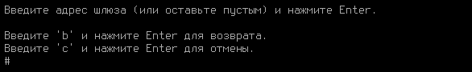
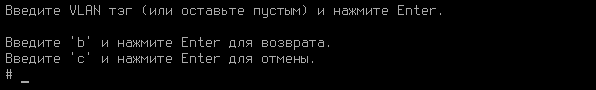

# Процесс установки

## Системные требования


**Обязательные условия для работы с Ideco UTM:**

1. Поддержка UEFI.
2. Отключить режим Legacy загрузки, он может называться CSM (Compatibility Support Module).
3. Отключить опцию Secure Boot в UEFI.


<table><thead><tr><th width="100">Комплектующие</th><th>Минимальные системные требования</th></tr></thead><tbody><tr><td>Процессор</td><td>Intel i3/i5/i7/i9/Xeon с поддержкой SSE 4.2</td></tr><tr><td>Объем оперативной памяти</td><td>16 ГБ (16-64 ГБ в зависимости от количества пользователей)</td></tr><tr><td>Дисковая подсистема</td><td>SSD, объемом 150 Гб или больше, с интерфейсом SATA, mSATA, SAS, NVMe. Дополнительный SSD при использовании почтового сервера.</td></tr><tr><td>Сеть</td><td>Две сетевые карты (или два сетевых порта) 100/1000 Mbps. Рекомендуется использовать карты на чипах Intel. Поддерживаются Realtek, D-Link и другие.</td></tr><tr><td>Гипервизоры</td><td>VMware, Microsoft Hyper-V (2-го поколения), VirtualBox, KVM, Citrix XenServer.</td></tr><tr><td>Дополнительно</td><td>Монитор и клавиатура</td></tr><tr><td>Замечания</td><td>Обязательна поддержка UEFI. Не поддерживаются программные RAID-контроллеры (интегрированные в чипсет). Для виртуальных машин необходимо использовать фиксированный, а не динамический размер хранилища и оперативной памяти.</td></tr></tbody></table>


Для оптимального выбора аппаратной платформы обратите внимание на [рекомендации](../recipes/popular-recipes/choosing-hardware-platform.md) по подбору оборудования для Ideco UTM. Примерный объем необходимого места на диске для хранения статистики веб-отчетности для 1000 пользователей за 1 год составляет 10-15 Гб.


### Поддержка браузеров для веб-интерфейса администрирования сервера

Поддерживаются современные версии браузеров Firefox, Chrome и браузеров основанных на Chromium. Internet Explorer не поддерживаются.

### Поддержка гипервизоров

Microsoft Hyper-V (2-го поколения, Windows 2012R2 и выше), VMware, VirtualBox, KVM, Citrix XenServer. Подробнее об [особенностях настройки](specifics-of-hypervisor-settings.md).

### Примеры конфигураций

Примеры нескольких типов конфигураций, зависящие от количества пользователей, представлены ниже в таблице.

<table><thead><tr><th width="167">Количество пользователей</th><th width="192">Модель процессора</th><th width="134">Объем оперативной памяти</th><th width="139">Дисковая подсистема</th><th>Сетевые адаптеры</th></tr></thead><tbody><tr><td>до 80</td><td>Intel Core i3, i5 или совместимый</td><td>16 ГБ</td><td>64 ГБ</td><td>2 шт.</td></tr><tr><td>до 350</td><td>Intel Xeon-D 1537, Atom C-3758 или совместимый</td><td>16 ГБ</td><td>240 ГБ</td><td>2 шт.</td></tr><tr><td>от 300 до 2000</td><td>Intel Xeon E-22, Xeon-D 1577 или совместимый</td><td>32 ГБ</td><td>480 ГБ</td><td>2 шт.</td></tr><tr><td>от 2000 до 3000</td><td>Intel Xeon Silver 4214R или совместимый</td><td>64 ГБ</td><td>480 ГБ</td><td>2 шт.</td></tr><tr><td>от 3000</td><td>Xeon Gold 6238R 28 Cores или совместимый</td><td>64 ГБ</td><td>480 ГБ</td><td>2 шт.</td></tr></tbody></table>

#### Данные по производительности

Пример конфигурации №1: Intel Atom C3758, 8 GB DDR4, 1GB LAN.

* В режиме L3: TCP до 1 Гбит/c, UDP до 1 Гбит/c, HTTP до 600 Мбит/с;
* **\***В режиме L7: TCP до 160 Мбит/c, UDP до 280 Мбит/c, HTTP до 100 Мбит/c.

Пример конфигурации №2: Intel Xeon E-2234, 16 GB DDR4, 1 GB LAN.

* В режиме L3: TCP до 1 Гбит/c, UDP до 1 Гбит/c, HTTP до 1 Гбит/c;
* **\***В режиме L7: TCP до 550 Мбит/c, UDP до 900 Мбит/c, HTTP до 500 Мбит/c.

**\*** - Режим L7: включенные модули IPS, контент-фильтр, контроль приложений, антивирусная проверка.

## Варианты установки

Вы можете установить Ideco UTM на отдельный сервер или на виртуальную машину. Выбор варианта установки зависит от предполагаемой нагрузки и мощности оборудования.

### Установка Ideco UTM с USB flash диска

Ideco UTM можно установить с flash-накопителя, записав на него установочный ISO-образ. Процесс подготовки установочного flash-накопителя описан в статье [Создание загрузочного USB flash диска](usb.md).

### Установка на отдельный сервер

Для установки шлюза безопасности Ideco UTM вам необходимо выполнить следующие действия:

1. Подготовьте оборудование, отвечающее системным требованиям;
2. Подготовьте USB flash диск объемом не менее 2 Гб;
3. Скачайте ISO-образ из личного кабинета пользователя: [my.ideco.ru](https://my.ideco.ru);
4. В целях обеспечения безопасности рекомендуется проверить контрольные суммы загруженного файла, которые можно найти на странице загрузки Ideco UTM в личном кабинете;
5. Запишите ISO-образ на USB flash диск;
6. В параметрах BIOS компьютера выберите загрузку с USB flash диск и начните загрузку системы с приготовленного носителя. На экране монитора должен появиться установщик Ideco UTM, как проиллюстрировано ниже.

## Процесс установки

### Шаг 1. Режим установки

**Выберите режим установки:**

1. Install Ideco UTM;
2. Install Ideco UTM in basic graphics mode.

Выберите второй вариант, если при установке у вас есть проблемы отображения элементов установщика.

### Шаг 2. Начало установки

1\. Система предупредит, что при установке будут уничтожены все данные, которые хранятся на жестком диске. Рекомендуем вам убедиться в том, что диск не содержит важной информации, так как её восстановление будет невозможно. Предупреждение об уничтожении данных представлено на снимке экрана ниже. Для продолжения введите **y** и нажмите **Enter**.

2\. Выберите часовой пояс. Выберите временную зону, в которой вы находитесь. Для этого введите **y** и нажмите **Enter**.

3\. Настройте дату и время. UTM предложит время в соответствии с выбранной временной зоной. **Обязательно проверьте правильно ли указана дата и время**. Если настройки верны, то введите **y** и нажмите **Enter**.

Если настройки не актуальны, то введите **n** и укажите верные данные, после чего нажмите **Enter**.

4\. Установщик выполнит необходимые действия для установки системы на диск:

* создание таблицы разделов и их форматирование;
* копирование системных файлов на диск;
* настройка основных параметры системы в соответствии с конфигурацией вашего компьютера.


Не забудьте извлечь носитель с дистрибутивом во время перезагрузки UTM, чтобы система не начала загрузку с установочного носителя.


После перезагрузки сервера вы увидите окно с информацией о системе:

Для продолжения нажмите любую клавишу.

5\. Выберите, требуется ли настроить сервер как вторую ноду кластера:

* Если требуется, то нажмите **y**, а затем **Enter**. Подробнее о настройке кластеризации смотрите в статье [cluster.md](../settings/server-management/cluster.md "mention");
* Если не требуется, то нажмите **n**, а затем **Enter**.

### Шаг 3. Создание учетной записи администратора

Создайте учетную запись администратора. После ввода логина нажмите **Enter** и введите новый пароль для учетной записи, после чего нажмите **Enter**.

Требования к созданию пароля администратора:

* Минимальная длина пароля - 10 символов;
* Строчные и заглавные латинские символы;
* Цифры;
* Специальные символы (! # $ % & ' \* + и т.д.).

**Если пароль не будет соответствовать требованиям политики безопасности, то появится надпись с информацией, что пароль не надёжен.** Необходимо ввести новый пароль, учитывая требования к созданию паролей и нажать **Enter**.

После того как аккаунт будет создан, нажмите любую клавишу для перехода в локальное меню и введите данные от только что созданной учетной записи администратора.

### Шаг 4. Настройка сетевого адаптера

Теперь система предложит вам настроить локальный сетевой интерфейс. Локальным считается интерфейс, к которому будет подключена локальная сеть вашего предприятия.


При определении локального интерфейса вы можете столкнуться со сложностями идентификации сетевой карты. Иногда у нескольких адаптеров может быть один и тот же производитель. В этом случае для правильного выбора необходимо будет идентифицировать устройство по его MAC-адресу. Не бойтесь ошибиться, в дальнейшем вы сможете изменить эти настройки.


1\. Введите номер сетевого адаптера из списка и нажмите **Enter**:

2\. Настройте локальную сеть автоматически через DHCP введя **y** или откажитесь, введя **n**:

3\. Введите локальный IP-адрес и маску подсети в формате `ip/маска` и нажмите **Enter**:

4\. Введите адрес шлюза в формате **ip** или оставьте поле пустым:

5\. Задайте тег VLAN (стандарт VLAN 802.3ad) или оставьте поле пустым и нажмите **Enter**.

После создания локального интерфейса откроется меню управления сервером.

Следующий шаг - конфигурирование Ideco UTM. Этот процесс рассмотрен в разделе [Первоначальная настройка](initial-setup.md).


Если в Ideco UTM настроен кластер, то в локальном меню будут отсутствовать пункты _Восстановиться на предыдущую версию_ и _Создание кластера_.

