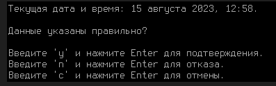
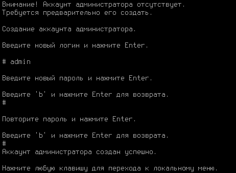
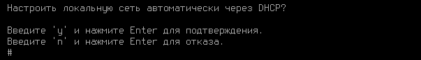
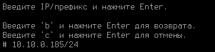

# Установка

## Процесс установки


При установке Ideco NGFW с загрузочного USB диска выберите загрузку с USB диска в настройках UEFI компьютера.


Для установки Ideco NGFW выполните действия:

1. Перейдите к установке, нажав **Install Ideco UTM**.
2. Выберите диск для установки и ознакомьтесь с **предупреждением об уничтожении данных на диске**:

3. Выберите временную зону, в которой вы находитесь:

4. Настройте дату и время в соответствии с вашей временной зоной. **Обязательно проверьте правильность даты и времени**:


Не забудьте извлечь USB диск после установки Ideco NGFW, чтобы загрузка с USB диска не началась заново.


## Создание учетной записи администратора

Для входа в веб-интерфейс Ideco NGFW нужно создать учетную запись администратора с соблюдением требований к паролю:

Требования к паролю

* **Минимальная длина пароля** - 12 символов;
* **Cодержит только строчные и заглавные латинские буквы**;
* **Содержит цифры**;
* **Содержит специальные символы** (! # $ % & ' * + и другие).


Если пароль не соответствует требованиям политики безопасности, то появится надпись с информацией, что пароль не надежен. Потребуется ввести новый пароль с учетом требований к паролю.


## Настройка локального интерфейса


При использовании сетевых карт одного производителя могут возникнуть трудности при идентификации сетевой карты для настройки сетевого интерфейса.
Для корректной идентификации сетевой карты используйте ее MAC-адрес.


Для настройки Ideco NGFW через веб-интерфейс нужно настроить локальный интерфейс в локальном меню шлюза:

1. Введите номер сетевого адаптера под локальный интерфейс:

2. Настройте локальную сеть автоматически через DHCP введя **y** или настройте вручную, введя **n**:

3. Введите локальный IP-адрес и маску подсети в формате `ip/маска` и нажмите **Enter**:

4. При настройке Ideco NGFW в качестве **шлюза** оставьте поле шлюз пустым.\
При настройке Ideco NGFW в качестве **прокси** требуется ввести шлюз с доступом в интернет.

Пример настройки в качестве **шлюза**:

5. Задайте тег VLAN (стандарт VLAN 802.3ad) или оставьте поле пустым:

После создания локального интерфейса откроется локальное меню управления сервером: 


Если в Ideco NGFW настроен кластер, то в локальном меню будут отсутствовать пункты _Восстановиться на предыдущую версию_ и _Создание кластера_.

