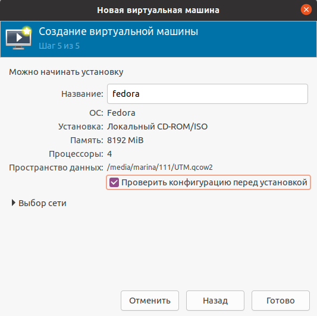
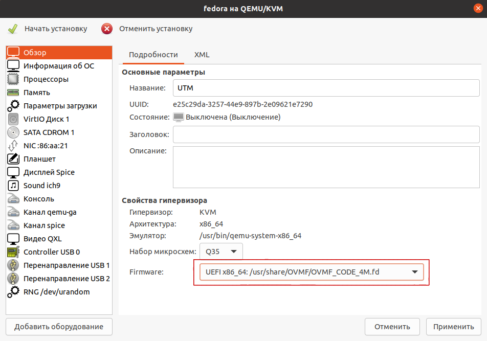

# Особенности настроек гипервизоров


**Обязательные условия для работы Ideco UTM:**

1. Поддержка UEFI;
2. Отключить режим Legacy загрузки (он также может называться CSM (Compatibility Support Module);
3. Отключить опцию Secure Boot в UEFI.


Ideco UTM поддерживает работу на следующих гипервизорах:

* VMware (Workstation и ESXi) версии не ниже 6.5.0;
* Microsoft Hyper-V (2-го поколения);
* VirtualBox;
* KVM;
* Citrix XenServer.

Для работы на виртуальных машинах нет необходимости в установке дополнительных драйверов или утилит на Ideco UTM. Гостевые дополнения входят в состав дистрибутива.

## Общие рекомендации

* Тип ОС для создания виртуальной машины: Linux Fedora, 64 bit;
* Минимальный размер жесткого диска - 64 ГБ;
* Динамическое расширение жесткого диска не автоматизировано, но возможно через обращение в техническую поддержку;
* Минимальное количество оперативной памяти: 8 ГБ;
* Внутренние часы ВМ должны быть настроены на хранение времени во временной зоне UTC.


Если при установке Ideco UTM появилась ошибка с текстом **Требуется не менее 8 ГБ оперативной памяти**, и при этом вы указали рекомендуемый размер оперативной памяти, то уменьшите размер ресурсов, выделенных под видеопамять до минимального.


## **Microsoft Hyper-V**

Поддерживается только второе поколение виртуальных машин под Windows Server 2012 R2 или выше. Необходимо отключить опцию Secure Boot (безопасная загрузка).

**Видеоинструкция по настройке виртуальной машины**:



Всегда используйте обычный виртуальный сетевой адаптер (Network Adapter).

## VMware ESXi

Перед установкой Ideco UTM необходимо увеличить размер видеопамяти для виртуальной машины до 16 МБ (по умолчанию 4 МБ).

Рекомендуется использовать виртуальные сетевые адаптеры **vmxnet3**.


При установке Ideco UTM на хосты кластера с разными поколениями процессоров укажите в настройках EVC самое старое поколение процессора из хостов, соответствующее минимальным системным требованиям для установки.


## Citrix XenServer

В случае, если xenserver не загружается с ISO-образа, сделайте следующее:

1. Выполните команду `xe vm-list`. Данная команда отобразит список виртуальных машин на xenserver;
2. Выберите виртуальную машину с UTM и запомните ее UUID;
3. Выполните команду `xe vm-param-set uuid=<UUID> HVM-boot-policy=BIOS\ order HVM-boot-params:order=dc`;

После выполнения данных шагов должна начаться загрузка с установочного носителя.

## KVM

1\. При установке Ideco UTM выберите тип операционной системы - **Fedora**

2\. На пятом шаге (virtm-manager) установки обязательно поставьте галочку **Проверить конфигурацию перед установкой** и нажмите кнопку **Готово**.

3\. Для дисков и сетевых карт укажите/измените интерфейс на **virtio.**

4\. Для дисков используйте режим кеширования **writeback**, если диски хранятся в qcow2 или raw-файлах. Если нет - проконсультируйтесь у вашего администратора хранилища либо нашей технической поддержки относительно выбора режима кеширования.

5\. В появившемся окне на вкладке **Обзор** в поле Firmware выберите пункт **UEFI x86\_64:/usr/share/OVMF/OVMF\_CODE.fd**. Выбор этого пункта включит UEFI и выключит опцию **Secure Boot**.


Если пункта **UEFI x86\_64:/usr/share/OVMF/OVMF\_CODE.fd** нет в списке, то нужно доустановить пакет ovmf. В Ubuntu этот пакет устанавливается командой **sudo apt install ovmf**.

