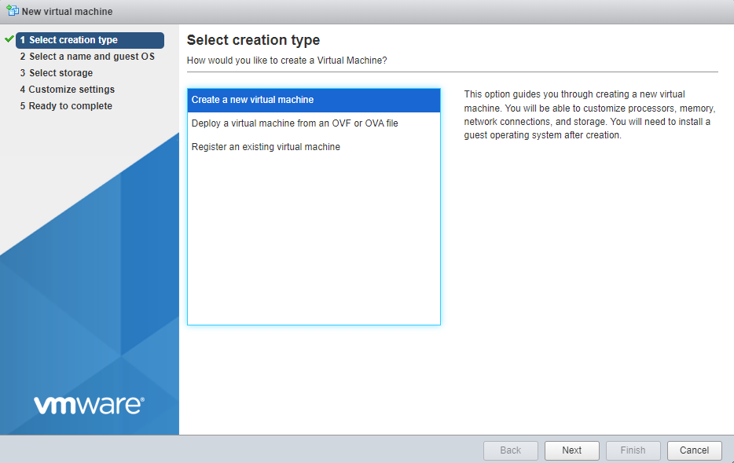
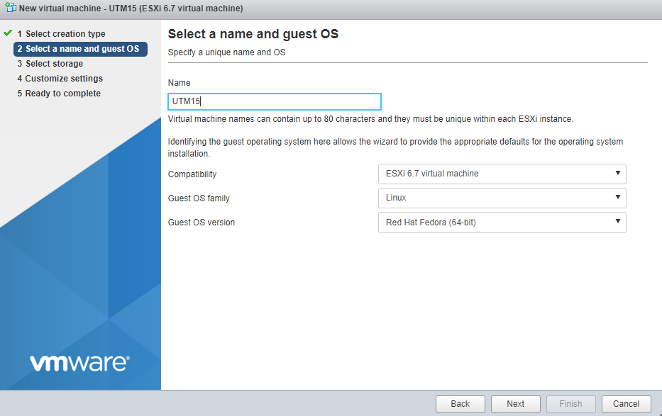
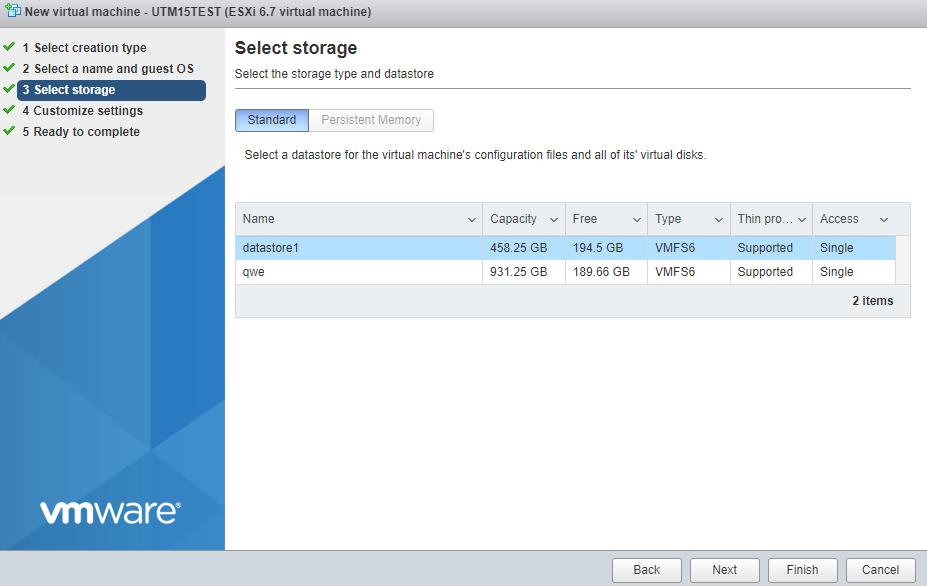
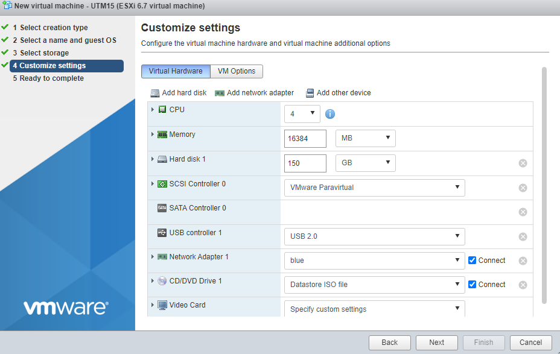
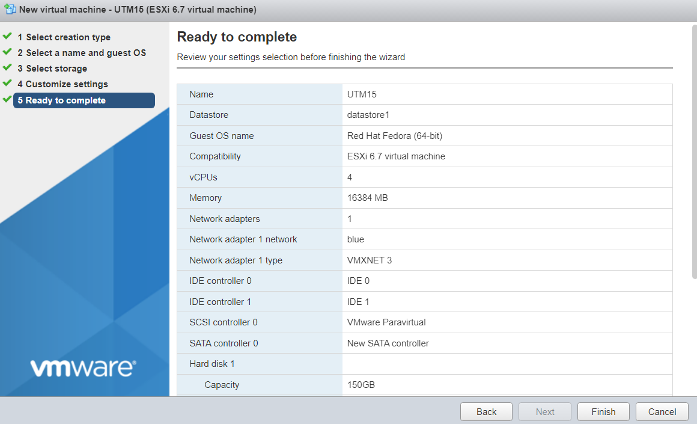
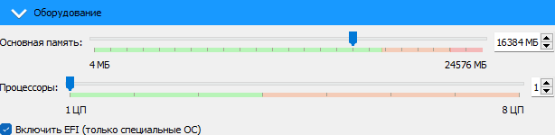
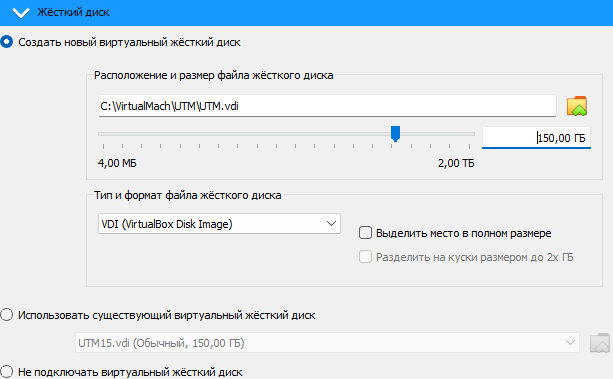
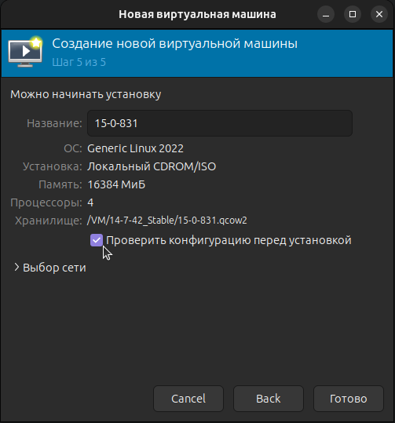
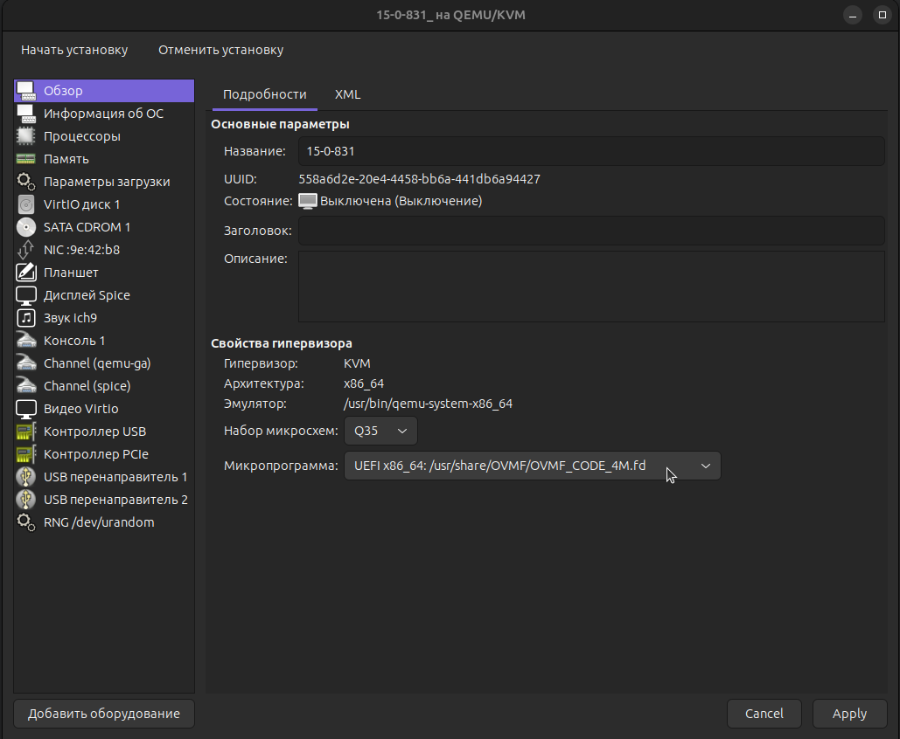

# Настройка гипервизора


Для установки Ideco NGFW нужно включить режим UEFI в настройках виртуальной машины.



**Обязательные условия для работы Ideco NGFW:**

* Поддержка UEFI;
* Отключить режим Legacy загрузки (он также может называться CSM);
* Отключить опцию Secure Boot в UEFI.


Ideco NGFW поддерживает работу на следующих гипервизорах:

* VMware (Workstation и ESXi) версии не ниже 6.5.0;
* Microsoft Hyper-V (2-го поколения);
* VirtualBox;
* KVM;
* Citrix XenServer.

## Общие рекомендации

* Тип ОС для создания виртуальной машины: **Linux Fedora 64 bit**;
* Минимальный размер жесткого диска - **150 ГБ**;
* Минимальное количество оперативной памяти: **16 ГБ**;
* Внутренние часы ВМ должны быть настроены на хранение времени во временной зоне UTC.


Если при установке Ideco NGFW появилась ошибка с текстом **Требуется не менее 16 ГБ оперативной памяти**, и при этом указан рекомендуемый размер оперативной памяти, то уменьшите размер ресурсов, выделенных под видеопамять до минимального.



Если при установке Ideco NGFW появилось окно с надписью **Installation in BIOS mode is not supported**, проверьте включение режима UEFI в настройках виртуальной машины. 


## Microsoft Hyper-V 

* Поддерживается только второе поколение виртуальных машин под Windows Server 2012 R2 или выше; 
* Отключите опцию **Secure Boot** (безопасная загрузка);
* Используйте обычный виртуальный сетевой адаптер (Network Adapter).

**Видеоинструкция по настройке виртуальной машины**:



## VMware ESXi

* Перед установкой Ideco NGFW увеличьте размер видеопамяти для виртуальной машины до 16 МБ;
* Используйте виртуальные сетевые адаптеры **vmxnet3**.

<details>
<summary>Настройка</summary>

Перед установкой Ideco NGFW VPP загрузите образ, скачанный с [MY.IDECO](https://my.ideco.ru/), на VMware ESXi. При настройке виртуальной машины потребуется указать его путь.

1. Создайте виртуальную машину:

    

2. Укажите **Имя** виртуальной машине и установите остальные настройки как на скриншоте:

    

3. Выберите хранилище для виртуальной машины:

    

4. Установите размер оперативной памяти **16ГБ** и размер диска **150ГБ**. После выберите в поле **CD/DVD Drive** Datastore ISO file и укажите путь к загрузочному образу:
   
    

5. Включите **UEFI** на вкладке **VM Options**, выбрав в поле **Firmware** EFI:

    

6. Нажмите **Finish**.

    

</details>


При установке Ideco NGFW на хосты кластера с разными поколениями процессоров укажите в настройках EVC самое старое поколение процессора из хостов, соответствующее минимальным системным требованиям для установки.


## Citrix XenServer

<details>
<summary>Настройка</summary>

Если xenserver не загружается с установочного образа:

1. Выполните команду `xe vm-list`. Данная команда отобразит список виртуальных машин на xenserver;
2. Выберите виртуальную машину с NGFW и запомните ее UUID;
3. Выполните команду:
``` 
xe vm-param-set uuid=<UUID> HVM-boot-policy=BIOS\ order HVM-boot-params:order=dc
```

После 3 шага начнется загрузка с установочного носителя.

</details>

## VirtualBox
* По умолчанию при создании виртуальной машины создается 1 сетевая карта с типом подключения **NAT**.

<details>
<summary>Настройка</summary>

1. Укажите **Имя** виртуальной машины (ВМ), выберите директорию для ВМ и установите путь до загрузочного образа NGFW. Остальные параметры установите как на скриншоте:

    

2. Установите размер оперативной памяти ВМ (**16 ГБ**) и нажмите **Включить EFI**:
    
    

3. Cоздайте виртуальный жесткий диск под ВМ (Объем не меньше **150ГБ**):

    

4. Нажмите **Готово**

</details>

## KVM

<details>
<summary>Настройка</summary>

1. При установке Ideco NGFW выберите тип операционной системы - **Fedora**

2. На пятом шаге (virtm-manager) установки обязательно поставьте галочку **Проверить конфигурацию перед установкой** и нажмите кнопку **Готово**.

    

3. Для дисков и сетевых карт измените интерфейс на **virtio.**

4. Для дисков используйте режим кеширования **writeback**, если диски хранятся в qcow2 или raw-файлах.\
Если нет - проконсультируйтесь у администратора хранилища или нашей технической поддержки относительно выбора режима кеширования.

5. В появившемся окне на вкладке **Обзор** в поле Firmware выберите пункт **UEFI x86\_64:/usr/share/OVMF/OVMF\_CODE.fd**. Выбор этого пункта включит **UEFI** и выключит опцию **Secure Boot**.

    

Если пункта **UEFI x86\_64:/usr/share/OVMF/OVMF\_CODE.fd** нет в списке, доустановите пакет ovmf. В Ubuntu этот пакет устанавливается командой `sudo apt install ovmf`.
</details>

Далее начнется установка Ideco NGFW на виртуальную машину. Подробнее об установке в статье [Установка](installation-process.md)



При возможных проблемах проверьте соответствие параметров виртуальной машины [общим рекомендациям](#obshie-rekomendacii).
