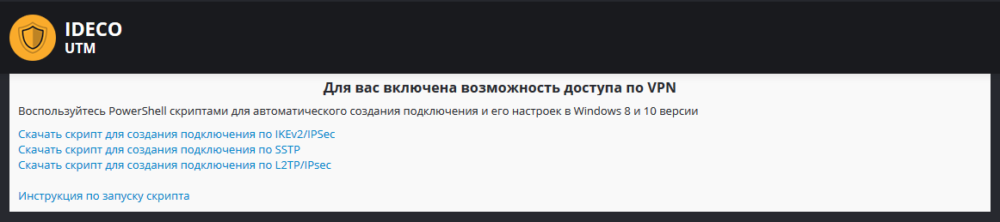
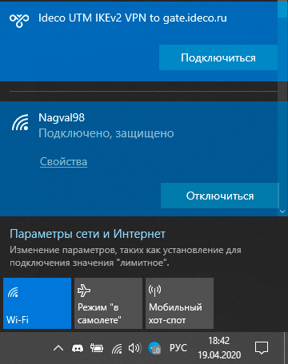

# Инструкция по запуску PowerShell-скриптов

Используйте загруженные с вашего сервера готовые скрипты для создания VPN-подключения в Windows версий 8.1 и 10.

Если вы используете Windows 7, необходимо создать подключение [вручную](https://github.com/ideco-team/docsUTM/tree/54be5c28981601375569bdca6ef75ead87808b16/Инструкция_по_созданию_подключения_в_Windows_7/README.md).

## Какой протокол VPN выбрать?

При нескольких вариантах возможных подключений по VPN выбирайте протоколы по следующим приоритетам \(лучшие - первые\):

1. **IKEv2/IPSec** - самый лучший в

   плане производительности и надежности подключения протокол.

2. **SSTP** - протокол основанный на TCP и SSL. Выберите его, если

   подключение по IKEv2 не проходит через вашего провайдера.

3. **L2TP/IPSec** - надежный в плане шифрования, но не самый

   оптимальный в плане скорости и производительности

   протокол.

4. **PPTP** - устаревший протокол, используйте его только в случае

   крайней необходимости и не работоспособности других протоколов

   на вашей ОС.

## Как запустить PowerShell скрипт?

1. Сохраните скрипт, кликнув по ссылке на него в личном кабинете.  

     

2. Щелкните правой кнопкой мыши по скаченному файлу и в контекстном

   меню выберите "Свойства".  

     

3. Поставьте галочку "Разблокировать" справа в нижнем углу свойств

   файла \(по-умолчанию ОС блокирует выполнение скаченных из

   интернета файлов\).  

     

4. Снова нажмите правой кнопкой мыши на файл и выберите "Выполнить в PowerShell" в контекстном меню.  
   

   При ошибке "выполнение сценариев отключено в этой системе", нужно включить выполнение сценариев, выполнив команду в PowerShell \(вызовите его через меню "Пуск"\):

   ```text
   Set-ExecutionPolicy Unrestricted
   ```

5. Ответьте "Да" на вопрос о внесении изменений в ваш компьютер.
6. Подключение создано. Нажмите "Подключиться" в списке ваших сетей. 

## Что делать, если запустить скрипт не получается?

Возможно вам не хватает прав на запуск скриптов или PowerShell не установлен в системе.

Воспользуйтесь инструкцией для создания подключения в Windows 8-ой и 10-ой версии в [данной статье](https://github.com/ideco-team/docsUTM/tree/54be5c28981601375569bdca6ef75ead87808b16/IPSec_IKEv2/README.md).

 \#\# Attachments:

 !\[\]\(images/icons/bullet\_blue.gif\) \[lk.PNG\]\(attachments/16842864/17072162.png\) \(image/png\) !\[\]\(images/icons/bullet\_blue.gif\) \[свойства файла.png\]\(attachments/16842864/17072164.png\) \(image/png\) !\[\]\(images/icons/bullet\_blue.gif\) \[разблокировать.PNG\]\(attachments/16842864/17072165.png\) \(image/png\) !\[\]\(images/icons/bullet\_blue.gif\) \[выполнить.png\]\(attachments/16842864/17072166.png\) \(image/png\) !\[\]\(images/icons/bullet\_blue.gif\) \[подключение.png\]\(attachments/16842864/17072167.png\) \(image/png\)

