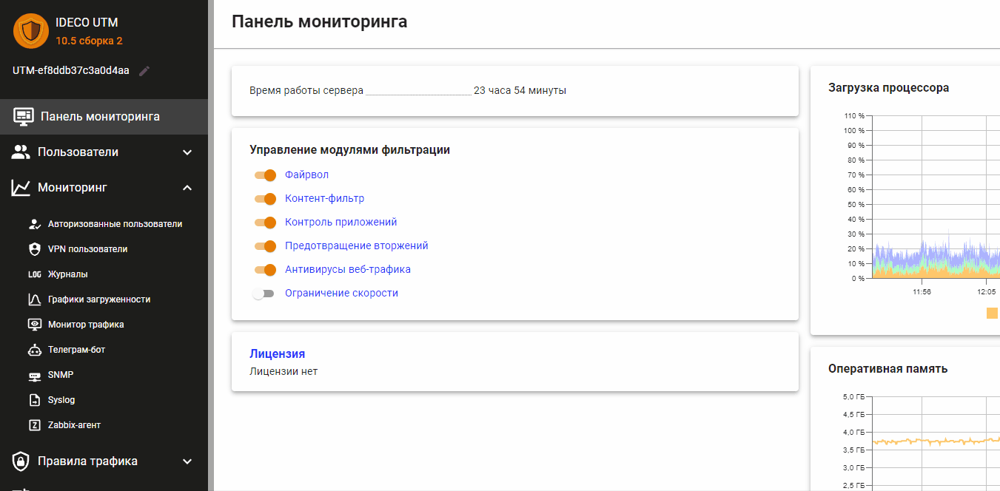

# Статьи по тегам

## 

## ad\_authorization

* \*\*\*\*[**Авторизация пользователей Active Directory**](https://docs.ideco.ru/users/active-directory/active-directory-user-authorization)\*\*\*\*

## additionally

* \*\*\*\*[**Настройка дополнительных параметров работы сервера**](https://docs.ideco.ru/services/additionally)\*\*\*\*

## admins

* \*\*\*\*[**Администраторы**](https://docs.ideco.ru/access-rules/admins)\*\*\*\*
* \*\*\*\*[**Восстановление пароля администратора**](https://docs.ideco.ru/popular-recipes/restore-access-to-ideco-utm)\*\*\*\*
* \*\*\*\*[**Удаленный доступ для управления сервером**](https://docs.ideco.ru/service/remote-access-for-server-management)\*\*\*\*

## antivirus

* \*\*\*\*[**Антивирусы веб-трафика**](https://docs.ideco.ru/access-rules/antivirus)\*\*\*\*

## application\_control

* \*\*\*\*[**Блокировка популярных ресурсов**](https://docs.ideco.ru/popular-recipes/blocking-popular-resources)\*\*\*\*
* \*\*\*\*[**Контроль приложений**](https://docs.ideco.ru/access-rules/application-control)\*\*\*\*

## backup

* \*\*\*\*[**Резервное копирование и восстановление данных**](https://docs.ideco.ru/service/backup)\*\*\*\*

## balancing\_and\_reserving

* \*\*\*\*[**Одновременное подключение к нескольким провайдерам**](https://docs.ideco.ru/connection-to-provider/multiple-simultaneous--connections)\*\*\*\*

## certificate

* \*\*\*\*[**Загрузка своего SSL-сертификата на сервер**](https://docs.ideco.ru/services/certificates/upload-ssl-certificate-to-server)
* \*\*\*\*[**Сертификаты**](https://docs.ideco.ru/services/certificates)\*\*\*\*

## cluster

* [**Кластеризация**](https://docs.ideco.ru/cluster)\*\*\*\*

## content\_filter

* \*\*\*\*[**Блокировка популярных ресурсов**](https://docs.ideco.ru/popular-recipes/blocking-popular-resources)\*\*\*\*
* \*\*\*\*[**Настройка фильтрации HTTPS**](https://docs.ideco.ru/access-rules/content-filter/filtering-https-traffic)\*\*\*\*
* \*\*\*\*[**Настройка контент-фильтра**](https://docs.ideco.ru/access-rules/content-filter/settings#nastroika-kontent-filtra)\*\*\*\*
* \*\*\*\*[**Описание категорий контент-фильтра**](https://docs.ideco.ru/access-rules/content-filter/custom-categories)\*\*\*\*

## device\_detection

* \*\*\*\*[**Обнаружение устройств**](https://docs.ideco.ru/services/device-discovery)\*\*\*\*

## dhcp

* \*\*\*\*[**DHCP**](https://docs.ideco.ru/services/dhcp)\*\*\*\*

## firewall

* \*\*\*\*[**Блокировка популярных ресурсов**](https://docs.ideco.ru/popular-recipes/blocking-popular-resources)\*\*\*\*
* \*\*\*\*[**Портмаппинг \(проброс портов, DNAT\)**](https://docs.ideco.ru/publishing-resources/portmapping)\*\*\*\*
* \*\*\*\*[**Файрвол**](https://docs.ideco.ru/access-rules/firewall)\*\*\*\*

## https\_filtration

* \*\*\*\*[**Настройка фильтрации HTTPS**](https://docs.ideco.ru/access-rules/content-filter/filtering-https-traffic)\*\*\*\*

## ids\_ips

* \*\*\*\*[**Предотвращение вторжений**](https://docs.ideco.ru/access-rules/ips)\*\*\*\*

## install

* \*\*\*\*[**Установка**](https://docs.ideco.ru/installation-process)\*\*\*\*

## ipsec

* \*\*\*\*[**Подключение Kerio Control к Ideco UTM по IPSec**](https://docs.ideco.ru/services/vpn-tunnel-protocols/site-to-site/ipsec-connection-kerio-control-to-utm)\*\*\*\*
* \*\*\*\*[**Подключение pfSense к Ideco UTM по IPsec**](https://docs.ideco.ru/services/vpn-tunnel-protocols/site-to-site/ipsec-connection-pfsense-to-utm)\*\*\*\*
* \*\*\*\*[**Подключение пользователей**](https://docs.ideco.ru/services/vpn-tunnel-protocols/site-to-site/ipsec/connecting-users)\*\*\*\*
* \*\*\*\*[**Подключение устройств**](https://docs.ideco.ru/services/vpn-tunnel-protocols/site-to-site/ipsec/connecting-devices)\*\*\*\*
* \*\*\*\*[**Филиалы и главный офис**](https://docs.ideco.ru/services/vpn-tunnel-protocols/site-to-site/ipsec/branch-office-and-main-office)\*\*\*\*

## license

* \*\*\*\*[**Личный кабинет**](https://docs.ideco.ru/service/lk)\*\*\*\*
* \*\*\*\*[**Регистрация сервера**](https://docs.ideco.ru/service/server-registration)\*\*\*\*
* \*\*\*\*[**Управление лицензиями**](https://docs.ideco.ru/service/license-management)\*\*\*\*

## network\_interface

* \*\*\*\*[**Настройка подключения по PPTP**](https://docs.ideco.ru/connection-to-provider/pptp-connection)
* \*\*\*\*[**Настройка подключения по PPPoE**](https://docs.ideco.ru/connection-to-provider/pppoe-connection)
* \*\*\*\*[**Настройка подключения по Ethernet**](https://docs.ideco.ru/connection-to-provider/ethernet-connection)
* \*\*\*\*[**Подключение по 3G и 4G**](https://docs.ideco.ru/connection-to-provider/3g-4g-connection)
* \*\*\*\*[**Настройка подключения по L2TP**](https://docs.ideco.ru/connection-to-provider/l2tp-connection)
* \*\*\*\*[**Одновременное подключение к нескольким провайдерам**](https://docs.ideco.ru/connection-to-provider/multiple-simultaneous--connections)

## dns

* \*\*\*\*[**DNS**](https://docs.ideco.ru/services/dns)\*\*\*\*

## object

* \*\*\*\*[**Объекты**](https://docs.ideco.ru/access-rules/aliases)\*\*\*\*

## portmapping

* \*\*\*\*[**Портмаппинг \(проброс портов, DNAT\)**](https://docs.ideco.ru/publishing-resources/portmapping)\*\*\*\*

## post

* \*\*\*\*[**Почтовый сервер**](https://docs.ideco.ru/mail)\*\*\*\*
* \*\*\*\*[**Настройка почтового сервера**](https://docs.ideco.ru/mail/mail-server-settings)\*\*\*\*
* \*\*\*\*[**Настройка почтовых клиентов**](https://docs.ideco.ru/mail/configuring-email-clients)\*\*\*\*
* \*\*\*\*[**Настройка почтового релея**](https://docs.ideco.ru/mail/mail-relay-settings)
* \*\*\*\*[**Web-почта**](https://docs.ideco.ru/mail/web-mail)\*\*\*\*
* \*\*\*\*[**Схема фильтрации почтового трафика**](https://docs.ideco.ru/mail/filtering-scheme-for-mail-traffic)\*\*\*\*
* \*\*\*\*[**Переадресация почты**](https://docs.ideco.ru/mail/mail-forwarding)\*\*\*\*
* \*\*\*\*[**Настройка домена у регистратора/держателя зоны**](https://docs.ideco.ru/mail/domain-settings-at-zone-holder)\*\*\*\*

## powershell

* \*\*\*\*[**Инструкция по запуску PowerShell скриптов**](https://docs.ideco.ru/services/vpn-tunnel-protocols/client-to-site/running-powershell-scripts)\*\*\*\*

## proxy

* \*\*\*\*[**Исключить IP-адреса из обработки прокси сервером**](https://docs.ideco.ru/services/proxy/exclusions)\*\*\*\*
* \*\*\*\*[**Настройка программы Proxifier для прямых подключений к прокси серверу**](https://docs.ideco.ru/popular-recipes/configuring-proxifier)\*\*\*\*
* \*\*\*\*[**Настройка прокси с одним интерфейсом**](https://docs.ideco.ru/services/proxy/proxy-setting)\*\*\*\*
* \*\*\*\*[**Подключение к внешним ICAP-сервисам**](https://docs.ideco.ru/services/proxy/icap)
* \*\*\*\*[**Прокси сервер**](https://docs.ideco.ru/services/proxy/proxy-server)

## report

* \*\*\*\*[**Журнал авторизации**](https://docs.ideco.ru/reports/authorization-log)
* \*\*\*\*[**Сайты**](https://docs.ideco.ru/reports/sites)\*\*\*\*

## reverse\_proxy

* \*\*\*\*[**Обратный прокси**](https://docs.ideco.ru/services/reverse-proxy)

## routing

* \*\*\*\*[**Доступ в удаленные сети через роутер в локальной сети**](https://docs.ideco.ru/popular-recipes/access-to-remote-networks-through-a-router-in-the-local-network)\*\*\*\*
* \*\*\*\*[**Маршрутизация**](https://docs.ideco.ru/services/routing)\*\*\*\*
* \*\*\*\*[**Особенности маршрутизации и организации доступа**](https://docs.ideco.ru/services/vpn-tunnel-protocols/client-to-site/features)

## server\_registration

* \*\*\*\*[**Личный кабинет**](https://docs.ideco.ru/service/lk)\*\*\*\*
* \*\*\*\*[**Регистрация сервера**](https://docs.ideco.ru/service/server-registration)\*\*\*\*

## server\_update

* [**Обновление сервера** ](https://docs.ideco.ru/service/server-update)\*\*\*\*

## snmp

* \*\*\*\*[**SNMP**](https://docs.ideco.ru/monitor/snmp)\*\*\*\*

## speed\_limit

* \*\*\*\*[**Ограничение скорости**](https://docs.ideco.ru/access-rules/shaper)\*\*\*\*

## support

* \*\*\*\*[**Поддержка устаревших алгоритмов шифрования**](https://docs.ideco.ru/popular-recipes/legacy-encryption-support)\*\*\*\*
* \*\*\*\*[**Режим удаленного помощника**](https://docs.ideco.ru/service/remote-assistant)
* \*\*\*\*[**Удаленный доступ для управления сервером**](https://docs.ideco.ru/service/remote-access-for-server-management)\*\*\*\*

## syslog

* \*\*\*\*[**Пересылка системных сообщений**](https://docs.ideco.ru/monitor/syslog)

## telegram-bot

* \*\*\*\*[**Telegram-бот**](https://docs.ideco.ru/monitor/telegram-bot)\*\*\*\*

## terminal

* \*\*\*\*[**Терминал**](https://docs.ideco.ru/terminal)\*\*\*\*

## usb

* \*\*\*\*[**Создание загрузочного USB flash диска**](https://docs.ideco.ru/usb)\*\*\*\*

## user\_authorization

* \*\*\*\*[**L2TP IPSec**](https://docs.ideco.ru/services/vpn-tunnel-protocols/client-to-site/l2tp-ipsec)
* \*\*\*\*[**SSTP**](https://docs.ideco.ru/services/vpn-tunnel-protocols/client-to-site/sstp)\*\*\*\*
* \*\*\*\*[**IPSec IKEv2**](https://docs.ideco.ru/services/vpn-tunnel-protocols/client-to-site/ipsec-ikev2)\*\*\*\*
* \*\*\*\*[**Авторизация пользователей Active Directory**](https://docs.ideco.ru/users/active-directory/active-directory-user-authorization)
* \*\*\*\*[**Личный кабинет**](https://docs.ideco.ru/service/lk)
* \*\*\*\*[**Авторизация пользователей**](https://docs.ideco.ru/users/authorization)

## user\_management

* \*\*\*\*[**Wi-Fi-сети**](https://docs.ideco.ru/users/wifi-network)\*\*\*\*
* \*\*\*\*[**Дерево пользователей**](https://docs.ideco.ru/users/user-tree)
* \*\*\*\*[**Монитор трафика**](https://docs.ideco.ru/monitor/traffic)\*\*\*\*
* \*\*\*\*[**Настройка пользователей**](https://docs.ideco.ru/users/customization-of-users)
* \*\*\*\*[**Управление пользователями**](https://docs.ideco.ru/users/user-management)

## user\_quota

* \*\*\*\*[**Пользовательские квоты**](https://docs.ideco.ru/access-rules/quotas)\*\*\*\*

## vpn\_authorization

* \*\*\*\*[**Ideco VPN**](https://docs.ideco.ru/ideco-vpn)
* \*\*\*\*[**IPSec IKEv2**](https://docs.ideco.ru/services/vpn-tunnel-protocols/client-to-site/ipsec-ikev2)\*\*\*\*
* \*\*\*\*[**L2TP IPSec**](https://docs.ideco.ru/services/vpn-tunnel-protocols/client-to-site/l2tp-ipsec)
* [**SSTP**](https://docs.ideco.ru/services/vpn-tunnel-protocols/client-to-site/sstp)\*\*\*\*

## zabbix

* \*\*\*\*[**Интеграция с Zabbix**](https://docs.ideco.ru/monitor/zabbix)

