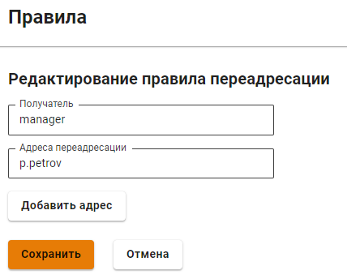
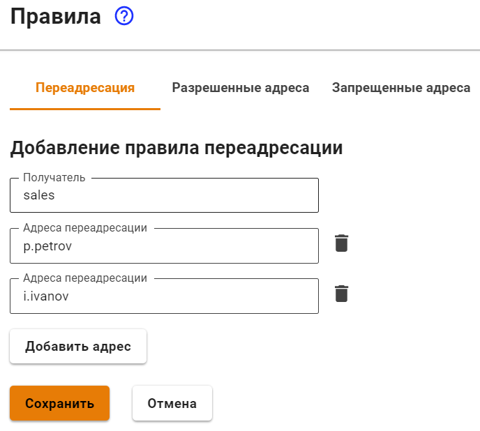
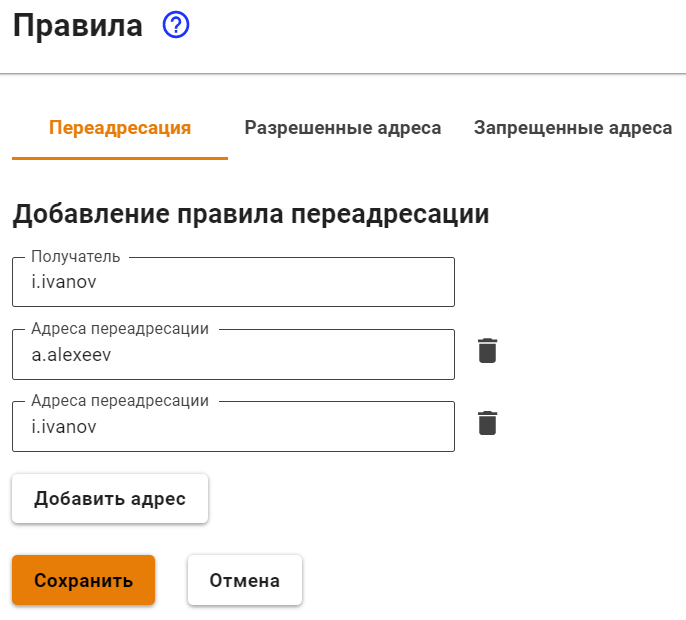
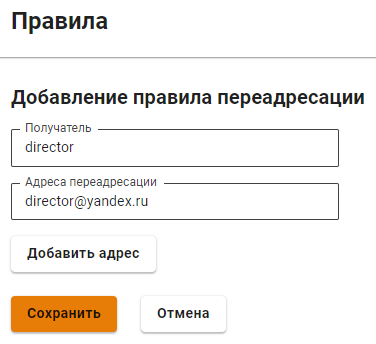
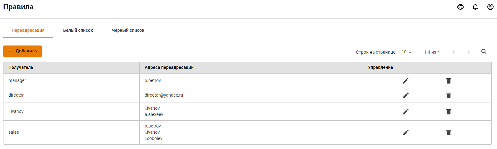

# Переадресация почты

Для того чтобы создавать и редактировать почтовые правила переадресации \(алиасы\) перейдите в раздел **Почтовый релей -&gt; Правила -&gt; Переадресация**.

Почтовые алиасы отличаются от почтовых ящиков тем, что не требуют логинов и паролей. Они закрепляются за ящиком и служат его копией с другим именем, или, в случае назначения алиаса нескольким почтовым ящикам, можно сказать что алиас - это группа почтовых ящиков или группа рассылки. Поступающая на алиас почта автоматически пересылается на все реальные почтовые ящики, связанные с этим алиасом. Часть адреса `@yourdomain.com` можно не указывать при создании правил, если ящик расположен на почтовом сервере Ideco UTM. Если перенаправление делается на какой-либо ящик в другом домене в интернете, то ящик, прописываемый в поле **Получатель**, должен реально существовать.

## Примеры:

* Создать алиас `manager@yourdomain.ru` для ящика менеджера вашей компании для связи с клиентами и партнерами, у которого реальный почтовый ящик имеет имя `p.petrov@yourmaildomain.ru`:

* Создать корпоративный алиас для отдела продаж `sales@yourmaildomail.ru`, чтобы почта пересылалась на всех сотрудников этого отдела:

* Создать временный алиас для переадресации почты сотрудника, который находится в отпуске `i.ivanov@yourmaildomail.ru` на ящик его коллеги `a.alexeev@yourmaildomain.ru` с сохранением почты на ящике `i.ivanov@yourmaildomail.ru`:

* Создать алиас `director@yourmaildomain.ru`, который будет перенаправлять почту на реальный ящик `director@yandex.ru`:

После создания всех правил у нас получился вот такой список: 

Опишем, как будет работать почта при таких правилах переадресации:

Письма, приходящие на несуществующий ящик \(алиас\) `manager@yourdomain.ru`, будут попадать на реальный `p.petrov@yourmaildomain.ru`. Также есть алиас для отдела продаж `sales@yourmaildomail.ru`, который, по сути, служит алиасом для рассылки почты и сам писем не хранит. Это удобно, если есть информация для отдела продаж, которую надо распространить на каждого сотрудника. Всё то же самое можно сделать, если просто указать в письме всех получателей, но использовать алиас намного удобнее. Также сотрудник с почтой `i.ivanov@yourmaildomail.ru` сейчас находится в отпуске и вся приходящая к нему почта попадает на его ящик и дублируется на `a.alexeev@yourmaildomain.ru`. Последнее правило позволяет директору получать почту не на корпоративный ящик, а на его личную почту на Яндексе.


Алиас не является действительным почтовым ящиком. К нему нельзя подключиться почтовым клиентом, используя логин и пароль, как в обычном почтовом аккаунте. Таким образом, создание алиасов не увеличивает максимально возможное количество реальных почтовых аккаунтов на Ideco UTM, которое равно количеству пользовательских аккаунтов в купленной вами лицензии. 


