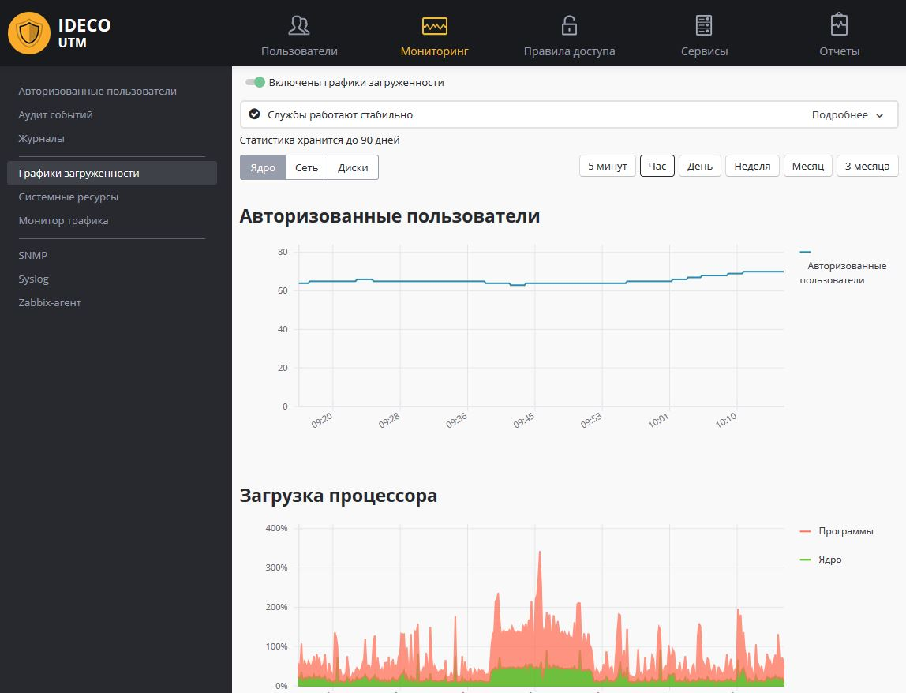

# Мониторинг

В разделе **Мониторинг** веб-интерфейса Ideco UTM можно получить данные об авторизованных на сервере пользователях, загрузки процессора и интерфейсов, а также посмотреть данные о трафике в режиме реального времени.

Интеграция с внешними системами мониторинга и анализа системных логов, описана в данном разделе документации.

