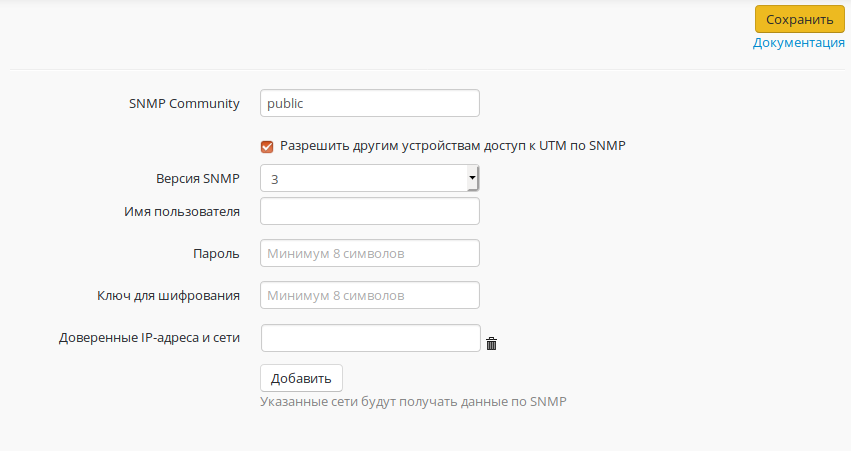

# SNMP

Данный модуль позволяет осуществлять мониторинг работы Ideco UTM по протоколу SNMP версий 1/2c/3.

Для доступа настройте имя пользователя, пароль и ключ шифрования.

Также можно внести IP-адреса и сети в доверенные, чтобы они получили доступ к данным с Ideco UTM.

