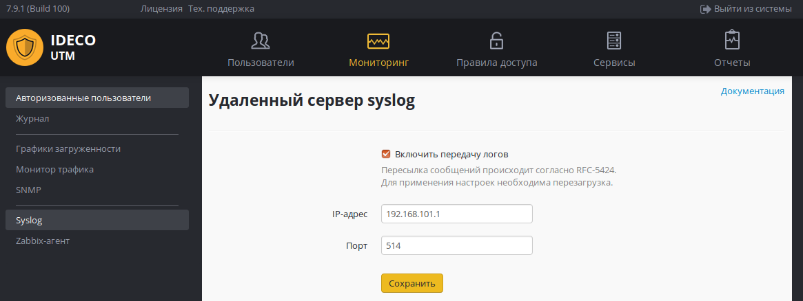

# Пересылка системных сообщений

Включение этого модуля даёт возможность передавать все системные сообщения (syslog) Ideco UTM в сторонние коллекторы (Syslog Collector) или в SIEM-системы.

В качестве коллектора можно указывать только IP-адрес из приватных диапазонов.

Для применения настроек необходимо выполнить перезагрузку.


Передача системных сообщений происходит согласно RFC-5424 (транспорт UDP).


