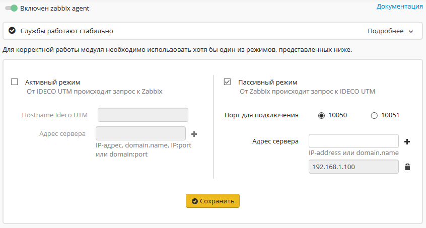

# Интеграция с Zabbix

Интеграция с системой мониторинга Zabbix возможна в двух режимах.

**Активный режим** - соединение с Zabbix-сервером происходит со стороны Ideco UTM.\
Для настройки этого режима заполните поля:

* Hostname Ideco UTM - имя сервера Ideco UTM, как оно будет отображаться на сервере мониторинга
* Адрес сервера: IP-адрес, доменное имя, либо IP-адрес:порт, доменное имя:порт в случаях если используется на стандартный для Zabbix входящий порт. Обязательно нажмите "+" при добавлении адреса.

**Пассивный режим** - подключение происходит со стороны Zabbix-сервера.\
Для настройки этого режима заполните поля:

* Порт для подключения (10050 или 10051)
* Адрес сервера - IP-адрес или доменное имя Zabbix-серверов. Обязательно нажмите "+" при добавлении адреса.

В обоих случаях интеграции Zabix-сервер должен находится внутри локальной сети Ideco UTM. Подключение мониторинга возможно только к локальным интерфейсам.

В качестве шаблонов данных можно использовать стандартные шаблоны для Linux-серверов.
