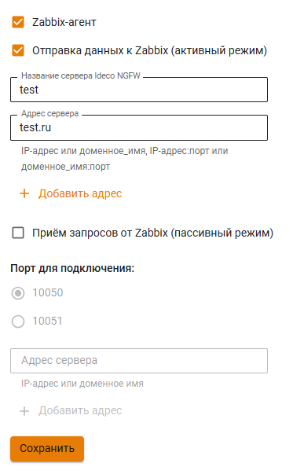

# Интеграция с Zabbix

Интеграция с системой мониторинга Zabbix возможна в двух режимах:

1. **Активный режим** - соединение с Zabbix-сервером происходит со стороны Ideco UTM. Для настройки этого режима заполните следующие поля:
   * **Имя сервера Ideco UTM** - имя, которое будет отображаться на сервере мониторинга.
   * **Адрес сервера** - IP-адрес, доменное имя, либо IP-адрес:порт, доменное имя:порт в случаях, если используется не стандартный для Zabbix входящий порт. Для добавления еще одного адреса нажмите на кнопку **Добавить адрес**.
2. **Пассивный режим** - подключение происходит со стороны Zabbix-сервера. Для настройки этого режима заполните следующие поля:
   * **Порт для подключения** - выберите 10050 или 10051 порт.
   * **Адрес сервера** - IP-адрес или доменное имя Zabbix-серверов. Для добавления еще одного адреса нажмите на кнопку **Добавить адрес**.

В обоих случаях интеграции Zabix-сервер должен находиться внутри локальной сети Ideco UTM. Подключение мониторинга возможно только к локальным интерфейсам.

В качестве шаблонов данных можно использовать стандартные шаблоны для Linux-серверов.

