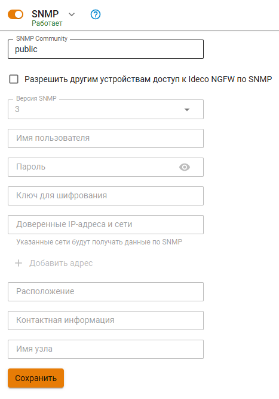

# SNMP

Данный модуль позволяет осуществлять мониторинг работы Ideco UTM по протоколу SNMP версий 1/2c и 3. Для этого необходимо настроить имя пользователя, пароль и ключ шифрования.

Также можно внести IP-адреса и сети в доверенные, чтобы они получили доступ к данным с Ideco UTM. Поля **Расположение**, **Контактная информация** и **Имя узла** носят информационный характер и яввляются необязательными.

