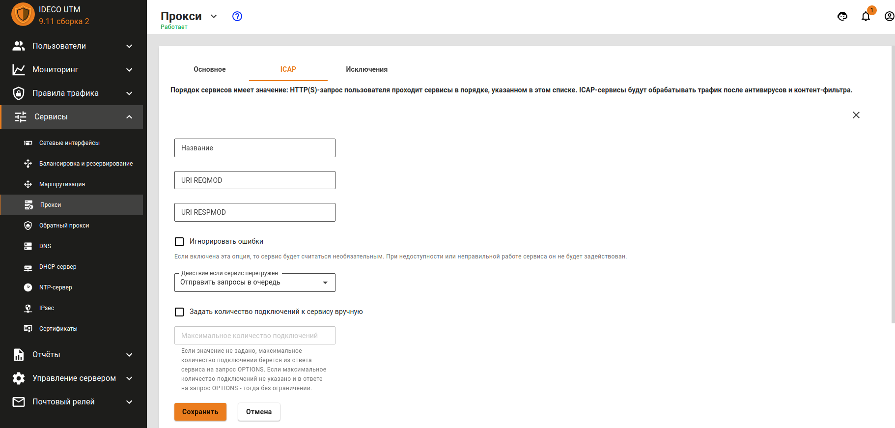

# Подключение-к-внешним-ICAP-сервисам

Существует возможность отправки HTTP\(S\)-трафика для анализа сторонним серверам по протоколу ICAP. При этом трафик этим серверам \(в роли которых могут быть DLP-системы, антивирусы, веб-фильтры\) передается в расшифрованном виде.

Настроить подключение к серверам по ICAP можно в разделе **Сервисы -&gt; Прокси** на вкладке **ICAP**.

Возможно установление подключения к нескольким ICAP-сервисам одновременно.

