# Подключение-устройств

## Подключение устройств

Данный раздел предназначен для описания вариантов подключения различных роутеров \(Mikrotik, Zyxel Keenetic и др.\) к Ideco UTM для организации site-to-site VPN с использованием протокола **IPsec IKEv2**.

Устройства, которые не описаны в данной инструкции, как правило, можно подключить с использованием аналогичных настроек.

> При объединении сетей с помощью VPN, локальные сети в разных офисах не должны пересекаться. {.is-info}

**При использовании нашего конфигуратора скриптов настроек MikroTik \(**[https://mikrotik.ideco.ru/](https://mikrotik.ideco.ru/)**\) есть несколько особенностей:**

* При подключении нескольких устройств MikroTik к одному Ideco UTM по PSK, нужно указывать разные **Ключи идентификации \(Key id\)** для каждого устройства.
* При подключении нескольких устройств MikroTik к одному Ideco UTM по сертификатам, нужно указывать разные **Имена сервера** \(Common Name\) для каждого устройства.

  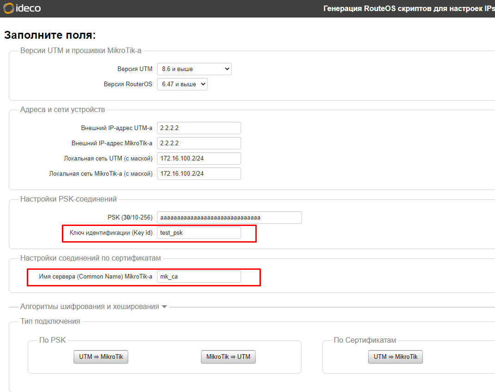

Список допустимых алгоритмов шифрования и хеширования, используемых в Ideco UTM:

* aes128 \(aes-128-cbc\);
* aes256 \(aes-256-cbc\);
* sha256;
* sha384;
* modp1536 \(DH группа: 5\);
* modp2048 \(DH группа: 14\);
* modp4096 \(DH группа: 16\).

## Подключение Ideco UTM к MikroTik с использованием PSK

При наличии на устройстве MikroTik «белого» IP-адреса, выполните действия ниже, чтобы настроить подключение Ideco UTM к MikroTik.

### 1 Шаг. Настройка Ideco UTM

1. В Ideco UTM откройте вкладку **Сервисы -&gt; IPSec -&gt; Устройства**, нажмите на значок  и заполните следующие поля:
   * **Название подключения** - укажите произвольное имя для подключения. Значение не должно быть длиннее 42 символов.
   * **Тип соединения** - выберите **Исходящее**, поскольку осуществляется подключение от UTM. 
   * **Адрес удаленного устройства** - укажите внешний IP-адрес устройства MikroTik.
   * **Тип аутентификации** - выберите тип **PSK**. 
   * **PSK** - будет сгенерирован случайный PSK-ключ. Он потребуется, чтобы настроить подключение в MikroTik.
   * **Ключ идентификации** - введенный вами ключ будет использоваться для идентификации исходящего подключения.
   * **Домашние локальные сети** - перечислите все **локальные сети UTM**, которые будут доступны в IPSec-подключении, т.е. будут видны противоположной стороне.
   * **Удаленные локальные сети** - перечислите все **локальные сети MikroTik**, которые будут доступны в IPSec-подключении, т.е. будут видны противоположной стороне.

     
2. После заполнения всех полей нажмите кнопку **Добавить подключение**. В списке подключений появится ваше подключение.

   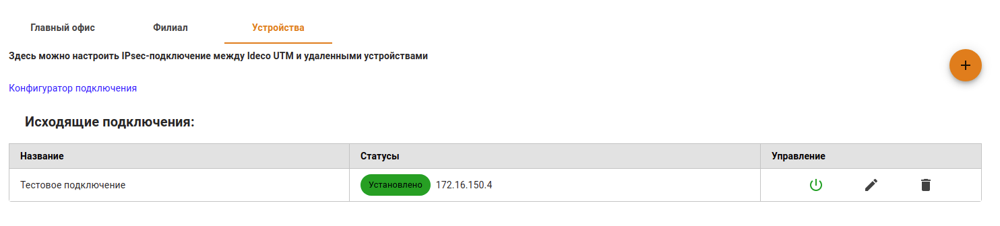

### 2 Шаг. Настройка Mikrotik

Настройку устройства MikroTik можно осуществить несколькими способами - через GUI, через консоль устройства или, воспользовавшись нашими конфигурационными скриптами, сгенерированными по адресу [https://mikrotik.ideco.ru/](https://mikrotik.ideco.ru/).

После генерации скрипта необходимо открыть раздел **System -&gt; Scripts**, создать скрипт, вставить в него код, сгенерированный конфигуратором и запустить.

После того как скрипт закончит свою работу, никаких дополнительных действий по настройке не требуется.

## Подключение MikroTik к Ideco UTM с использованием PSK

При наличии на Ideco UTM «белого» IP-адреса, выполните действия ниже, чтобы настроить подключение устройства MikroTik к Ideco UTM.

### 1 Шаг. Настройка MikroTik

Настройку устройства MikroTik можно осуществить несколькими способами - через GUI, через консоль устройства или, воспользовавшись нашими конфигурационными скриптами, сгенерированными по адресу [https://mikrotik.ideco.ru/](https://mikrotik.ideco.ru/).

После генерации скрипта необходимо открыть раздел **System -&gt; Scripts**, создать скрипт, вставить в него код, сгенерированный конфигуратором и запустить.

После того как скрипт закончит свою работу, никаких дополнительных действий по настройке не требуется.

### 2 Шаг. Настройка Ideco UTM

1. В Ideco UTM откройте вкладку **Сервисы -&gt; IPSec -&gt; Устройства**, нажмите на значок  и заполните следующие поля:
   * **Название подключения** - укажите произвольное имя для подключения. Значение не должно быть длиннее 42 символов.
   * **Тип соединения** - выберите **Входящее**, поскольку осуществляется подключение к UTM.
   * **Тип аутентификации** - укажите тип **PSK**.
   * **PSK** - вставьте PSK-ключ, полученный от MikroTik.
   * **Ключ идентификации** - вставьте идентификатор MikroTik \(параметр Key ID в `/ip ipsec peers`\).
   * **Домашние локальные сети** - перечислите все **локальные сети UTM**, которые будут доступны в IPSec-подключении, т.е. будут видны противоположной стороне.
   * **Удаленные локальные сети** - перечислите все локальные сети MikroTik, которые будут доступны в IPSec-подключении, т.е. будут видны противоположной стороне.

     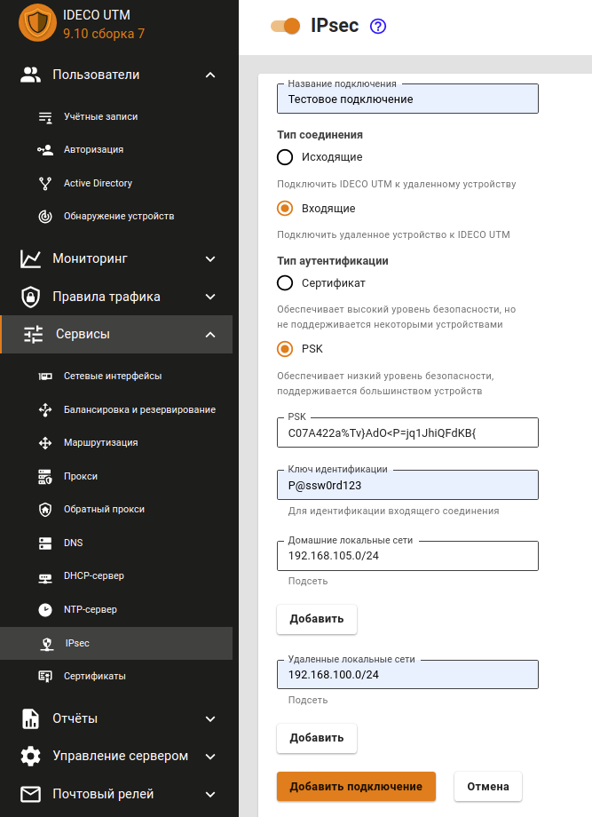
2. После заполнения всех полей нажмите кнопку **Добавить подключение**. В списке подключений появится ваше подключение.

   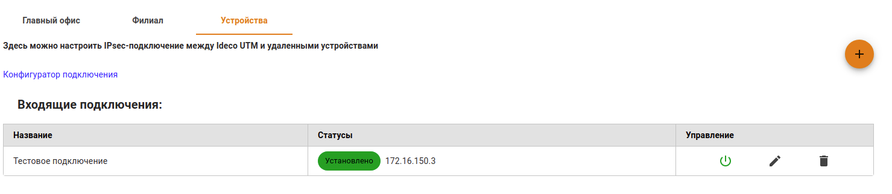

## Подключение Ideco UTM к MikroTik с использованием сертификатов

Подключение по сертификатам используется, так как является более безопасным, чем подключение по PSK, либо в случаях, когда устройство не поддерживает PSK.

### 1 Шаг. Настройка Ideco UTM

1. В Ideco UTM откройте вкладку **Сервисы -&gt; IPSec -&gt; Устройства**, нажмите на значок  и заполните следующие поля: 
   * **Название подключения** - укажите произвольное имя для подключения. Значение не должно быть длиннее 42 символов.
   * **Тип подключения** - выберите **Исходящее**, поскольку осуществляется подключение от UTM.
   * **Тип аутентификации** - укажите тип **Сертификат**.
   * **Адрес удаленного устройства** - укажите внешний IP-адрес MikroTik.
   * **Запрос на подпись сертификата** - будет сгенерирован **запрос, который необходимо выслать для подписи на MikroTik**.

     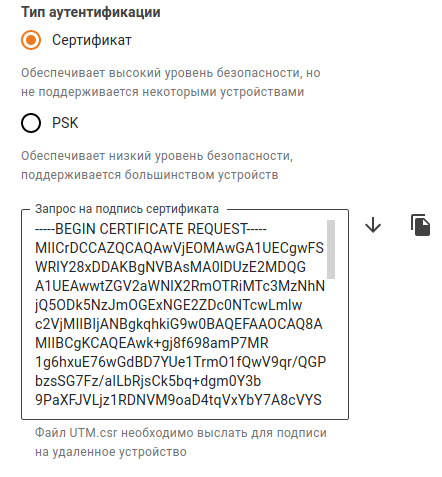
2. После того как запрос будет подписан, необходимо будет продолжить настройку подключения в Ideco UTM. 

   > **Не закрывайте вкладку с настройками!** {.is-warning}

### 2 Шаг. Настройка MikroTik

На данном этапе следует настроить MikroTik, чтобы продолжить настройку UTM.

Файл **UTM.csr**, полученный из Ideco UTM, необходимо загрузить в файловое хранилище MikroTik. Для этого необходимо открыть раздел **File**, нажать кнопку **Browse**, выбрать файл и загрузить его.

Настройку MikroTik можно осуществить несколькими способами - через GUI, через консоль устройства или, воспользовавшись нашими конфигурационными скриптами, сгенерированными по адресу [https://mikrotik.ideco.ru/](https://mikrotik.ideco.ru/).

После генерации скрипта необходимо открыть раздел **System -&gt; Scripts**, создать скрипт, вставить в него код, сгенерированный конфигуратором и запустить.

После того как скрипт закончит свою работу, в файловой системе MikroTik появятся два файла, которые необходимо скачать, чтобы впоследствии загрузить на UTM.

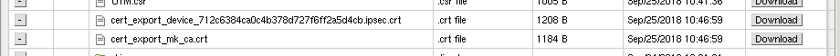

Файл вида `cert_export_device_<случайный набор символов>.ipsec.crt` - **это подписанный сертификат UTM**. Файл вида `cert_export_mk_ca.crt` - **это корневой сертификат MikroTik.**

На этом настройку MikroTik можно считать завершенной.

### 3 Шаг. Завершение настройки Ideco UTM

Перейдите обратно на Ideco UTM во вкладку с настройками подключения устройства и продолжите заполнять следующие поля:

* **Подписанный сертификат UTM** - загрузите подписанный в MikroTik сертификат UTM.
* **Корневой сертификат удаленного устройства** - загрузите корневой сертификат MikroTik.
* **Домашние локальные сети** - перечислите все **локальные сети UTM**, которые будут доступны в IPSec-подключении, т.е. будут видны противоположной стороне.
* **Удаленные локальные сети** - перечислите все **локальные сети MikroTik**, которые будут доступны в IPSec-подключении, т.е. будут видны противоположной стороне.

  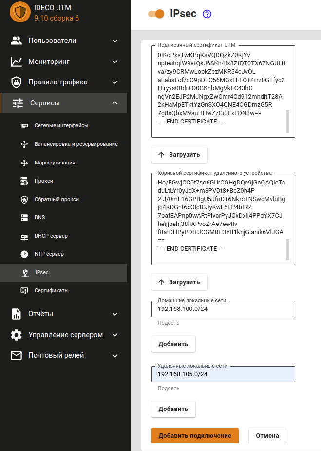

После заполнения полей нажмите кнопку **Добавить подключение**. В списке подключений появится ваше подключение.

## Подключение MikroTik к Ideco UTM по сертификатам

Подключение по сертификатам используется, так как является более безопасным, чем подключение по PSK, либо в случаях, когда устройство не поддерживает PSK.

### 1 Шаг. Настройка MikroTik

Настройку MikroTik можно осуществить несколькими способами - через GUI, через консоль устройства или, воспользовавшись нашими конфигурационными скриптами, сгенерированными по адресу [https://mikrotik.ideco.ru/](https://mikrotik.ideco.ru/) .

После генерации скрипта необходимо открыть раздел **System -&gt; Scripts**, создать скрипт, вставить в него код, сгенерированный конфигуратором и запустить его.

Поскольку скриптов конфигуратором генерируется два, то и в MikroTik также нужно создать два скрипта.

Перед настройкой необходимо запустить первый скрипт. После того как он завершит работу, в файловом хранилище MikroTik появятся два файла, которые необходимо скачать, поскольку они требуются для дальнейшей настройки.:

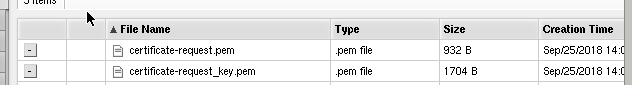

Файл `certificate-request.pem` - **запрос на подпись сертификата**. Файл `certificate-request_key.pem` - **приватный ключ**.

Далее потребуется заполнить поле **Запрос на подпись сертификата** в Ideco UTM, поэтому перейдем к его настройке.

### 2 Шаг. Настройка Ideco UTM

1. В Ideco UTM откройте вкладку **Сервисы -&gt; IPSec -&gt; Устройства**, нажмите на значок  и заполните следующие поля:
   * **Название подключения** - укажите произвольное имя для подключения. Значение не должно быть длиннее 42 символов.
   * **Тип подключения** - выберите **Входящее**, поскольку осуществляется подключение к UTM.
   * **Тип аутентификации** - укажите тип **Сертификат**.
   * **Запрос на подпись сертификата** - загрузите запрос на подпись, **полученный от MikroTik**.
   * **Домашние локальные сети** необходимо перечислить все локальные сети UTM, которые будут доступны в IPSec-подключении, т.е. будут видны противоположной стороне.

     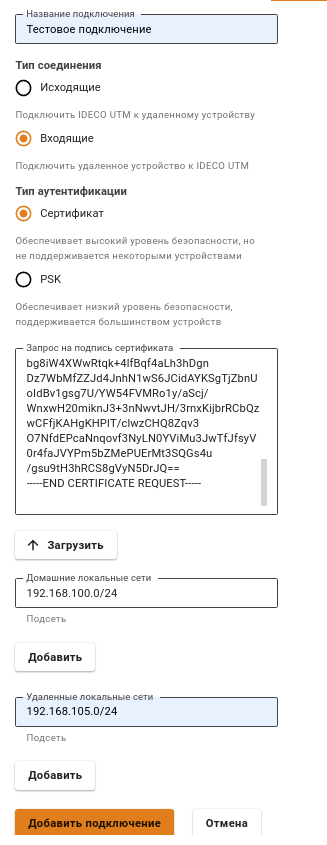
2. После настроек нажмите кнопку **Добавить подключение**. В списке подключений появится ваше подключение. Нажмите на кнопку редактирования соединения, чтобы продолжить настройку.

   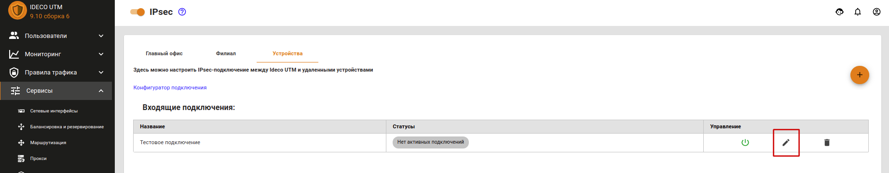

3. Появится область редактирования настроек подключения. Необходимо скачать файлы, которые находятся в полях **Корневой сертификат UTM** и **Подписанный сертификат устройства**, для их последующего использования в MikroTik.

   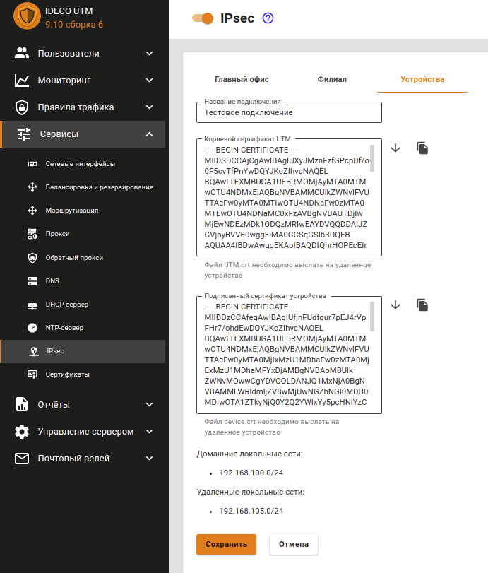

### 3 Шаг. Завершение настройки MikroTik

1. Откройте в текстовом редакторе файл `device.crt`, полученный от UTM. В конец файла необходимо вставить содержимое файла `certificate-request_key.pem`, полученного от MikroTik и сохранить изменения. В результате файл device.crt должен иметь такую структуру: 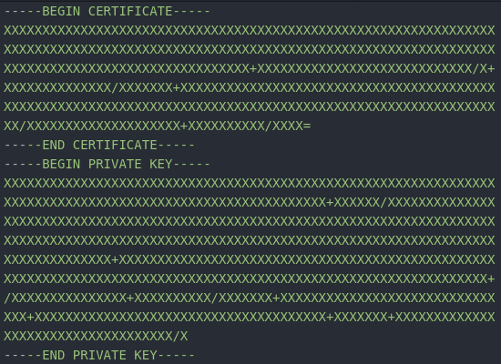 Т.е. блок с сертификатом - сверху, блок с приватным ключом - снизу.
2. Далее, в файловую систему MikroTik необходимо загрузить файлы `utm.crt` и `device.crt (измененный)`, полученные из Ideco UTM. Для этого откройте раздел **File**, нажмите кнопку **Browse**, выберите один из файлов и загрузите его. Аналогично загрузите второй файл.
3. Перейдите в раздел со скриптами **System -&gt; Scripts** и запустите второй скрипт настройки. После того как скрипт закончит свою работу, никаких дополнительных действий по настройке осуществлять не требуется. На этом настройку IPSec-соединения можно считать завершенной.

## Проблемы при повторной активации входящего подключения к Ideco UTM

Если, после использования данного подключения, вы его отключили, например, за ненадобностью, и, при попытке повторного включения через какое-то время, соединение не установилось, то скорее всего удаленное устройство попало в fail2ban \(инструмент, который отслеживает в log-файлах попытки обратиться к сервисам, и если находит повторяющиеся неудачные попытки авторизации с одного и того же IP-адреса или хоста, блокирует дальнейшие попытки\).

Для того чтобы соединение установилось, необходимо сбросить блокировки по IP на Ideco UTM. О том как это сделать, читайте в статье [Защита от bruteforce атак](https://github.com/ideco-team/docsUTM/tree/c6fdc8e9437797db7478b8404ef059e57173d3af/Настройка/Правила-доступа/Защита-от-bruteforce-атак/README.md).

