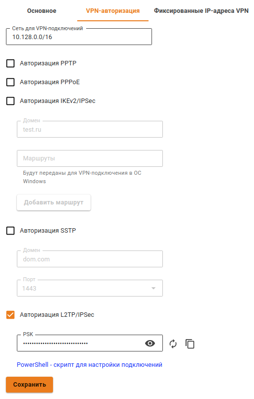
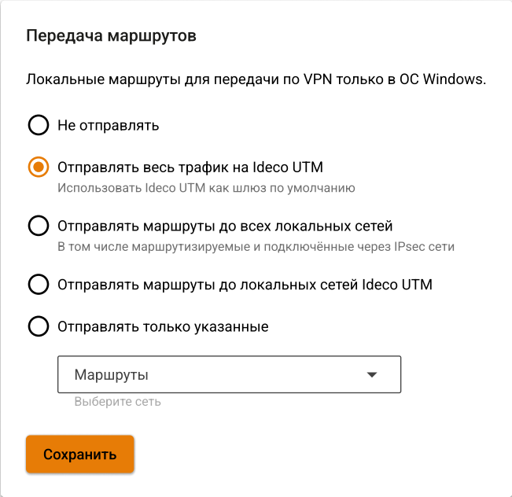
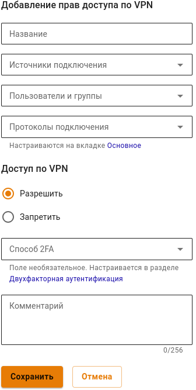
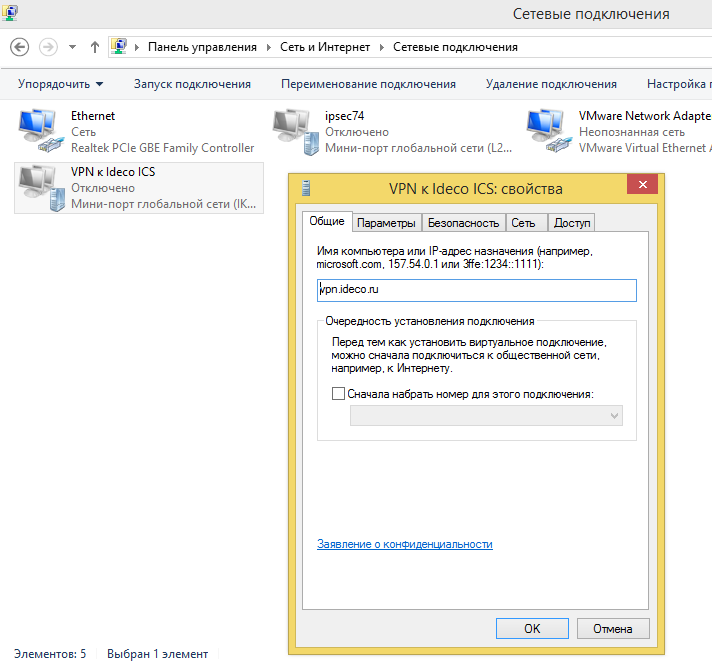
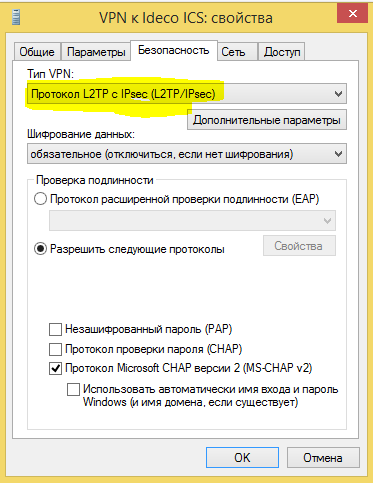

# L2TP-IPSec

> По возможности не используйте этот тип подключения. Этот способ подключения может работать нестабильно, обладает огромной избыточностью, низкой производительностью и поддерживает не самое сильное шифрование. Вместо этого рекомендуется \[IPSec-IKEv2\]\(/Настройка/Сервисы/Туннельные-протоколы-VPN/Подключение-пользователей-\(client-to-site\)/IPSec-IKEv2\). Все современные ОС поддерживают IKEv2, либо для них есть приложения. {.is-warning}

## Настройка глобальных параметров Ideco UTM

1. Перейдите в раздел **Пользователи -&gt; Авторизация -&gt; VPN-авторизация**.
2. Включите флажок **Авторизация L2TP/IPSec**.
3. Укажите секретную фразу \(PSK ключ\).
4. Нажмите на кнопку **Сохранить**.

   

## Настройка пользователей в Ideco UTM

Разрешите пользователю подключения по VPN из сети интернет, включив в настройках пользователя \(**Пользователи -&gt; Нужный пользователь -&gt; вкладка Основное**\) флажок **Разрешить удаленный доступ через VPN**.

## Общие настойки подключающегося устройства

При настройке подключения по VPN из сети Интернет, в свойствах VPN-подключения нужно указывать:

* **Тип VPN** - L2TP/IPsec;
* Внешний адрес Ideco UTM в качестве VPN-сервера;
* Логин и пароль созданного пользователя;
* **PSK \(pre-shared key\)** - ключ, указанный на странице **Сервисы -&gt; Авторизация пользователей -&gt; VPN-авторизация**;
* Включить шифрование соединения.

После подключения вы будете авторизованы на сервере Ideco UTM от имени созданного пользователя и вам будут доступны сетевые хосты в локальной сети предприятия.

> Если вы не хотите, чтобы после подключения по VPN интернет-трафик до внешних ресурсов ходил через Ideco UTM, то в свойствах VPN-подключения **Сеть/Протокол интернета TCP/IP версии 4/Дополнительно** уберите галочку **Использовать основной шлюз в удаленной сети**. Далее чтобы получить доступ к компьютерам за Ideco UTM, вручную пропишите маршруты. {.is-info}

### Настройка подключения к серверу в Windows 7, 8, 10.

Вы можете создать скрипт для подключения пользователей, тогда достаточно будет запустить полученный файл - все настройки создадутся автоматически.

Для настройки подключения вручную выполните следующие действия: 1. Зайдите в **Центр управления сетями и общим доступом -&gt; Создание и настройка нового подключения или сети**. 1. Выберите пункт **Подключение к рабочему месту**.  1. Пункт **Использовать мое подключение к Интернету \(VPN\)**.  1. Введите адрес сервера \(доменное имя или внешний IP-адрес Ideco UTM\) и название подключения.  1. Перейдите в свойства данного подключения.  1. На вкладке **Безопасность** установите следующие параметры:  1. Нажмите кнопку **Дополнительные параметры**, и введите общий ключ \(PSK-ключ\). 

> Если не удалось подключиться, рекомендуем выполнить следующие действия: 1. Откройте редактор реестра. 2. Перейти в HKEY\_LOCAL\_MACHINE\SYSTEM\CurrentControlSet\Services\PolicyAgent и создать DWORD-параметр с именем AssumeUDPEncapsulationContextOnSendRule и значением 2. 3. Перезагрузить Windows. {.is-info}{.is-info} {.is-info}

### Возможные неполадки

* Неправильно указан логин или пароль пользователя. Часто при повторном соединении предлагается указать домен. Старайтесь создавать цифро-буквенные пароли, желательно на латинице для ваших учетных записей. Если есть сомнения в этом пункте, то временно установите логин и пароль пользователю «user» и «123456».
* Если подключение осуществляется с ОС Windows, то для того, чтобы пакеты пошли через него надо убедиться, что в настройках этого подключения стоит чекбокс **Использовать основной шлюз в удалённой сети** в разделе **Свойства подключения VPN -&gt; Вкладка «Сеть» -&gt; Свойства опции «Протокол Интернета версии 4 \(TCP/IPv4\)» -&gt; Дополнительно**. Если же маршрутизировать все пакеты в этот интерфейс не обязательно, то маршрут надо писать вручную.
* Подключение происходит через DNAT, т.е. внешний интерфейс Ideco UTM не имеет «белого» IP-адреса, а необходимые для работы порты \(500 и 4500\) «проброшены» на внешний интерфейс устройства, расположенного перед Ideco UTM и имеющего «белый» IP-адрес. В данном случае VPN-подключение либо вообще не будет устанавливаться, либо будут периодические обрывы. Решение  - исключить устройство перед Ideco UTM и указать на внешнем интерфейсе Ideco UTM «белый» IP-адрес, к которому в итоге и будут осуществляться L2TP/IPsec-подключения. Либо используйте протокол SSTP, потму что его проще опубликовать с помощью проброса портов.

> Убедитесь, что локальная сеть \(или адрес на сетевой карте\) на удалённой машине не пересекается с локальной сетью вашей организации, а если пересекается, то доступа к сети вашей организации не будет \(трафик по таблице маршрутизации пойдёт в физический интерфейс, а не в VPN\). Адресацию необходимо менять. {.is-warning}

## Скрипт автоматического создания пользовательских подключений по L2TP/IPSec

Вы можете запустить следующий скрипт PowerShell для автоматического создания подключения на компьютерах пользователей с Windows 8.1 и 10. Для этого скачайте готовые скрипты подключения вашего сервера из раздела **Пользователи -&gt; Авторизация -&gt; VPN-авторизация**.

Подключение будет создано со следующими параметрами:

1. Протокол **L2TP/IPsec** с использованием PSK-ключа.
2. Параметр **Использовать основной шлюз в удаленной сети** выключен.

   Доступ к локальным сетям того же класса, что были получены для VPN-подключения по умолчанию в Windows 7 и 10 будет осуществляться через VPN-подключение, поэтому дополнительных маршрутов создавать не нужно \(если вы не используете разные классы сетей в локальной сети офиса\).

Создайте файл с именем **ideco\_utm\_l2tp.ps1** \(в Блокноте или редакторе Windows PowerShell ISE\) и скопируйте в него следующий текст:

```text
### Ideco UTM L2TP/IPsec connection ###
param([switch]$Elevated)
$currentUser = New-Object Security.Principal.WindowsPrincipal $([Security.Principal.WindowsIdentity]::GetCurrent())
if (!$currentUser.IsInRole([Security.Principal.WindowsBuiltinRole]::Administrator))  {
  if (!$elevated) {
    Start-Process `
            powershell.exe `
            -Verb RunAs `
            -ArgumentList ('-noprofile -noexit -file "{0}" -elevated' -f ( $myinvocation.MyCommand.Definition ))
  }
  exit
}
Enable-NetFirewallRule -Group "@FirewallAPI.dll,-28502"
Add-VpnConnection `
    -Force `
    -Name "Ideco UTM L2TP VPN" `
    -TunnelType L2TP `
    -ServerAddress my.domain.com `
    -L2tpPsk "XXXXXXXXXXXXXXXXXXXXXXXXXXXXXXXX" `
    -EncryptionLevel "Required" `
    -AuthenticationMethod MSChapV2 `
    -SplitTunneling $False `
    -DnsSuffix activedirectory.domain `
    -RememberCredential
```

**Поменяйте в нем необходимые параметры на соответствующие вашим настройкам:**

* **Ideco UTM L2TP VPN** - имя подключения в системе \(может быть произвольным\).
* **my.domain.com** - домен или IP-адрес основного внешнего интерфейса Ideco UTM.
* **XXXXXXXXXXXXXXXXXXXXXXXXXXXXXXXX** - PSK-ключ вашего сервера.
* **activedirectory.domain** - ваш домен Active Directory \(если есть, если нет нужно удалить эту строчку из скрипта\).

**Запустить скрипт на компьютере пользователя можно из контекстного меню файла «Выполнить с помощью PowerShell». Нажмите «Ок» в диалоге повышения прав \(они требуются для разрешения доступа к общим файлам и принтерам\).**

После этого подключение в системе будет создано, а также включен общий доступ к файлам и принтерам для всех сетей \(иначе доступ к файловым ресурсам в локальной сети может быть невозможен\).

Пользователю при первой авторизации необходимо ввести свой логин/пароль.

### Возможные ошибки при выполнении скрипта

* При появлении ошибки «Выполнение сценариев отключено в этой системе», нужно включить выполнение сценарием, выполнив команду в PowerShell: `Set-ExecutionPolicy Unrestricted`.

### Если VPN-соединение установлено, но не получается получить доступ к ресурсам локальной сети

Выполните рекомендации статьи \[Особенности маршрутизации и организации доступа\]\(/Настройка/Сервисы/Туннельные-протоколы-VPN/Подключение-пользователей-\(client-to-site\)/Особенности-маршрутизации-и-организации-доступа\).

