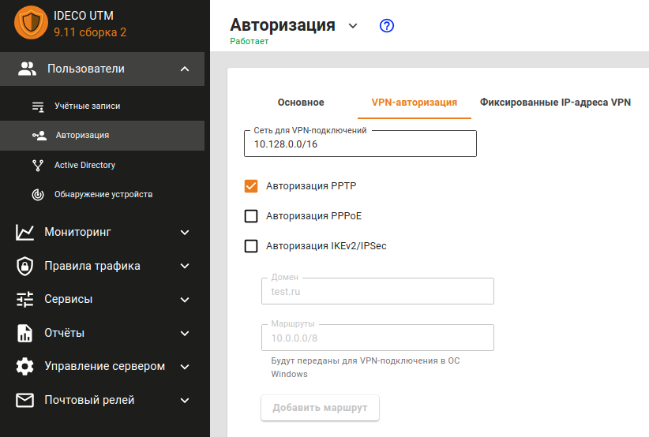

# PPTP

> Не используйте этот тип подключения. Этот способ подключения КРАЙНЕ небезопасен, оставлен исключительно для совместимости со старыми решениями. Используйте \[IPSec-IKEv2\]\(/Настройка/Сервисы/Туннельные-протоколы-VPN/Подключение-пользователей-\(client-to-site\)/IPSec-IKEv2\). {.is-danger}

## Настройка глобальных параметров Ideco UTM

1. Перейдите в раздел **Пользователи -&gt; Авторизация -&gt; VPN-авторизация**.
2. Включите влажок **Авторизация PPTP**.
3. Нажмите на кнопку **Сохранить**.

   

## Настройка пользователей в Ideco UTM

Разрешите пользователю подключения по VPN из сети интернет, включив в настройках пользователя \(**Пользователи -&gt; Нужный пользователь -&gt; вкладка Основное**\) флажок **Разрешить удаленный доступ через VPN**.

## Настройка VPN на клиенте

При настройке подключения по VPN из сети Интернет, в свойствах VPN-подключения нужно указать следующие параметры:

* **Тип VPN** - выберите PPTP.
* Внешний адрес Ideco UTM в качестве VPN-сервера.
* Логин и пароль созданного пользователя.
* Шифрование MPPE, протокол авторизации - только MSCHAPV2.
* Шифрование данных: обязательное \(отключиться, если нет шифрования\).

После подключения вы будете авторизованы на сервере Ideco UTM от имени созданного пользователя, и вам будут доступны сетевые хосты в локальной сети предприятия.

## Возможные неполадки

* Провайдер со стороны шлюза или со стороны подключаемого клиента не пропускает GRE-протокол, с помощью которого происходит PPTP-соединение. В таком случае при попытке подключиться на внешний адрес Ideco UTM будет получена ошибка 619. Можно определить с какой стороны проблема, подключаясь с разных мест и от разных провайдеров. Если из некоторых мест удастся подключиться, значит проблема со стороны тех клиентов, которые не могут подключиться. Когда провайдер будет определен, то нужно попытаться решить проблему с ним, либо использовать \[IPSec-IKEv2\]\(/Настройка/Сервисы/Туннельные-протоколы-VPN/Подключение-пользователей-\(client-to-site\)/IPSec-IKEv2\) или \[SSTP\]\(/Настройка/Сервисы/Туннельные-протоколы-VPN/Подключение-пользователей-\(client-to-site\)/SSTP\).
* Заблокирован порт 1723 TCP. Проверить доступность порта можно с помощью стандартных сетевых утилит, таких как telnet. Если соединения на этот порт нет, то туннель не может быть установлен.
* Неправильно указан логин или пароль пользователя. Если такое происходит, то часто при повторном соединении предлагается указать домен. Старайтесь создавать цифробуквенные пароли, желательно на латинице для ваших учетных записей. При неправильном вводе пароля более 6 раз, произойдет блокировка IP-адреса пользователя [службой защиты от подбора паролей](https://github.com/ideco-team/docsUTM/tree/c6fdc8e9437797db7478b8404ef059e57173d3af/Настройка/Правила-доступа/Защита-от-bruteforce-атак/README.md).
* Если подключение осуществляется с ОС Windows, то для того, чтобы пакеты пошли через него надо убедиться, что в настройках этого подключения стоит чекбокс **Использовать основной шлюз в удалённой сети** в разделе **Свойства подключения VPN -&gt; Вкладка Сеть -&gt; Свойства опции «Протокол Интернета версии 4 \(TCP/IPv4\)» -&gt; Дополнительно**. Если же маршрутизировать все пакеты в этот интерфейс не обязательно, то маршрут надо писать вручную.
* При возникновении ошибки **Подключение было закрыто удаленным компьютером** необходимо включить поддержку MPPE 128-bit \(В Windows эта опция включена по умолчанию\) и среди протоколов аутентификации отмечать только MSCHAPV2.

## Если VPN-соединение установлено, но не получается получить доступ к ресурсам локальной сети

Выполните рекомендации статьи \[Особенности маршрутизации и организации доступа\]\(/Настройка/Сервисы/Туннельные-протоколы-VPN/Подключение-пользователей-\(client-to-site\)/Особенности-маршрутизации-и-организации-доступа\).

