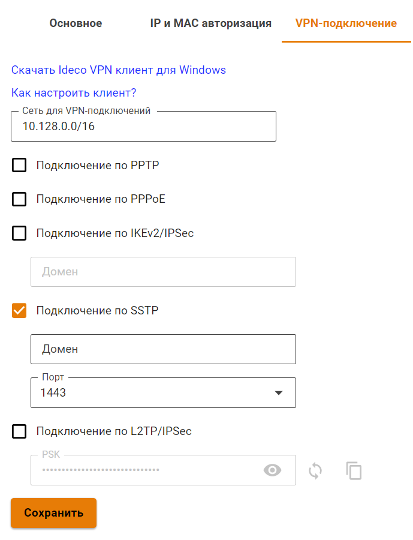
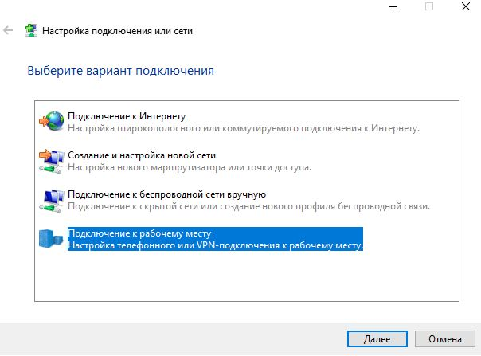

# SSTP

> По возможности не используйте этот тип подключения. Этот способ подключения лучше других проходит через NAT, но при нестабильном качестве связи работает значительно [хуже](https://en.wikipedia.org/wiki/Secure_Socket_Tunneling_Protocol) чем другие VPN \(особенно при передаче звука/видео\), так как инкапсулирует все данные внутри TCP. Рекомендуется использовать \[IPSec-IKEv2\]\(/Настройка/Сервисы/Туннельные-протоколы-VPN/Подключение-пользователей-\(client-to-site\)/IPSec-IKEv2\) вместо SSTP. {.is-info}

**SSTP** \(Secure Socket Tunneling Protocol\) - протокол безопасного туннелирования трафика, основанный на SSL/TLS.

Поддерживается ОС Windows начиная с Vista, а также роутерами Mikrotik, Keenetic и другими.

## Настройка Ideco UTM

1. Для включения авторизации по SSTP установите флажок **Авторизация SSTP** в веб-интерфейсе в разделе **Пользователи -&gt; Авторизация -&gt; VPN-авторизация**.
2. Подключение возможно только по DNS-имени, поэтому IP-адрес внешнего интерфейса Ideco UTM должен резолвится в одно из имен вашей внешней доменной зоны. В поле **Домен** необходимо указать данное DNS-имя \(используйте реальное имя с правильной А-записью, т.к. оно необходимо для выписки сертификата Let’s Encrypt\).
3. **Порт** - выберите предлагаемый порт \(из вариантов: 1443, 2443, 3443, 4443\).

   

4. У пользователей, которым необходимо подключаться извне по VPN установите флажок **Разрешить удалённый доступ через VPN** в дереве пользователей. Указанный логин и пароль будут использоваться для подключения.

## Настройка VPN в Windows

Для создания VPN вы можете использовать скрипт автоматического создания подключения по SSTP. Либо создать его вручную, выполнив следующие действия: 1. Откройте «Центр управления сетями и общим доступом» и выберите пункт «Создание и настройка нового подключения или сети».  1. Выберите пункт **Подключение к рабочему месту**.  1. На вопрос об использовании существующего подключения ответьте **Нет, создать новое подключение**. 1. Далее выберите пункт **Использовать мое подключение к Интернету \(VPN\)**. 1. В качестве адреса подключения используйте только домен \(если пропишите IP-адрес, то подключение работать не будет, выдавая ошибку **CN имя сертификата не совпадает с полученным значением**\). **После ввода домена через двоеточие укажите порт, на котором вы настроили SSTP в Ideco UTM.** Нажмите кнопку **Создать**.  1. После создания подключения необходимо зайти в его свойства \(доступны в контекстном меню объекта\) в **Сетевых подключениях**. На вкладке **Безопасность** выберите тип VPN - **SSTP \(Secure Socket Tunneling Protocol\)**. 

## Скрипт автоматического создания пользовательских подключений по SSTP

Вы можете запустить следующий скрипт PowerShell для автоматического создания подключения на компьютерах пользователей с Windows 8.1 и 10. Для этого скачайте готовый скрипт из раздела **Пользователи -&gt; Авторизация -&gt; VPN-авторизация**.

**Подключение будет создано со следующими параметрами:**

1. Протокол **SSTP** с использованием PSK-ключа.
2. Параметр **Использовать основной шлюз в удаленной сети** выключен.

   Доступ к локальным сетям того же класса, что были получены для VPN-подключения по-умолчанию в Windows 7 и 10 будет осуществляться через VPN-подключение, поэтому дополнительных маршрутов создавать не нужно \(если вы не используете разные классы сетей в локальной сети офиса\).

Создайте текстовый файл с именем **ideco\_utm\_sstp.ps1** \(в Блокноте или редакторе Windows PowerShell ISE\) и скопируйте туда следующий текст:

```text
### Ideco UTM SSTP connection ###
param([switch]$Elevated)
$currentUser = New-Object Security.Principal.WindowsPrincipal $([Security.Principal.WindowsIdentity]::GetCurrent())
if (!$currentUser.IsInRole([Security.Principal.WindowsBuiltinRole]::Administrator))  {
  if (!$elevated) {
    Start-Process `
            powershell.exe `
            -Verb RunAs `
            -ArgumentList ('-noprofile -noexit -file "{0}" -elevated' -f ( $myinvocation.MyCommand.Definition ))
  }
  exit
}
Enable-NetFirewallRule -Group "@FirewallAPI.dll,-28502"
Add-VpnConnection `
    -Force `
    -Name "Ideco UTM SSTP VPN" `
    -TunnelType SSTP `
    -ServerAddress my.domain.com:4443 `
    -EncryptionLevel "Required" `
    -AuthenticationMethod MSChapV2 `
    -SplitTunneling $False `
    -DnsSuffix activedirectory.domain `
    -RememberCredential
```

**Поменяйте в нем необходимые параметры на соответствующие вашим настройкам:**

1. **Ideco UTM SSTP VPN** - имя подключения в системе \(может быть произвольным\).
2. **my.domain. com:4443** - домен внешнего интерфейса Ideco UTM и порт, на котором вы включили SSTP.
3. **activedirectory.domain** - ваш домен Active Directory \(если домена нет, нужно удалить эту строчку из скрипта\).

**Запустить скрипт на компьютере пользователя можно из контекстного меню файла «Выполнить с помощью PowerShell». Нажмите «Ок» в диалоге повышения прав \(они требуются для разрешения доступа к общим файлам и принтерам\).**

После этого подключение в системе будет создано, а также включен общий доступ к файлам и принтерам для всех сетей \(иначе доступ к файловым ресурсам в локальной сети может быть невозможен\).

Пользователю при первой авторизации необходимо ввести свой логин/пароль.

## Возможные ошибки при выполнении скрипта

* При ошибке «Выполнение сценариев отключено в этой системе», нужно включить выполнение сценарием, выполнив команду в PowerShell: `Set-ExecutionPolicy Unrestricted`.

## Если VPN-соединение установлено, но не получается получить доступ к ресурсам локальной сети

Выполните рекомендации статьи \[Особенности маршрутизации и организации доступа\]\(/Настройка/Сервисы/Туннельные-протоколы-VPN/Подключение-пользователей-\(client-to-site\)/Особенности-маршрутизации-и-организации-доступа\).

