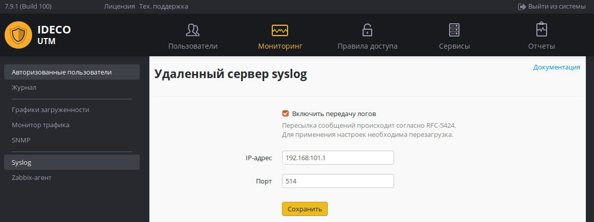

# Пересылка системных сообщений

Включение этого модуля даёт возможность передавать все системные сообщения \(syslog\) Ideco UTM в сторонние коллекторы \(Syslog Collector\) или в SIEM-системы.

В качестве коллектора можно указывать только IP-адрес из приватных диапазонов.

Для применения настроек необходимо выполнить перезагрузку.

 Передача системных сообщений происходит согласно RFC-5424 \(транспорт UDP\).

&lt;/div&gt;

 \#\# Attachments:

 !\[\]\(images/icons/bullet\_blue.gif\) \[image2017-11-29\\_14-14-28.png\]\(attachments/5472407/5832738.png\) \(image/png\) !\[\]\(images/icons/bullet\_blue.gif\) \[syslog.png\]\(attachments/5472407/11436175.png\) \(image/png\)

