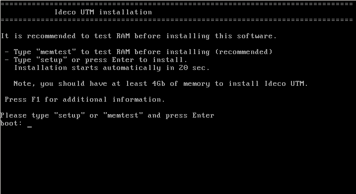

# Подготовка к установке

## Установка на отдельный сервер

Для установки шлюза безопасности Ideco UTM вам необходимо выполнить следующие действия:

1. Подготовьте оборудование, отвечающее [системным](sistemnye_trebovaniya.md) [требованиям](sistemnye_trebovaniya.md).
2. Подготовьте чистый CD-R/RW диск или USB-flash drive объемом не менее 1 Гб.
3. Скачайте ISO-образ из личного кабинета пользователя [my.ideco.ru](https://my.ideco.ru).
4. В целях обеспечения безопасности рекомендуется проверить контрольные суммы загруженного файла, которые можно найти на странице загрузки Ideco UTM в личном кабинете.
5. Запишите ISO-образ на чистый CD-R/RW диск или на [USB-flash drive](sozdanie_zagruzochnogo_usb_flash_diska.md).
6. В параметрах BIOS компьютера выберите загрузку с CD/DVD-привода или USB-flash drive и начните загрузку системы с приготовленного носителя. На экране монитора должен появиться установщик Ideco UTM, как проиллюстрировано ниже. **UEFI нужно переключить в Legacy режим**.

Дальнейший процесс установки описан в статье [Процесс установки](process_ustanovki.md).


Также вы можете посмотреть видео по настройке продукта:

* [Установка и первоначальная настройка Ideco](https://youtu.be/B5ggcTxbSAs) [UTM](https://youtu.be/B5ggcTxbSAs);
* [Ideco UTM Cookbook](https://www.youtube.com/watch?v=kiJAl16RkI0&list=PLQJTQf4Vb3wCKEEqOZFyQxjqPdan848sq) - инструкции по настройке модулей.


 

