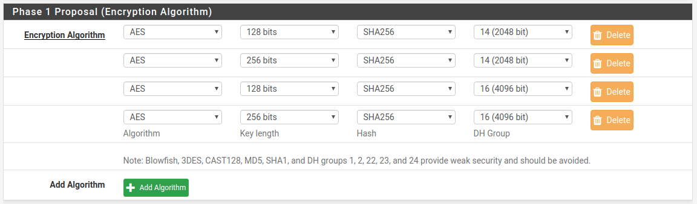

# Подключение pfSense к Ideco UTM по IPsec

По шагам ниже можно объединить сети pfSense и Ideco UTM по IPsec с использованием PSK.

 Объединяемые локальные сети не должны пересекаться\!

&lt;/div&gt;

## Настройка Ideco UTM

1. В веб-интерфейсе Ideco UTM откройте вкладку **Сервисы – IPsec – Устройства**
2. Добавьте новое подключение:
   * Название – _любое_
   * Тип – _входящее_
   * Тип аутентификации – _PSK_
   * PSK – _укажите PSK-ключ, который будет использоваться для подключения_
   * Ключ идентификации – _любой_
   * Домашние локальные сети – _выберите локальную сеть Ideco UTM, которая будет видна из подсети pfSense_
   * Удалённые локальные сети – _укажите локальную сеть pfSense, которая будет видна из подсети Ideco UTM_
3. Сохраните созданное подключение, затем нажмите на кнопку "Включить"
4. На Ideco UTM в папке **`/etc/strongswan/autogen/`** будут сгенерированы два конфигурационных файла. Необходимо перейти в консоль и открыть на редактирование файл вида **`device_<номер>.peer`**
5. Из этого файла необходимо скопировать значение строки **`rightid`** \(примерный вид – `@#746573745f70736b`\). В дальнейшем это значение потребуется прописать на pfSense.
6. Настройка завершена, теперь переходим к настройке pfSense.

## Настройка pfSense

1. В веб-интерфейсе pfSense перейдите на вкладку **VPN – IPsec – Tunnels**
2. Добавьте новое подключение:
   * Key Exchange version – _IKEv2_
   * Internet Protocol – _IPv4_
   * Interface – _выберите внешний интерфейс pfSense, который будет использоваться для подключения к Ideco UTM\)_
   * Remote Gateway – _IP внешнего интерфейса Ideco UTM_
   * Description – _любое_
   * Authentication Method – _Mutual PSK_
   * My identifier и Peer identifier – _сюда вставьте значение строки rightid на Ideco UTM \(см. шаг 5 в настройке Ideco UTM\)_
   * Pre-Shared Key – _вставьте PSK-ключ, который ранее прописывали на Ideco UTM_
   * Encryption Algorithm – _представлены на скриншоте ниже:_

     

   * Все остальные значения можно оставить по умолчанию
3. Сохраните подключение
4. Нажмите на кнопку Show Phase 2 Entries и добавьте новую Phase 2
5. Здесь укажите:
   * Local Network – \*локальную сеть pfSense, которая будет доступна

     из подсети Ideco UTM\*

   * Remote Network – \*локальную сеть Ideco UTM, которая будет

     доступна из подсети pfSense\*

   * Все остальные значения можно оставить по умолчанию
6. Сохраняем подключение
7. Затем нужно разрешить хождение трафика между локальными сетями pfSense и Ideco UTM в файрволе pfSense \(переходим на вкладку **Firewall – Rules – IPsec** и создаём два правила, разрешающее хождение трафика между локальными сетями Ideco UTM и pfSense\)
8. Также обратите внимание на раздел фарйвола WAN – по умолчанию в нём запрещён входящий трафик из "серых" подсетей, поэтому необходимо снять это ограничение
9. Теперь переходим на вкладку **Status – IPsec** \(там должно появится созданное нами подключение\), нажимаем на кнопку Connect VPN
10. Настройка завершена, соединение должно успешно установиться

Если соединение установить не удалось, а настройки файрвола pfSense сделаны верно, следует пересоздать соединение на UTM, указав в поле "Ключ идентификации" то значение, которое мы указали в My identifier и Peer identifier у pfSense, и попробовать подключиться ещё раз. На стороне pfSense никаких изменений вносить не требуется.

 \#\# Attachments:

 !\[\]\(images/icons/bullet\_blue.gif\) \[encryption.png\]\(attachments/16842773/16842772.png\) \(image/png\)

