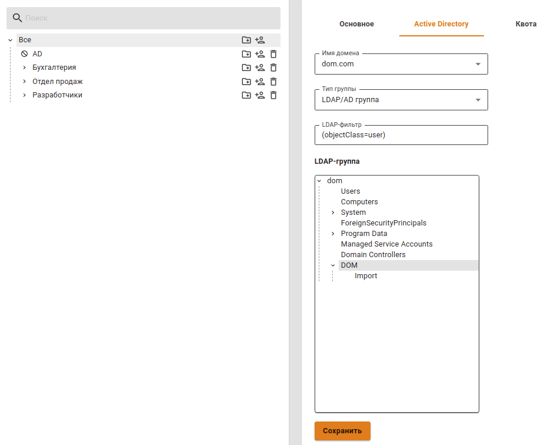
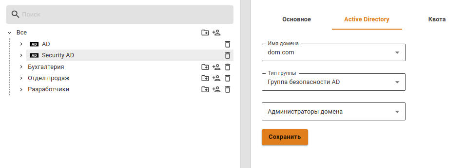

# Импорт-пользователей

## Импорт учетных записей из LDAP

В Ideco UTM реализована возможность импорта учетных записей из LDAP-каталога Active Directory \(далее AD\). Импорт осуществляется по протоколам LDAP/LDAPS \(протокол LDAPS не требует дополнительных настроек со стороны UTM и будет использоваться автоматически в случае необходимости и использования его на контроллере домена\).

Импортировать группы пользователей AD можно в специально созданные группы пользователей в Ideco UTM. Их название может быть произвольным.

Для того, чтобы импортировать пользователей из AD, выполните следующие действия:

1. Создайте группу в дереве пользователей Ideco UTM.
2. Выберите эту группу в дереве и перейдите на вкладку Active Directory в правой части экрана.
3. Выберите домен, из которого вы хотите импортировать пользователей \(если Ideco UTM является членом нескольких доменов\).
4. В поле **Тип группы** выберите LDAP/AD группа.
5. При нажатии на поле **LDAP группа** откроется дерево пользователей Active Directory. Выберите из него необходимую группу для импорта \(также можно выбрать корневую группу для импорта всего дерева\).
6. При нажатии на кнопку **Сохранить** будет произведен импорт пользователей \(это может занять несколько минут\).

Пример окна с импортированными пользователями из AD представлен на скриншоте ниже:

> В дальнейшем пользователи будут автоматически синхронизироваться с Active Directory каждые 15 минут. {.is-info}

При необходимости можно воспользоваться фильтром запросов. Например, если у вас в одних и тех же контейнерах находятся пользователи и компьютеры, а вы хотите импортировать только пользователей, то в поле **LDAP-фильтр** напишите написать следующий текст: **\(&\(objectCategory=person\)\(objectClass=user\)\)**.

Можно импортировать разные группы пользователей AD в различные группы Ideco UTM для удобства назначения на них правил файрвола, контентной фильтрации, контроля приложений, ограничения полосы пропускания и других модулей.

## Импорт учетных записей из групп безопасности

> Пользователь Active Directory может быть импортирован только в одну группу Ideco UTM. Поэтому, если он находится в нескольких группах безопасности Active Directory, он попадет только в одну из групп в UTM при импорте. {.is-info}

Можно импортировать любое количество групп безопасности AD в разные папки в дереве пользователей Ideco UTM.

1. Создайте группу в дереве пользователей Ideco UTM.
2. Выберите эту группу в дереве и перейдите на вкладку Active Directory.
3. В поле **Имя домена** выберите нужный домен.
4. В поле **Тип группы** выберите **Группа безопасности AD**.
5. В поле ниже из раскрывающегося списка выберите нужную группу безопасности.
6. Нажмите на кнопку **Сохранить**.

Пример настройки импорта пользователей из групп безопасности представлен на скринншоте ниже:

