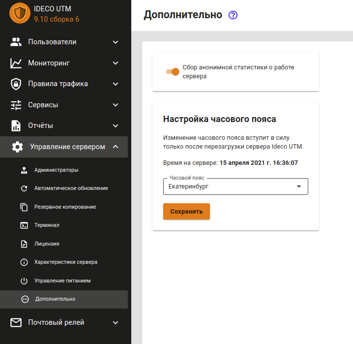
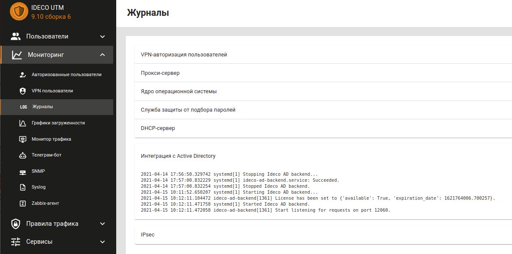

# Общая-информация-и-особенности

В Ideco UTM реализована возможность односторонней синхронизации с доменом на базе Microsoft Active Directory. При этом импортируются только учетные записи, исключая пароли. Это означает, что при прохождении пользователем процедуры аутентификации, проверка будет осуществляться средствами Active Directory.

> Поддерживается интеграция с Windows Server 2008 \(только R2\), 2012, 2016, 2019. {.is-info}

## Особенности использования интеграции с несколькими доменами Active Directory

При интеграции Ideco UTM с несколькими доменами имеются следующие ограничения:

* Авторизация через Ideco Agent будет работать только с первым доменом, к которому был присоединен Ideco UTM.
* При Single Sign-On авторизации при первом открытии браузера, пользователю будет предложен выбор домена для аутентификации. Выбор будет сохранен с помощью cookie и будет использован при следующей авторизации. Если вы хотите изменить домен - удалите файл cookie \(для локального IP-адреса Ideco UTM\).

## Возможные проблемы интеграции с Active Directory и их решение

**Проблемы:**

* Импортированная из AD группа перестала синхронизироваться с доменом; 
* Вы получаете пустой список пользователей при повторной синхронизации; 
* Возникает ошибка подключения к домену; 
* Проблемы с авторизацией пользователей. 

**Решение:**

* Для интеграции с Active Directory необходимо, чтобы время и часовой пояс на Ideco UTM и контроллерах домена совпадали. Обязательно проверьте текущие настройки времени на вкладке **Управление сервером -&gt; Дополнительно**.

* Для авторизации пользователя его устройство должно резолвить домены в IP-адреса без подключения к Интернету \(с помощью DNS-сервера контроллера домена или DNS-сервера Ideco UTM\). Проверить резолвинг можно с помощью команды `nslookup ya.ru`.
* Журнал службы интеграции с доменом можно посмотреть в разделе **Мониторинг -&gt; Журналы -&gt; Интеграция с Active Directory**.

