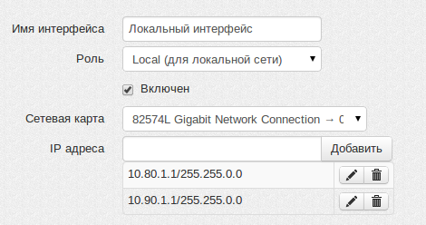

# Доступ в удаленные сети через роутер в локальной сети

## Избавление от непосредственной маршрутизации между роутером и хостами локальной сети.

Допустим, в локальной сети UTM есть роутер, устанавливающий связь с другими сетями (часто с помощью туннеля). UTM является шлюзом по умолчанию для клиентов сети. Вы хотите настроить маршрутизацию на UTM так, чтобы клиенты получали доступ в удаленную сеть через роутер. Для этого роутер и клиенты локальной сети UTM должны находиться в разных подсетях. Иначе возникнет эффект асимметричной маршрутизации, при которой часть трафика от клиентов до роутера пойдет через шлюз, а часть будет идти непосредственно от роутера абонентам сети. Разная маршрутизация на разных участках прохождения трафика сделает прохождение пакетов между двумя локальными сетями невозможной.

**Вариант неправильной топологии подобной сети**, при которой возникает непосредственная или асимметричная маршрутизация между роутером и клиентами локальной сети:

Ideco UTM является шлюзом для локальной сети `10.80.1.0/24`. В этой сети имеется роутер с IP-адресом `10.80.1.2`, который имеет доступ в удаленную сеть `192.168.10.0/24`. Требуется обеспечить доступ хостов сети `10.80.1.0/24` в сеть `192.168.10.0/24` и обратно.

Красной стрелкой обозначена двусторонняя связь роутера с удаленным шлюзом (или тоже роутером), посредством которой обеспечивается доступ к удаленной сети `192.168.10.0/24`. Это может быть туннель к шлюзу, расположенному в сети Интернет или маршрут до роутера в соседнюю сеть предприятия.

Синими стрелками обозначены участки прохождения трафика от хостов локальной сети UTM `10.80.1.0/24` до удаленной сети `192.168.10.0/24` через шлюз UTM c IP-адресом `10.80.1.1`. Затем через роутер с IP-адресом `10.80.1.2`, и участок возвращаемого хостам локальной сети трафика от роутера, минуя UTM, что приводит к непринятию такого трафика хостами локальной сети.

Для того чтобы схема работала правильно необходимо: 1. Вынести роутер в отдельную локальную сеть (DMZ) (например, `10.90.1.0/24`), чтобы избежать непосредственной маршрутизации между роутером и клиентами локальной сети. 2. Настроить DMZ на UTM, добавив еще один IP-адрес на локальный интерфейс UTM `10.90.1.1/24`, к локальной сети которого подключен роутер. 3. На роутере настроить IP-адрес из адресного пространства новой сети `10.90.1.2`. Шлюзом указать дополнительный IP-адрес, настроенный на локальном интерфейсе UTM из этой сети `10.90.1.1`.

Физически роутер и клиенты локальной сети будут находиться в одном сегменте, имея при этом разную IP-адресацию и шлюзы.

Также можно физически изолировать локальную сеть клиентов UTM и роутер, подключив к Ideco UTM дополнительную сетевую карту. Настроить на ней дополнительный локальный интерфейс и отдельную IP-адресацию в этой сети. Шлюзом для роутера будет являться адрес, настроенный на дополнительном локальном интерфейсе.

Физически роутер будет находиться в сегменте дополнительной сетевой карты. Но как правило схемы с виртуальной изоляцией сетей на основе одного физического интерфейса достаточно.

Топология сети после организации DMZ на основе создания дополнительной сети `10.90.1.0/24` на локальном интерфейсе UTM представлена на схеме ниже:

## Необходимые настройки на UTM

Несколько виртуальных локальных сетей на одном физическом локальном интерфейсе UTM выглядят как показано ниже.

Изолировав роутер в DMZ все готово для указания маршрута на UTM до удаленной сети за роутером.\
Локальная сеть клиентов имеет адресацию 10.80.1.0/16, адрес роутера в DMZ - 10.90.1.2, а удаленная сеть, к которой у роутера есть доступ, имеет адресацию 192.168.10.0/24. В таком случае маршрут на UTM будет следующим:

* DST сеть (назначение) : 192.168.10.0/24
* Шлюз: 10.90.1.2

Или в виде однострочной записи для локального меню UTM: `192.168.10.0/24 10.90.1.2`

При желании можно добавить SRC сеть (источник), в нашем случае "10.80.1.0/16", но не обязательно. Теперь трафик между сетями UTM (10.80.1.0/16) и 192.168.10.0/24 во всех направлениях будет идти через UTM и роутер. Непосредственной маршрутизации ни на одном участке прохождения пакетов по маршруту не случится.


Всегда избегайте указания сети 0.0.0.0/0 в маршрутах.


## Настройки на клиентских машинах

Хосты сетей которые теперь обслуживает UTM (10.80.1.0/16 и 10.90.1.0/16) физически включены в один ethernet-сегмент обслуживаемый этим локальным интерфейсом. Шлюзом и DNS-сервером для хостов этих сетей является соответствующий своей сети адрес на локальном интерфейсе UTM. Например, для хоста с адресом 10.80.1.10 шлюзом и DNS будет являться 10.80.1.1, а для хоста с адресом 10.90.1.15 шлюзом и DNS будет являться 10.90.1.1.

При добавлении новых локальных сетей (например, 192.168.0.0/24), на Ideco необходимо добавлять адрес этой сети на существующий или новый локальный интерфейс (например, 192.168.1.1). Этот адрес будет являться шлюзом и DNS-сервером для сетевых устройств из этого адресного пространства (например, для хоста с адресом 192.168.1.10).

