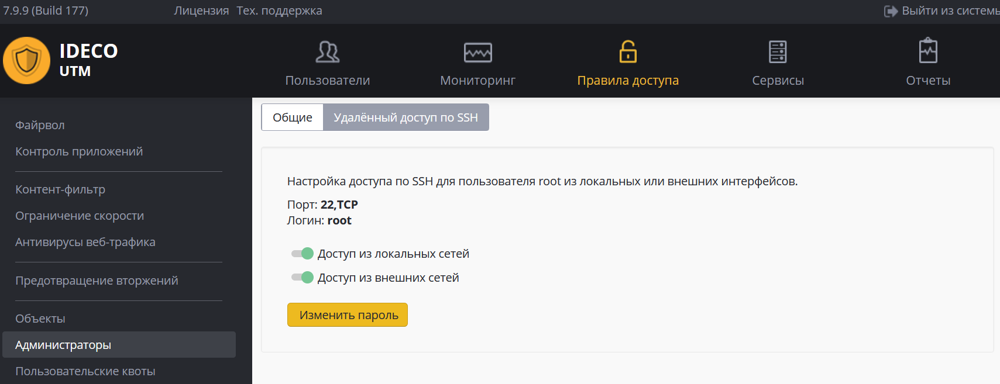

# Удаленный доступ по SSH

Доступ по SSH к серверу может быть включен для локальной сети или для внешних сетей \(не рекомендуется\).

Доступ осуществляется по 22 TCP-порту.

Попытки побора паролей блокируются автоматически.

Используйте команду **ideco-local-menu** для запуска меню, команду **mc** – для запуска файлового менеджера.

Подробнее о настройке подключения к веб-интерфейсу при удаленном доступе смотрите в статье: [Удаленный доступ для управления сервером](https://github.com/ideco-team/docsUTM/tree/54be5c28981601375569bdca6ef75ead87808b16/Удаленный_доступ_для_управления_сервером/README.md)

 \#\# Attachments:

 !\[\]\(images/icons/bullet\_blue.gif\) \[SSH.JPG\]\(attachments/6586932/8388615.jpg\) \(image/jpeg\) !\[\]\(images/icons/bullet\_blue.gif\) \[ssh799.PNG\]\(attachments/6586932/24182785.png\) \(image/png\)

