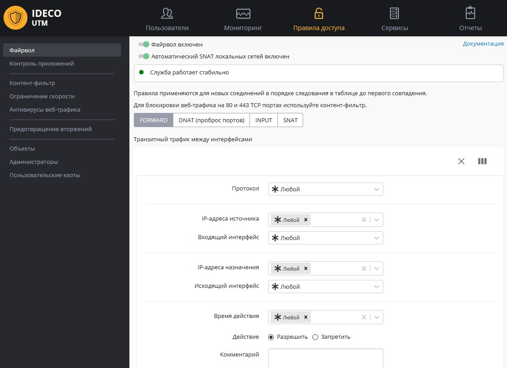

# Файрвол



## Принцип работы

Одним из основных средств управления трафиком на сервере является файрвол \(межсетевой экран\). С его помощью можно по различным критериям ограничивать трафик пользователей, проходящий через сервер из локальной сети во внешние или между разными локальными интерфейсами сервера, а также входящий трафик на сам сервер

Принцип работы брандмауэра заключается в анализе заголовков пакетов, проходящих через интерфейсы сервера. Эта низкоуровневая задача решается шлюзом на основе стека протоколов TCP/IP. Поэтому брандмауэр хорошо подходит для определения глобальных правил управления трафиком по сетевым протоколам, портам, принадлежности к определенным IP-сетям и другим критериям, основанным на значениях полей в заголовках сетевых пакетов.

Сетевой экран не предназначен для решения задач, связанных с контролем доступа к ресурсам сети Интернет, исходя из адреса URL, доменного имени или типа контента на веб-сайтах. Эти задачи более высокого уровня, как правило, касающиеся веб-трафика, нужно решать с помощью модуля [контентной фильтрации](kontent-filtr/).

Настройка файрвола доступна в разделе веб-интерфейса **Правила доступа -&gt; Файрвол**.


Обратите внимание, что кроме доступного для пользователя файервола, в Ideco UTM присутствуют преднастроенные и автоматически включаемые системные правила. Они обеспечивают защиту служб сервера \(почтового, прокси и обратного прокси-сервера и других\) - как правило нет необходимости дополнительно настраивать защиту сервера Ideco UTM с помощью пользовательских правил. Используйте их для фильтрации трафика локальной сети и публикации ресурсов. 

Даже при отключении пользовательского файервола в веб-интерфейсе, системные правила продолжают работу.



В случае создания некорректных правил \(например, запрещающий доступ в веб-интерфейс Ideco UTM\), вы можете отключить пользовательский файрвол из локального меню сервера. **Правила доступа -&gt; Пользовательский файрвол**.


## Автоматический SNAT локальных сетей

NAT \(от англ. Network Address Translation — «преобразование сетевых адресов»\) — это механизм в сетях TCP/IP, позволяющий преобразовывать IP-адреса транзитных пакетов. [Подробнее](https://ru.wikipedia.org/wiki/NAT).

Параметр **Автоматический SNAT локальных сетей** включает в файрволе автоматические правила NAT для локальных сетей. Таким образом вам не нужно создавать такие правила вручную \(и изменять их при добавлении или изменении локальных сетей\).

Отключите данную настройку, если есть необходимость доступа с каких-то внешних сетей \(например ведомственных, либо DMZ\) до локальной сети Ideco UTM без NAT.

Таким образом вы сможете создать правила SNAT вручную для тех, кому он необходим и отключить \(правилом не SNAT\) для тех, кого необходимо допустить в сеть без сетевой трансляции адресов.

## Таблицы файрвола

Для удобства управления правилами в интерфейсе они разбиты на четыре таблицы.

**FORWARD** - правила в данной таблице действуют на трафик, проходящий между интерфейсами сервера \(и соответственно сетью Интернет и локальной сетью, а также между локальными сетями\). Это основная таблица, в которую могут быть добавлены правила ограничивающие трафик пользователей.

**DNAT \(проброс портов\)** - правила этой таблицы используются для прямого перенаправления портов с внешнего интерфейса на определенные ресурсы в локальной сети. Такие правила часто называются правилами проброса портов, port forwarding, portmapper.

**INPUT** - таблица для правил входящего трафика на интерфейсы сервера. Как правило, это трафик для служб сервера \(например, почтового сервера\).

**SNAT** - таблица правил для управления трансляцией сетевых адресов.


Правила в таблицах имеют приоритет сверху вниз \(т.е. верхнее правило приоритетнее нижнего\).


## Протоколы

Брандмауэр определяет популярные сетевые протоколы путем чтения данных из заголовков пакета. При выборе протоколов TCP и UDP появляется возможность указания портов для источника и назначения. Порты можно выбрать из списка или ввести вручную. Допускается ввод нескольких портов через запятую. В этом случае порты будут проверяться по принципу "ИЛИ". Для указания любого порта выберите "Любой". Перечень доступных для управления в правилах протоколов представлен в таблице ниже.

| Название | Описание |
| :---: | :--- |
| UDP | Является  одним из самых простых протоколов транспортного уровня модели OSI. Не гарантирует доставку  пакета. Это позволяет ему  гораздо быстрее и эффективнее доставлять данные для приложений, которым  требуется большая пропускная способность линий связи или требуется малое  время доставки данных |
| TCP | Выполняет функции протокола транспортного уровня модели OSI. В отличие от UDP, TCP гарантирует доставку  пакета |
| ICMP | В основном используется для передачи сообщений об ошибках и других исключительных ситуациях, возникших при передаче данных |
| GRE | Назначение протокола – инкапсуляция пакетов сетевого уровня  модели OSI в IP-пакеты. Номер протокола в IP – 47. В основном  используется при создании VPN \(Virtual Private Network\) |
| AH | Протокол защиты передаваемых данных в IPsec. Обеспечивает идентификацию, проверку целостности и защиту от воспроизведения информации |
| ESP | Протокол защиты передаваемых данных в IPsec. Обеспечивает идентификацию, проверку целостности и защиту от воспроизведения информации. **Отличие протокола ESP от AH состоит в том, что ESP выполняет шифрование данных**. При работе с ESP для шифрования и расшифровки данных обе конечные системы применяют общий ключ |

## Правила файрвола

**По умолчанию используется политика "разрешить"**. Если вы не создадите запрещающих правил, все порты и протоколы для пользователей будут разрешены.

### Параметры правил файрвола

| Название | Описание |
| :--- | :--- |
| Протокол | Протокол передачи данных \(UDP/TCP/ICMP/GRE/ESP/AH либо **Любой**\) |
| Источник | IP-адрес  источника трафика \(src\), проходящего через шлюз. В этом поле могут быть  указаны IP-адреса, диапазоны IP-адресов, сети или домены - данные  берутся из [Объектов](obekty.md), заданных пользователем. Также  в качестве источника могут использоваться пользователи и группы \(при  смене их IP-адресов, файрвол автоматически это учтет\) |
| Входящий интерфейс | Интерфейс UTM, в который будет входить трафик |
| Назначение | IP-адрес назначения трафика \(dst\), проходящего через шлюз. В этом поле могут быть указаны IP-адреса, диапазоны IP-адресов, сети или домены - данные берутся из [Объектов](obekty.md), заданных пользователем. Также  в качестве назначения могут использоваться пользователи и группы \(при  смене их IP-адресов, файрвол автоматически это учтет\) |
| Порт назначения | Указывается при создании правила с протоколами TCP/UDP. Это может быть отдельный порт, список портов или диапазон  портов, определенных в [Объектах](obekty.md) |
| Исходящий интерфейс | Интерфейс UTM, через который будет выходить трафик |
| Время действия | Время действия правила. Указываются временные промежутки \(например, **рабочее время**\), которые определяются в [Объектах](obekty.md) |
| Комментарий | Произвольный текст, поясняющий цель действия правила. Значение не должно быть длиннее 255 символов |

### Действие

Значения этого параметра описаны в следующей таблице.

| Значение | Описание |
| :--- | :--- |
| Запретить | Запрещает трафик |
| Разрешить | Разрешает трафик |
| DNAT | Транслирует адреса назначения, тем самым позволяет перенаправить входящий трафик. Ниже в поле **Изменить IP-адрес назначения** вы можете указать один IP-адрес или диапазон \(при указании диапазона IP-адресов пакет будет перенаправлен на любой из них\). Аналогично, если при создании правила вы указали протоколы TCP или UDP, то появится поле **Сменить порт назначения**. С помощью этой возможности можно прозрачно переадресовать входящий трафик на другой адрес или порт |
| SNAT | Транслирует адреса источника |
| Не производить SNAT | Отменяет действие SNAT для трафика, удовлетворяющего критериям правила |
| Не производить DNAT | Отменяет действие DNAT для трафика, удовлетворяющего критериям правила |

### Создание правил

Перед созданием правил для сетей, IP-адресов или диапазонов IP-адресов, предварительно создайте их в разделе [Объекты](obekty.md).

Для того чтобы создать правила в нужной таблице, нажмите кнопку "+".

Укажите необходимые параметры и действия правила и нажмите кнопку **Сохранить**. Правило будет добавлено вниз таблицы. Измените его приоритет, в случае если это необходимо.


Особенность по созданию правил для фильтрации веб-трафика \(80, 443 TCP порты\): т.к. в Ideco UTM на данных портах работает служба прозрачного прокси-сервера, правила в таблице FORWARD для данных портов будут работать только если добавить IP-адреса удаленных ресурсов в исключения [прокси-сервера](../servisy/proksi/). Для фильтрации веб-трафика рекомендуется использовать правила [контент-фильтра](kontent-filtr/).



**После создания правил, изменения их приоритета в таблицах, включения или отключения правил - правила начинают действовать практически мгновенно.**


## Примеры правил и техник

### Портмаппинг, DNAT, публикация сервера в локальной сети

Этот пример подробно описан в соответствующей [**статье**](https://github.com/ideco-team/docsUTM/tree/54be5c28981601375569bdca6ef75ead87808b16/Портмаппинг_проброс_портов_DNAT_/README.md) в разделе **Публикация ресурсов**.

### Блокировка различных ресурсов средствами файрвола

Вопросы блокировки различных ресурсов: программ удаленного управления \(AmmyAdmin и TeamViewer\), мессенджеров и другого ПО описаны в отдельной [статье](../populyarnye_recepty/blokirovka_populyarnykh_resursov.md).

