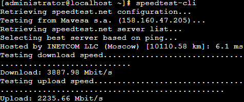

# Проверка скорости сети

[Сюда временно вносится информация hintов из статей]: #

Для проверки скорости сети Control plane интерфейса перейдите в раздел **Управление сервером -> Терминал** и введите `speedtest-cli`. \
Пример вывода команды:

