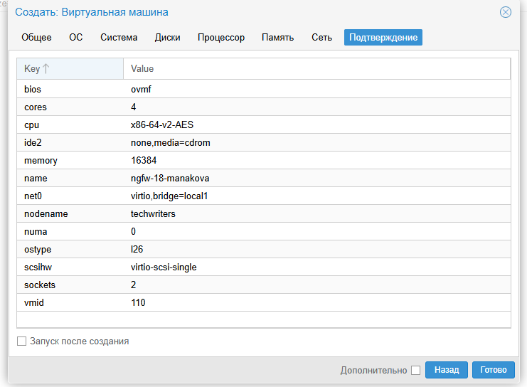

# Проблемы и улучшения


Перемещение виртуалки с локального компьютера на сервер


До 5 шага все понятно. Далее на 6м шаге - желательно в связи с удалением диска сделать скрин проверки, как должны выглядеть окончательные параметры виртуалки

<figure><figcaption></figcaption></figure>

После этого появляются вопросы:\
1\. Где смотреть путь диска?\
2\. Где мне нужно написать эти команды?


Создание стенда из NGFW, ЦК, хоста


Не актуальная ссылка

