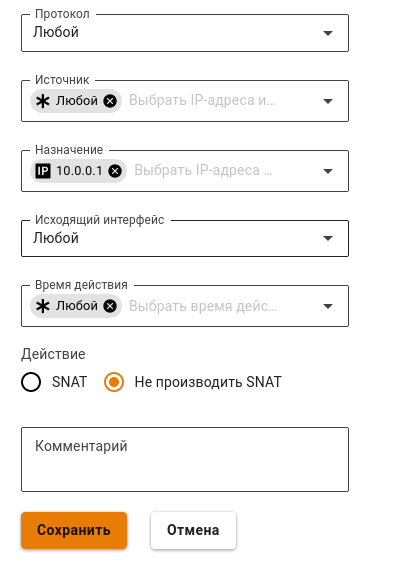
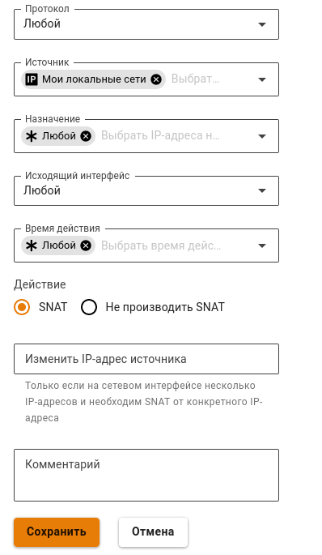
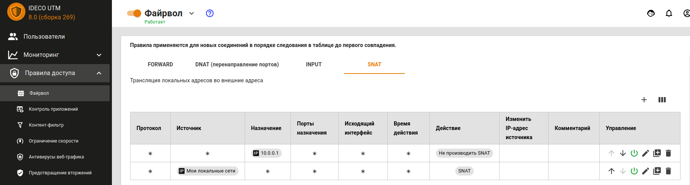

# Доступ из внешней сети без NAT

## Доступ из локальной сети во внешнюю без NAT

При необходимости \(как правило, когда Ideco UTM расположен внутри локальной сети, а не на границе с Интернетом\) возможно организовать прямой доступ в некоторым ресурсам внешних по отношению к Ideco UTM сетей без использования NAT.

Для примера разберем настройку файрвола для доступа без NAT к IP-адресу: **10.0.0.1** \(в общем случае это также может быть сеть или диапазон IP-адресов\).

1. Выключите параметр "Автоматический SNAT локальных сетей" в **Правила доступа -&gt; Файрвол**.
2. В файрволе в таблице SNAT создайте правило с действием **Не производить SNAT** для данного IP-адреса назначения.

   

3. Следующим правилом создайте правила SNAT для своей локальной сети \(чтобы остальные хосты работали через NAT\)

   

**Итоговые правила файрвола выглядят так:**

> На устройствах локальной сети Ideco UTM должен использоваться в качестве основного шлюза, либо должен быть прописан необходимый маршрут к внешним IP-адресам через Ideco UTM. Также устройства локальной сети должны быть авторизованы на UTM. На устройствах из внешней сети \(по-отношению к Ideco UTM\) также Ideco UTM должен использоваться в качестве основного шлюза, либо иметься маршрут к локальной сети через Ideco UTM. {.is-info}

## Доступ из внешней сети в локальную без NAT и фильтрации

> Внимание! Учитывайте риски подобного доступа с точки зрения информационной безопасности. Не предоставляйте доступ для сетей и хостов в безопасности которых вы не уверены. {.is-danger}

При необходимости вы можете разрешить доступ с хостов или из сетей расположенных во внешней относительно Ideco UTM сети в локальную сеть с прямым обращением к локальным IP-адресам.

Для примера разберем настройку файрвола разрешающую хосту 10.0.0.1 доступ к локальной сети.

1. В консоли UTM \([доступ по SSH](https://github.com/ideco-team/docsUTM/tree/c6fdc8e9437797db7478b8404ef059e57173d3af/Настройка/Правила-доступа/Администраторы/README.md)\) ввести команду:

   `mcedit /usr/bin/ideco-firewall`

2. Между строками:

   `iptables -A FORWARD -m state --state INVALID -j smart_drop`

   `iptables -A FORWARD -j forward_sys_rules`

   Вписать строки:

   `iptables -A FORWARD -d 10.0.0.1 -j ACCEPT`

   `iptables -A FORWARD -s 10.0.0.1 -j ACCEPT`

3. Сохраните файл
4. Перезагрузите Ideco UTM

> Внимание! После обновления Ideco UTM в некоторых случаях процедуру данной ручной настройки придется повторить. {.is-warning}

