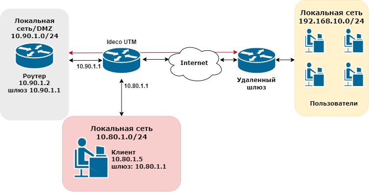
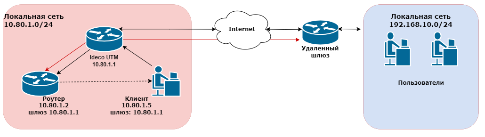
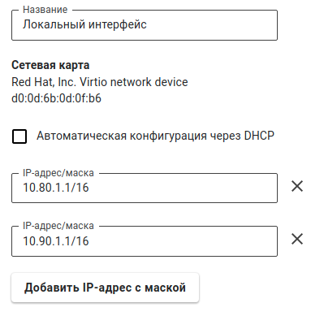

# Доступ в удаленные сети через роутер в локальной сети

## Избавление от непосредственной маршрутизации между роутером и хостами локальной сети.

Допустим, в локальной сети UTM есть роутер, устанавливающий связь с другими сетями (часто с помощью туннеля). UTM является шлюзом по умолчанию для клиентов сети. Вы хотите настроить маршрутизацию на UTM так, чтобы клиенты получали доступ в удаленную сеть через роутер. Для этого роутер и клиенты локальной сети UTM должны находиться в разных подсетях. Иначе возникнет эффект асимметричной маршрутизации, при которой часть трафика от клиентов до роутера пойдет через шлюз, а часть будет идти непосредственно от роутера абонентам сети. Разная маршрутизация на разных участках прохождения трафика сделает прохождение пакетов между двумя локальными сетями невозможной.

**Вариант неправильной топологии подобной сети**, при которой возникает непосредственная или асимметричная маршрутизация между роутером и клиентами локальной сети:

Ideco UTM является шлюзом для локальной сети `10.80.1.0/24`. В этой сети имеется роутер с IP-адресом `10.80.1.2`, который имеет доступ в удаленную сеть `192.168.10.0/24`. Требуется обеспечить доступ хостов сети `10.80.1.0/24` в сеть `192.168.10.0/24` и обратно.

Красной стрелкой обозначена двусторонняя связь роутера с удаленным шлюзом (или тоже роутером), посредством которой обеспечивается доступ к удаленной сети `192.168.10.0/24`. Это может быть туннель к шлюзу, расположенному в сети Интернет или маршрут до роутера в соседнюю сеть предприятия.

Синими стрелками обозначены участки прохождения трафика от хостов локальной сети UTM `10.80.1.0/24` до удаленной сети `192.168.10.0/24` через шлюз UTM c IP-адресом `10.80.1.1`. Затем через роутер с IP-адресом `10.80.1.2`, и участок возвращаемого хостам локальной сети трафика от роутера, минуя UTM, что приводит к непринятию такого трафика хостами локальной сети.

Для того чтобы схема работала правильно необходимо: 1. Вынести роутер в отдельную локальную сеть (DMZ) (например, `10.90.1.0/24`), чтобы избежать непосредственной маршрутизации между роутером и клиентами локальной сети. 2. Настроить DMZ на UTM, добавив еще один IP-адрес на локальный интерфейс UTM `10.90.1.1/24`, к локальной сети которого подключен роутер. 3. На роутере настроить IP-адрес из адресного пространства новой сети `10.90.1.2`. Шлюзом указать дополнительный IP-адрес, настроенный на локальном интерфейсе UTM из этой сети `10.90.1.1`.

Физически роутер и клиенты локальной сети будут находиться в одном сегменте, имея при этом разную IP-адресацию и шлюзы.

Также можно физически изолировать локальную сеть клиентов UTM и роутер, подключив к Ideco UTM дополнительную сетевую карту. Настроить на ней дополнительный локальный интерфейс и отдельную IP-адресацию в этой сети. Шлюзом для роутера будет являться адрес, настроенный на дополнительном локальном интерфейсе.

Физически роутер будет находиться в сегменте дополнительной сетевой карты. Но как правило схемы с виртуальной изоляцией сетей на основе одного физического интерфейса достаточно.

Топология сети после организации DMZ на основе создания дополнительной сети `10.90.1.0/24` на локальном интерфейсе UTM представлена на схеме ниже:

## Необходимые настройки на UTM

Настройка нескольких виртуальных локальных сетей на одном физическом локальном интерфейсе UTM производится в разделе **Сервисы -> Сетевые интерфейсы** и выглядит следующим образом:

После изоляции роутера в DMZ нужно указать маршрут на UTM до удаленной сети.

Локальная сеть клиентов имеет адресацию `10.80.1.0/24`, адрес роутера в DMZ - `10.90.1.2`, а удаленная сеть, к которой у роутера есть доступ, имеет адресацию `192.168.10.0/24`. В данном случае маршрут на UTM будет иметь следующие параметры:

* **Назначение (DST)**: 192.168.10.0/24;
* **Шлюз**: 10.90.1.2.

Также можно добавить **Источник (SRC)**, в нашем случае `10.80.1.0/24`, но это не обязательно. Теперь трафик между сетями UTM (`10.80.1.0/24` и `192.168.10.0/24`) во всех направлениях будет направляться через UTM и роутер.


Всегда избегайте указания сети `0.0.0.0/0` в маршрутах.


## Настройки на клиентских машинах

Хосты сетей, которые теперь обслуживает UTM (`10.80.1.0/24` и `10.90.1.0/24`) физически включены в один ethernet-сегмент. Шлюзом и DNS-сервером для хостов этих сетей является соответствующий своей сети адрес на локальном интерфейсе UTM. Например, для хоста с адресом `10.80.1.10` шлюзом и DNS будет являться `10.80.1.1`, а для хоста с адресом `10.90.1.15` шлюзом и DNS будет являться `10.90.1.1`.
