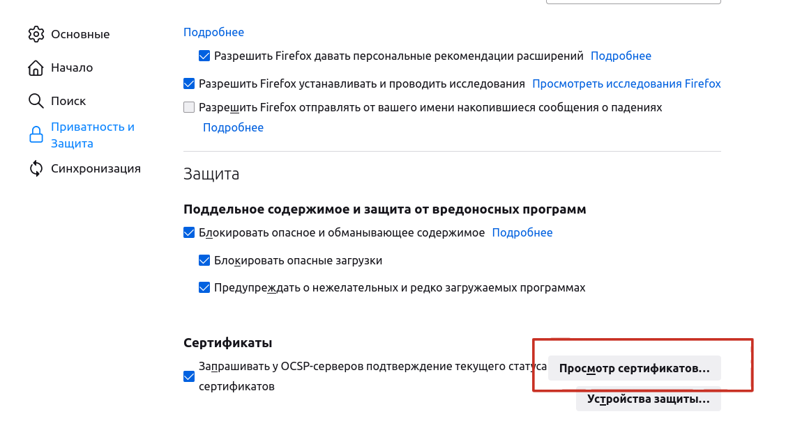

# Настройка прозрачной авторизации на Astra linux


Данное решение подходит для браузеров **Chromium** и **Firefox.**


1. Для начала введите Astra linux в домен.
2. Зайдите под доменной учетной записью на Astra Linux.
3. Скачайте браузер **Chromium** командой `apt install chromium -y` **.**

3.1 Для браузера **Chromium**:  
Создайте файл **mydomain.json** в директории **/etc/chromium/policies/managed/** и впишите в него строчку:

```text
{ 
    "AuthServerWhitelist": "*.имя_домена" 
}
```

1. Для браузера **Firefox**: Запустите браузер и в адресной строке введите **about:config**, чтобы попасть в режим редактирования расширенных настроек. Введите параметр **security.enterprise\_roots.enabled** и нажмите по блоку со строчкой два раза левой кнопкой мыши, чтобы значение изменилось на **True.** В двух следующих параметрах впишите доменное имя UTM через HTTP и HTTPS через запятую: **network.automatic-ntlm-auth.trusted-uris** и **network.negotiate-auth.trusted-uris** \(например, [http://utm.domain.com](http://utm.domain.com), [https://utm.domain.com\](https://utm.domain.com\)\).
2. Добавьте корневой сертификат Ideco UTM в список доверенных центров сертификации. Для этого сначала [скачайте сертификат с Ideco UTM](../../settings/services/certificates/).
3. В настройках браузера Firefox в пункте **Защита и приватность** в разделе **Защита** выберите **Просмотр сертификатов**. 



1. В появившемся меню во вкладке **Центры сертификации** нажмите **Импортировать** и выберите скачанный с UTM сертификат.
2. В появившемся меню отметьте пункт **Доверять при идентификации веб-сайтов** и подтвердите.
3. Откройте браузер, появится окно с авторизацией, после чего произойдет перенаправление на начальную страницу.

