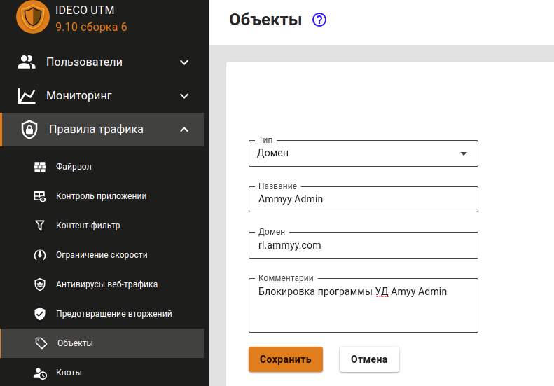
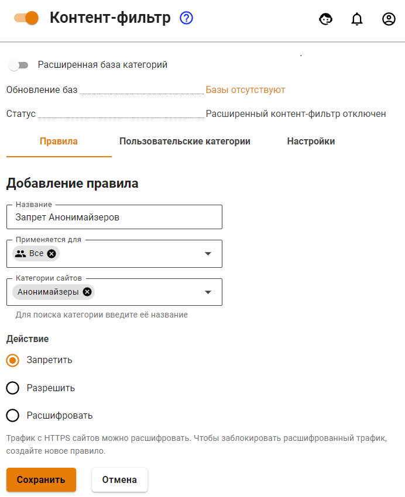
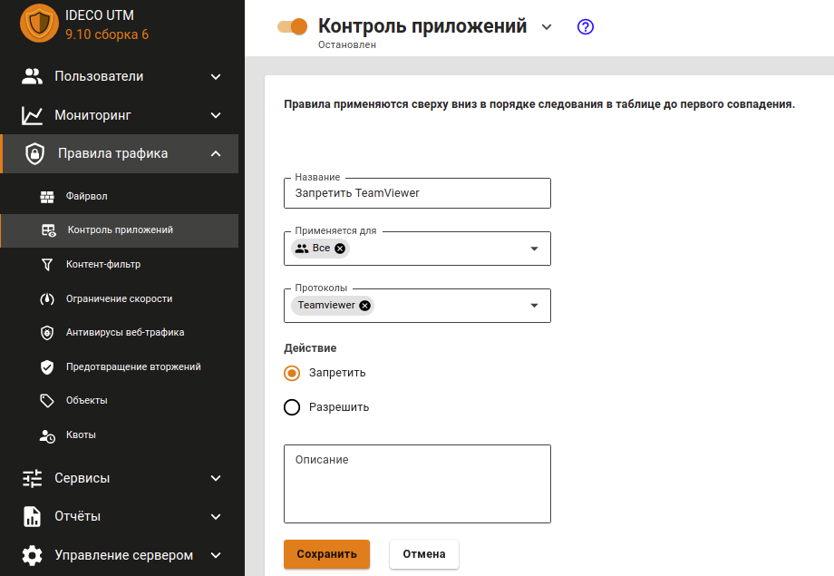
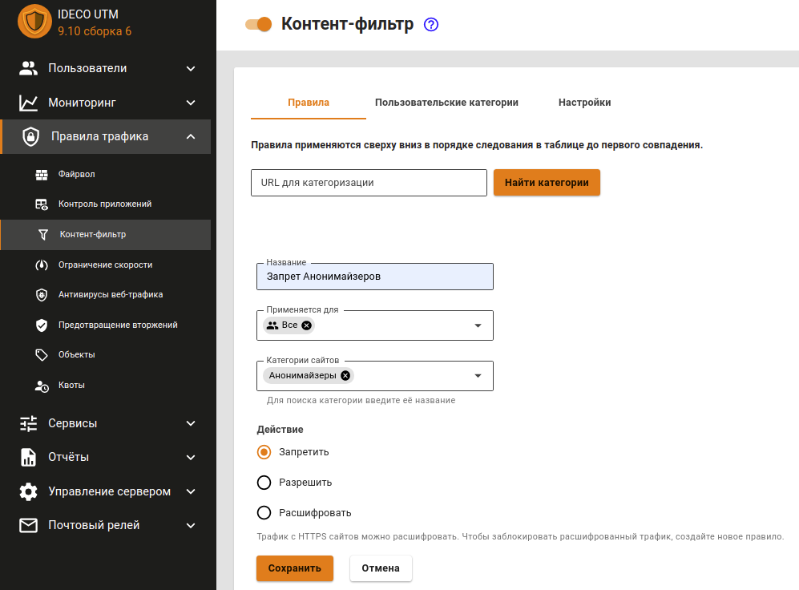
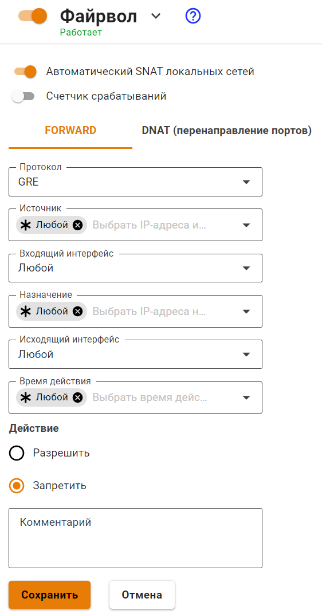
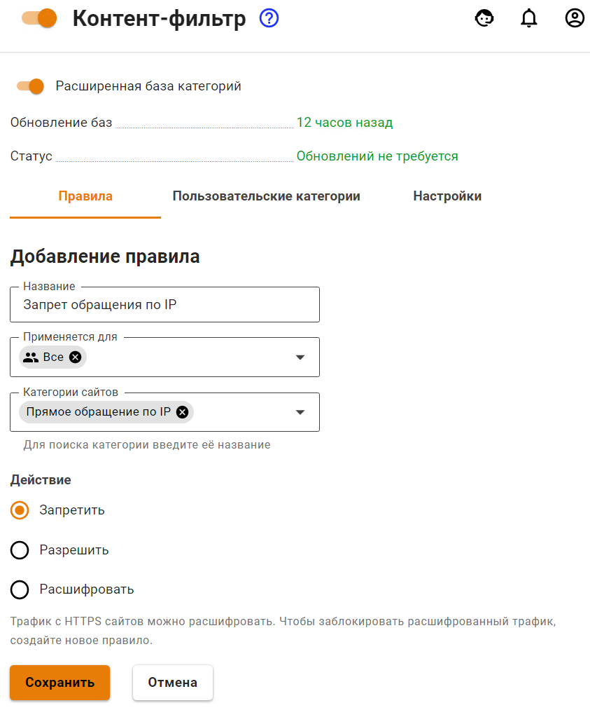
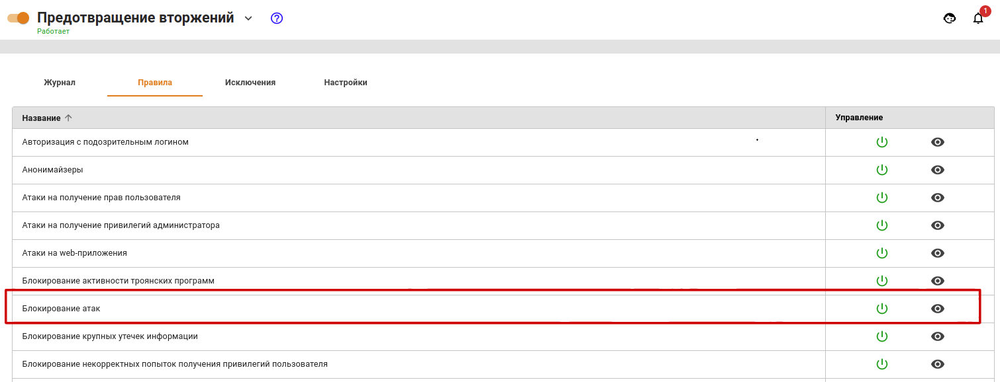
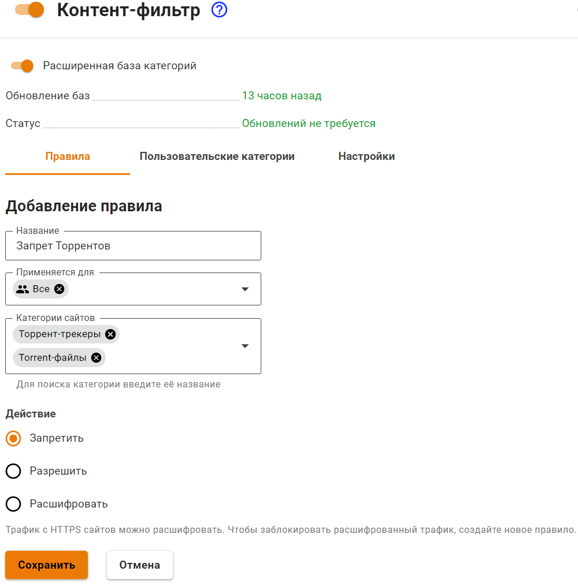
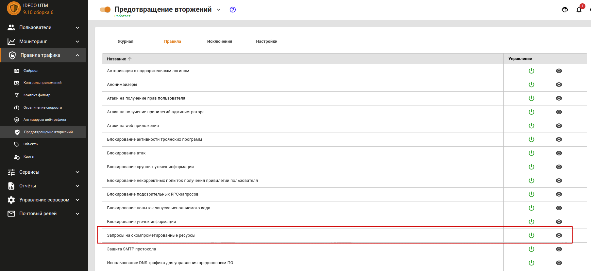

# Блокировка популярных ресурсов

## Блокировка программ удаленного доступа

### Ammyy Admin

1\. Зайдите в раздел **Правила трафика -> Объекты** и создайте объект типа **Домен** с доменным именем rl.ammyy.com.

2\. Затем зайдите в раздел **Правила трафика -> Фаервол -> FORWARD** и создайте правило запрета для нужных пользователе или групп. В IP-адресе назначения укажите Ammyy Admin:

### TeamViewer

TeamViewer блокируется с помощью модуля [Контроль приложений](../../settings/access-rules/application-control.md). Для этого нужно выбрать одноименный протокол в правиле для пользователей или групп.

## Блокирование анонимайзеров

Заблокировать анонимайзеры можно в разделе **Правила трафика** тремя способами:

1\. Анонимайзеры, работающие по HTTP(S), можно заблокировать с помощью модуля [Контент-фильтр](../../settings/access-rules/content-filter/) (категория **Анонимайзеры**).

2\. Для блокировки VPN-анонимайзеров, использующих протокол PPTP, как правило, достаточно заблокировать протокол GRE в правилах [фаервола](../../settings/access-rules/firewall.md).

3\. Для запрета обхода контент-фильтра рекомендуем создать правило запрета прямых обращений по IP-адресам в [Контент-фильтре](../../settings/access-rules/content-filter/).

## Блокирование Opera.Turbo, Opera VPN, Yandex.Turbo, friGate, Anonymox, Browsec

Заблокировать данные и некоторые другие плагины (анонимайзеры) и функции браузеров, которые часто используются для обхода контентной фильтрации, можно с помощью модуля [Предотвращение вторжений](../../settings/access-rules/ips.md). Для этого на вкладке **Правила** активируйте группу правил **Анонимайзеры** и отдельную группу правил **Opera VPN** для блокировки одноименного сервиса.

В журнале системы предотвращения вторжений будут фиксироваться попытки обхода контентной фильтрации с помощью данного ПО, после чего они будут заблокированы. Пример вывода информации, отображенной в журнале системы предотвращения вторжений, представлен ниже:

* `07/20/2017-15:06:04.056815 [Drop] [**] [1:1001697:1] Opera VPN [**] [Classification: Opera VPN] [Priority: 2] {TCP} 10.80.1.74:64784 -> 169.254.254.254:443`
* `07/20/2017-15:09:20.531169 [Drop] [**] [1:1001675:0] Anonymox HTTP [**] [Classification: Анонимайзеры] [Priority: 2] {TCP} 10.80.20.95:35576 -> 207.244.89.90:88`

## Блокирование TOR

**Tor** - это система прокси-серверов, позволяющая устанавливать анонимное сетевое соединение для обхода контентной фильтрации.


**Tor** - специально разработанное программное обеспечение и среда прокси-серверов, предназначенная для обхода различного рода блокировок, поэтому полностью заблокировать его в настоящее время не представляется возможным.


Для противодействия использованию сети Tor, а также для журналирования попыток подключения к ней и её использования, необходимо сделать следующее:

1\. Включить систему [Предотвращение вторжений](../../settings/access-rules/ips.md) и активировать в ней категорию **Блокирование атак**, которая позволяет блокировать подключения к входным узлам сети Tor.

2\. Включить [Контроль приложений](../../settings/access-rules/application-control.md) и добавить правила запрета приложения TOR к определенной группе или всем пользователям:

## Блокирование ICQ

В модуле [Контроль приложений](../../settings/access-rules/application-control.md) создайте правила блокировки протокола Oscar и ICQ для нужных пользователей или групп.

## Блокирование торрентов

BitTorrent - P2P-протокол, предназначенный для обмена файлами через сеть Интернет.

Для существенного ограничения возможности использования торрентов необходимо выполнить следующие настройки:

1\. Запретите протокол BitTorrent с помощью правила в модуле [Контроль приложений](../../settings/access-rules/application-control.md).

2\. Использовать политику **Запретить все, кроме разрешенного** при настройке фаервола.

Разрешите нужные TCP и UDP порты пользователям, сделав последнее правило запрещающим.

3\. Запретить сайты-каталоги торрент-файлов с помощью модуля [Контент-фильтр](../../settings/access-rules/content-filter/), запретив категорию Торрент-трекеры. И запретить скачивание файлов с расширением .torrent.

4\. Включить систему [Предотвращение вторжений](../../settings/access-rules/ips.md) и активировать в ней категорию **Запросы на скомпрометированные ресурсы**, которая позволяет блокировать активность P2P-программ.

