# Инструкция по созданию подключения в Windows


Перед настройкой VPN-подключения, в дереве пользователей в карточке нужных пользователей и установите флаг **Разрешить удаленный доступ через VPN**. Для этого перейдите в раздел **Пользователи -> Учетные записи**:




## Создание VPN-подключений на стороне пользователя вручную

<details>

<summary>Создание VPN-подключения в Windows 10</summary>

1\. Кликните на иконке сетевого подключения в системном трее, и в появившемся окне выберите **Параметры сети и Интернет**:

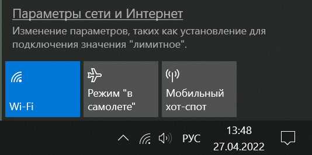

2\. Перейдите в раздел **VPN** и нажмите **Добавить VPN-подключение**:

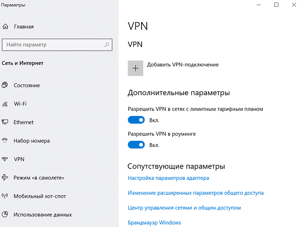

3\. Заполните соответствующие поля и нажмите **Сохранить**:

* Имя подключения - название создаваемого подключения;
* Имя или адрес сервера - адрес VPN-сервера;
* Тип VPN - Протокол PPTP;
* Тип данных для входа - Имя пользователя и пароль;
* Имя пользователя - имя пользователя, которому разрешено подключение по VPN;
* Пароль - пароль пользователя.

**Для PPTP:**

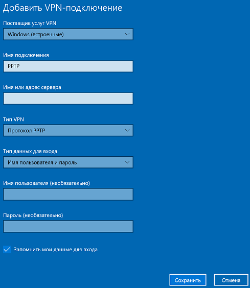

При настройке подключения по VPN из сети Интернет, в свойствах VPN-подключения нужно указать следующие параметры:

* Перейдите в **Настройки параметров адаптера**;
* Нажмите на созданное подключение правой кнопкой мыши и выберите **Свойства**;
* Перейдите во вкладку **Безопасность** и установите:
  * **Шифрование данных** - обязательное (отключиться, если нет шифрования)
  * **Протокол расширенной проверки подлинности (EAP)** - Microsoft защищенный пароль (EAP MSCHAPV2)

**Для L2TP/IPSec с общим ключом:**

* Общий ключ - значение строки **PSK** в разделе **Пользователи -> Авторизация -> VPN-подключение -> Подключение по L2TP/IPSec**.

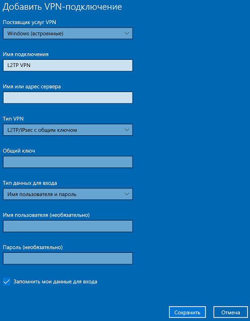

Если вы создаете VPN-подключение к UTM через проброс портов, рекомендуем выполнить следующие действия:

1. Откройте **Редактор реестра**.
2. Перейдите в `HKEY_LOCAL_MACHINE\SYSTEM\CurrentControlSet\Services\PolicyAgent` и создайте DWORD-параметр с именем AssumeUDPEncapsulationContextOnSendRule и значением `2`.
3. Перезагрузите Windows.

Возможные неполадки

1. Неправильно указан логин или пароль пользователя. Часто при повторном соединении предлагается указать домен. Старайтесь создавать цифро-буквенные пароли, желательно на латинице для ваших учетных записей. Если есть сомнения в этом пункте, то временно установите логин и пароль пользователю «user» и «123456».
2. Для того, чтобы пакеты пошли через VPN-туннель, надо убедиться, что в настройках этого подключения стоит чекбокс **Использовать основной шлюз в удалённой сети** в разделе **Настройка параметров адаптера -> Правой кнопкой мыши по подключению -> Свойства -> Сеть -> Свойства опции «Протокол Интернета версии 4 (TCP/IPv4)» ->Дополнительно**. Если же маршрутизировать все пакеты в этот интерфейс не обязательно, то маршрут надо писать вручную.
3. Подключение происходит через DNAT, т.е. внешний интерфейс Ideco UTM не имеет «белого» IP-адреса, а необходимые для работы порты (500 и 4500) «проброшены» на внешний интерфейс устройства, расположенного перед Ideco UTM и имеющего «белый» IP-адрес. В данном случае VPN-подключение либо вообще не будет устанавливаться, либо будут периодические обрывы. Решение - исключить устройство перед Ideco UTM и указать на внешнем интерфейсе Ideco UTM «белый» IP-адрес, к которому в итоге и будут осуществляться L2TP/IPsec-подключения. Либо используйте протокол SSTP, потому что его проще опубликовать с помощью проброса портов.
4. Если в OC Windows 10 повторно подключиться по L2TP, но при этом использовать **невалидный** ключ PSK (введя его в дополнительных параметрах (скриншот ниже)), подключение все равно будет установлено успешно. Это связано с особенностями работы ОС.

Убедитесь, что локальная сеть (или адрес на сетевой карте) на удалённой машине не пересекается с локальной сетью вашей организации, а если пересекается, то доступа к сети вашей организации не будет (трафик по таблице маршрутизации пойдёт в физический интерфейс, а не в VPN). Адресацию необходимо менять.

**Для SSTP:**

* Имя или адрес сервера - адрес VPN-сервера в формате _адрес\_VPN\_сервера:порт_.

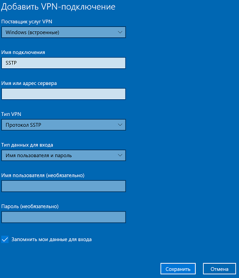

**Для IKEv2:**

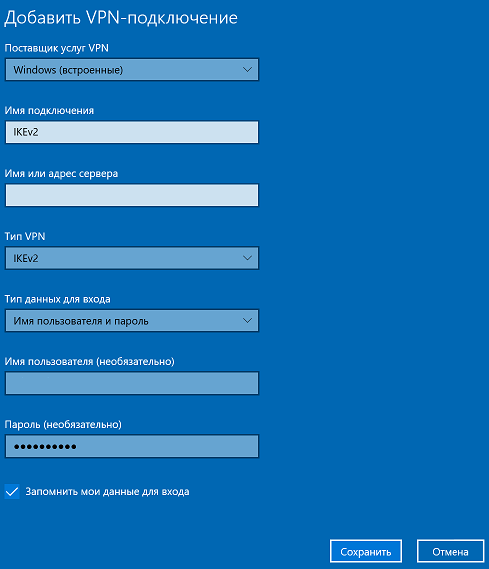

4\. Активируйте подключение, нажав правой кнопкой мыши по созданному подключению и выбрав **Подключиться**:

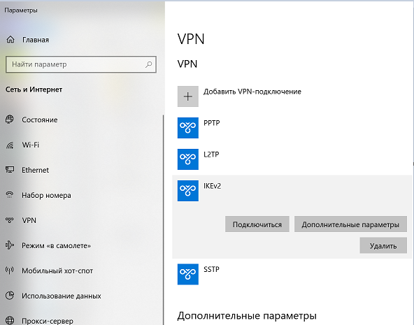

5\. Для разрыва подключения нажмите **Отключиться**. Если нужно внести изменение в созданное подключение, нажмите **Дополнительные параметры -> Изменить**

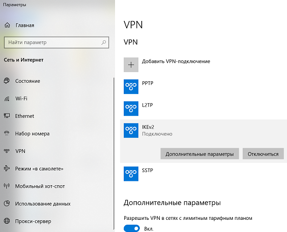

</details>

<details>

<summary>Создание VPN-подключения в Windows 7</summary>

Вам потребуется доменное имя вашего сервера (можно получить у системного администратора) и учетные данные пользователя (логин/пароль).

1\. Откройте **Центр управления сетями и общим доступом**:


2\. Выберите **Настройка нового подключения или сети**:


3\. Выберите **Подключение к рабочему месту**:


4\. Выберите **Использовать мое подключение к Интернету (VPN)**:

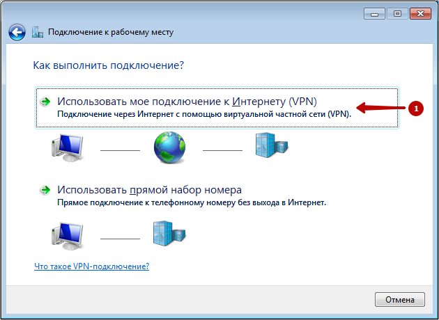

5\. Введите доменное имя сервера в качестве адреса подключений. Имя местоназначения может быть произвольным:

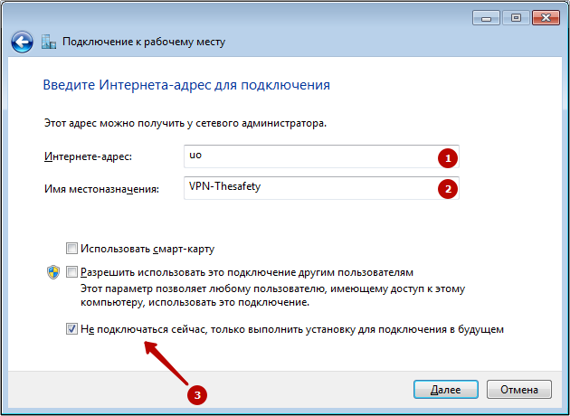

6\. Введите ваш _логин_ и _пароль_:


7\. Нажмите **Закрыть**:


8\. Выберите **Подключение к IKEv2 VPN серверу** в Windows 7:

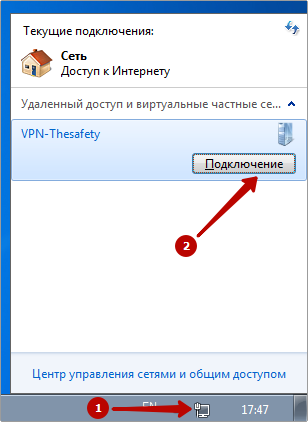

9\. Выберите **Свойства**:


10\. Выберите протокол **IKEv2** и обязательное шифрование:


11\. Подключитесь к IKEv2 VPN серверу в Windows 7:


</details>

## Автоматическое создание подключений

<details>

<summary>Протокол L2TP/IPSec</summary>

Вы можете запустить следующий скрипт PowerShell для автоматического создания подключения на компьютерах пользователей с Windows 8.1 и 10. Для этого скачайте готовые скрипты подключения вашего сервера из раздела **Пользователи -> Авторизация -> VPN-подключение**.

Подключение будет создано со следующими параметрами:

1. Протокол **L2TP/IPsec** с использованием PSK-ключа.
2.  Параметр **Использовать основной шлюз в удаленной сети** выключен.

    Доступ к локальным сетям того же класса, что были получены для VPN-подключения по умолчанию в Windows 7 и 10 будет осуществляться через VPN-подключение, поэтому дополнительных маршрутов создавать не нужно (если вы не используете разные классы сетей в локальной сети офиса).

Создайте файл с именем **ideco\_utm\_l2tp.ps1** (в Блокноте или редакторе Windows PowerShell ISE) и скопируйте в него следующий текст:

```
### Ideco UTM L2TP/IPsec connection ###
param([switch]$Elevated)
$currentUser = New-Object Security.Principal.WindowsPrincipal $([Security.Principal.WindowsIdentity]::GetCurrent())
if (!$currentUser.IsInRole([Security.Principal.WindowsBuiltinRole]::Administrator))  {
  if (!$elevated) {
    Start-Process `
            powershell.exe `
            -Verb RunAs `
            -ArgumentList ('-noprofile -noexit -file "{0}" -elevated' -f ( $myinvocation.MyCommand.Definition ))
  }
  exit
}
Enable-NetFirewallRule -Group "@FirewallAPI.dll,-28502"
Add-VpnConnection `
    -Force `
    -Name "Ideco UTM L2TP VPN" `
    -TunnelType L2TP `
    -ServerAddress my.domain.com `
    -L2tpPsk "XXXXXXXXXXXXXXXXXXXXXXXXXXXXXXXX" `
    -EncryptionLevel "Required" `
    -AuthenticationMethod MSChapV2 `
    -SplitTunneling $False `
    -DnsSuffix activedirectory.domain `
    -RememberCredential
```

**Поменяйте в нем необходимые параметры на соответствующие вашим настройкам:**

* **Ideco UTM L2TP VPN** - имя подключения в системе (может быть произвольным).
* **my.domain.com** - домен или IP-адрес основного внешнего интерфейса Ideco UTM.
* **XXXXXXXXXXXXXXXXXXXXXXXXXXXXXXXX** - PSK-ключ вашего сервера.
* **activedirectory.domain** - ваш домен Active Directory (если есть, если нет нужно удалить эту строчку из скрипта).

**Запустить скрипт на компьютере пользователя можно из контекстного меню файла «Выполнить с помощью PowerShell». Нажмите «Ок» в диалоге повышения прав (они требуются для разрешения доступа к общим файлам и принтерам).**

После этого подключение в системе будет создано, а также включен общий доступ к файлам и принтерам для всех сетей (иначе доступ к файловым ресурсам в локальной сети может быть невозможен).

Пользователю при первой авторизации необходимо ввести свой логин/пароль.

**Возможные ошибки при выполнении скрипта**

* При появлении ошибки «Выполнение сценариев отключено в этой системе», нужно включить выполнение сценарием, выполнив команду в PowerShell: `Set-ExecutionPolicy Unrestricted`.

</details>

<details>

<summary>Протокол SSTP</summary>

Вы можете запустить следующий скрипт PowerShell для автоматического создания подключения на компьютерах пользователей с Windows 8.1 и 10. Для этого скачайте готовый скрипт из раздела **Пользователи -> Авторизация -> VPN-подключение**.

**Подключение будет создано со следующими параметрами:**

1. Протокол **SSTP** с использованием PSK-ключа.
2.  Параметр **Использовать основной шлюз в удаленной сети** выключен.

    Доступ к локальным сетям того же класса, что были получены для VPN-подключения по умолчанию в Windows 7 и 10 будет осуществляться через VPN-подключение, поэтому дополнительных маршрутов создавать не нужно (если вы не используете разные классы сетей в локальной сети офиса).

Создайте текстовый файл с именем **ideco\_utm\_sstp.ps1** (в Блокноте или редакторе Windows PowerShell ISE) и скопируйте туда следующий текст:

```
### Ideco UTM SSTP connection ###
param([switch]$Elevated)
$currentUser = New-Object Security.Principal.WindowsPrincipal $([Security.Principal.WindowsIdentity]::GetCurrent())
if (!$currentUser.IsInRole([Security.Principal.WindowsBuiltinRole]::Administrator))  {
  if (!$elevated) {
    Start-Process `
            powershell.exe `
            -Verb RunAs `
            -ArgumentList ('-noprofile -noexit -file "{0}" -elevated' -f ( $myinvocation.MyCommand.Definition ))
  }
  exit
}
Enable-NetFirewallRule -Group "@FirewallAPI.dll,-28502"
Add-VpnConnection `
    -Force `
    -Name "Ideco UTM SSTP VPN" `
    -TunnelType SSTP `
    -ServerAddress my.domain.com:4443 `
    -EncryptionLevel "Required" `
    -AuthenticationMethod MSChapV2 `
    -SplitTunneling $False `
    -DnsSuffix activedirectory.domain `
    -RememberCredential
```

**Поменяйте в нем необходимые параметры на соответствующие вашим настройкам:**

1. **Ideco UTM SSTP VPN** - имя подключения в системе (может быть произвольным).
2. **my.domain. com:4443** - домен внешнего интерфейса Ideco UTM и порт, на котором вы включили SSTP.
3. **activedirectory.domain** - ваш домен Active Directory (если домена нет, нужно удалить эту строчку из скрипта).

**Запустить скрипт на компьютере пользователя можно из контекстного меню файла «Выполнить с помощью PowerShell». Нажмите «Ок» в диалоге повышения прав (они требуются для разрешения доступа к общим файлам и принтерам).**

После этого подключение в системе будет создано, а также включен общий доступ к файлам и принтерам для всех сетей (иначе доступ к файловым ресурсам в локальной сети может быть невозможен).

Пользователю при первой авторизации необходимо ввести свой логин/пароль.

#### Возможные ошибки при выполнении скрипта

При ошибке «Выполнение сценариев отключено в этой системе», нужно включить выполнение сценарием, выполнив команду в PowerShell: `Set-ExecutionPolicy Unrestricted`.

</details>

<details>

<summary>Протокол IPSec IKEv2</summary>

Вы можете запустить скрипт PowerShell для автоматического создания подключения на компьютерах пользователей с Windows 8.1 и 10. Для этого скачайте готовый скрипт из раздела **Пользователи -> Авторизация -> VPN-подключение**.

**Подключение с помощью скрипта будет создано со следующими параметрами:**

1. Протокол IKEv2.
2. Параметр **Использовать основной шлюз в удаленной сети** выключен. Доступ к локальным сетям того же класса, что были получены для VPN-подключения по умолчанию в Windows 7 и 10, будет осуществляться через VPN-подключение, поэтому дополнительных маршрутов создавать не нужно (если вы не используете разные классы сетей в локальной сети офиса).

Создайте текстовый файл с именем **ideco\_utm\_ikev2.ps1** (в Блокноте или редакторе Windows PowerShell ISE) и скопируйте туда следующий текст:

```
### Ideco UTM IKEv2 connection ###
param([switch]$Elevated)
$currentUser = New-Object Security.Principal.WindowsPrincipal $([Security.Principal.WindowsIdentity]::GetCurrent())
if (!$currentUser.IsInRole([Security.Principal.WindowsBuiltinRole]::Administrator))  {
  if (!$elevated) {
    Start-Process \`
            powershell.exe `
            -Verb RunAs `
            -ArgumentList ('-noprofile -noexit -file "{0}" -elevated' -f ( $myinvocation.MyCommand.Definition ))
  }
  exit
}
Enable-NetFirewallRule -Group "@FirewallAPI.dll,-28502"
Add-VpnConnection `
    -Force `
    -Name "Ideco UTM IKEv2 VPN" `
    -TunnelType IKEv2 `
    -ServerAddress my.domain.com `
    -EncryptionLevel "Required" `
    -AuthenticationMethod EAP `
    -SplitTunneling $False `
    -DnsSuffix activedirectory.domain `
    -RememberCredential
```

**Поменяйте в нем необходимые параметры на соответствующие вашим настройкам:**

1. `Ideco UTM IKEv2 VPN` - название подключения в системе (может быть произвольным).
2. `my.domain.com` - домен внешнего интерфейса Ideco UTM (А-запись для домена должна ссылаться на IP-адрес внешнего интерфейса Ideco UTM).
3. `activedirectory.domain` - ваш домен Active Directory (если его, то нужно удалить эту строчку из скрипта).

Запустить скрипт на компьютере пользователя можно из контекстного меню файла «Выполнить с помощью PowerShell». Нажмите «Ок» в диалоге повышения прав (они требуются для разрешения доступа к общим файлам и принтерам).

После этого подключение в системе будет создано, а также включен общий доступ к файлам и принтерам для всех сетей (иначе доступ к общим папкам в локальной сети будет невозможен).

При первой авторизации необходимо ввести логин/пароль пользователя.

**Возможные ошибки при выполнении скрипта**

При появлении ошибки «Выполнение сценариев отключено в этой системе», нужно включить выполнение сценариев, выполнив команду в PowerShell: `Set-ExecutionPolicy Unrestricted`

</details>

## Ошибки работы VPN-подключений

<details>

<summary>Если VPN-подключение по протоколам IPSeс в Windows автоматически разрывается через 7 часов 45 минут и при подключении по IKEv2 возникает ошибка "Ошибка сопоставления групповой политики" или ошибка с кодом "13868"</summary>

Для восстановления связи подойдут следующие действия:

1\. Переподключите соединение. В данном случае соединение восстановится, но через 7 часов 45 минут вновь будет автоматически разорвано. Если вы хотите, чтобы подключение не разрывалось автоматически, то выполните действия из следующего пункта.

2\. Внесите изменения в реестр:

* Откройте **Редактор реестра**.
* Перейдите по пути `HKEY_LOCAL_MACHINE\SYSTEM\CurrentControlSet\Services\RasMan\Parameters`.
* Нажмите правой кнопкой мыши по параметру именем **NegotiateDH2048\_AES256** и нажмите **Изменить**.
* В строке **Значение** укажите значение `1`:


* Нажмите **OK**.
*   Перезагрузите Windows.

    Если параметра именем **NegotiateDH2048\_AES256** нет, то создайте его. Для этого:
* Нажмите правой кнопкой мыши по свободному месту реестра в **Parameters** и выберите **Создать -> DWORD**:


* Задайте имя **NegotiateDH2048\_AES256**.
* Нажмите правой кнопкой мыши по созданному файлу и выберите **Изменить**:


* В строке **Значение** укажите значение `1`:


* Нажмите **OK**.

3\. Перезагрузите Windows.

</details>
