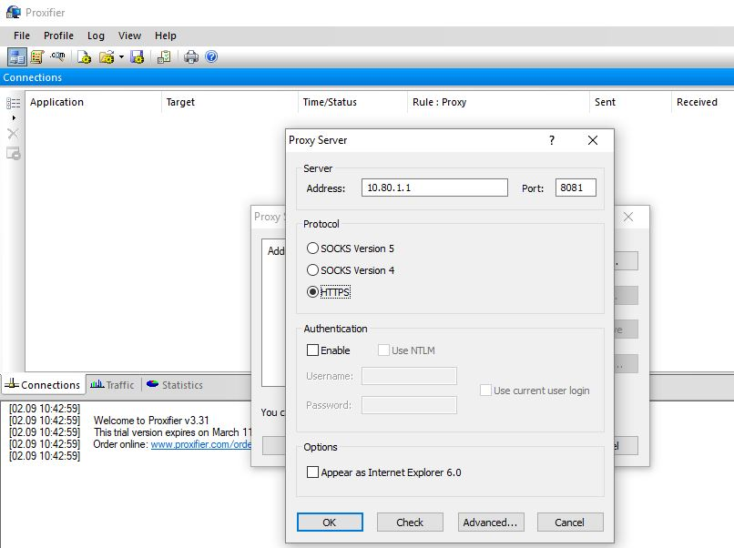
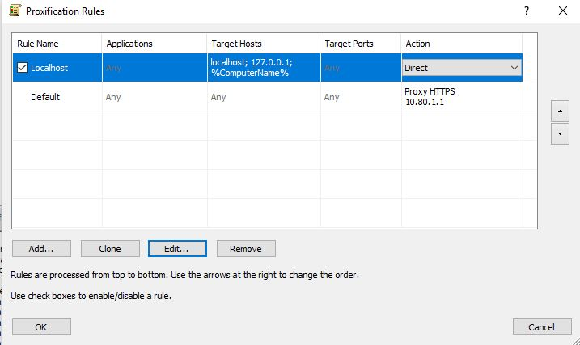

# Настройка программы Proxifier для прямых подключений к прокси серверу

При использовании прямых подключений к прокси-серверу выход в сеть Интернет будет поддерживаться всеми программами, имеющими настройки прокси-сервера, либо программами, применяющими системные настройки прокси (из Internet Explorer).

Но некоторое ПО не имеет настроек прокси-сервера. Поэтому необходимо использовать специализированное ПО на конечных рабочих станциях для вывода в Интернет таких программ.

Самая популярная программа для настройки прокси-сервера: Proxifier. Скачать ее можно с [сайта разработчика](http://www.proxifier.com).

## Настройка

Выполните стандартные настройки браузера для прямых подключений к прокси-серверу, а затем настройте программу для перенаправления остального трафика на прокси-сервер.

Пропишите в настройках прокси-сервера в Proxyfier IP-адрес локального интерфейса Ideco UTM и порт, указанный в настройке прокси для прямых подключений (см. документацию по [прокси-серверу](../../settings/services/proxy/proxy-server.md)). Тип протокола: HTTPS. Настройки авторизации указывать необязательно.

После добавления прокси-сервера ответьте утвердительно на вопросы о создании правил перенаправления трафика на него.

Либо эти настройки можно отредактировать позже:

Настройка закончена, программы будут выходить в Интернет через заданный прокси-сервер.
