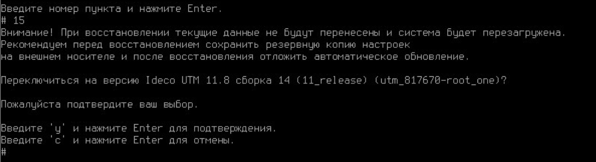

# Как восстановиться на прошлую версию после обновления Ideco NGFW

Рекомендуем использовать эту возможность, если после обновления Ideco NGFW работает некорректно.


Возможность восстановиться на предыдущую версию после обновления Ideco NGFW доступна с 12.0.


При обновлении NGFW на версию 12.0 и выше вся информация версии, с которой обновляетесь, сохранится на диске NGFW. Для восстановления выполните действия:

1\. Перейдите в локальное меню Ideco NGFW.

2\. Введите логин и пароль администратора.

3\. Укажите номер пункта 15 и нажмите **Enter**:

Появится окно с предупреждением и описанием версии, на которую произойдет переключение.


Если в Ideco NGFW настроен кластер, то в локальном меню будет отсутствовать пункт **Восстановиться на предыдущую версию**.


3\. Подтвердите выбор, введя **y** и нажав **Enter**:

4\. После перезагрузки Ideco NGFW переключится на предыдущую версию.


Предыдущая версия восстановится с настройками и логами, которые были в Ideco NGFW на момент обновления.

При восстановлении предыдущей версии настройки и логи из обновленной версии не переносятся в предыдущую версию.

