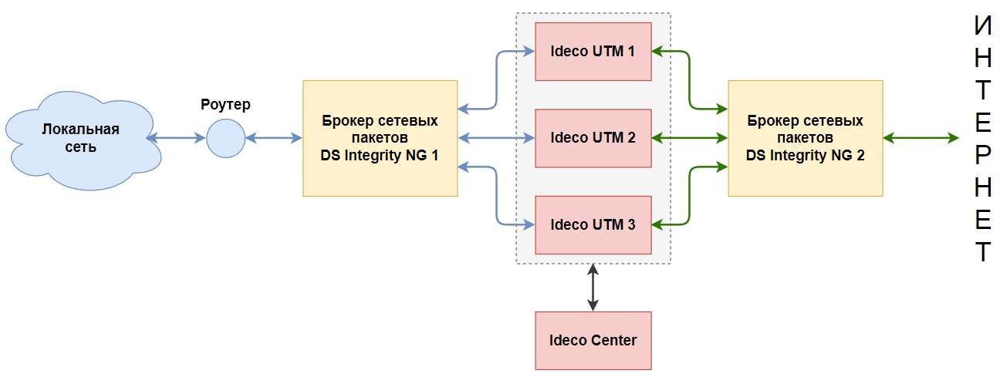

# Интеграция Ideco UTM и брокера сетевых пакетов DS Integrity NG

Для повышения отказоустойчивости помимо реализованной в Ideco UTM кластеризации Active/Passive можно воспользоваться решением наших партнёров АО «НПП «Цифровые решения» – брокером сетевых пакетов DS Integrity NG.

Расположите брокер сетевых пакетов перед Ideco UTM. Он будет самостоятельно балансировать трафик от устройств в локальной сети между нодами получившегося кластера.
При падении одной из нод трафик просто перебалансируется между остальными Ideco UTM без перерыва в связи, что фактически делает эту схему реализацией кластера Active/Active.


Объединять в кластер устройства Ideco UTM не нужно. \
Для корректной работы на всех нодах должны быть одинаковые настройки. 



Для централизованного управления всеми нодами можно воспользоваться Ideco Center.



Особенности использования этой схемы:
* Настройки, которые нельзя распространить через центральную консоль, придётся вручную изменять на каждом Ideco UTM;
* Почта будет доступна для работы только в режиме почтового релея. Хранение почтовых ящиков отключено;
* Данные отчетности, логов и мониторинга не синхронизируются между нодами. У каждой ноды хранятся свои данные;
* Восстановление из резервной копии и обновление системы будет затрагивать только одну ноду. Каждую ноду нужно будет обновлять отдельно;
* Между локальной сетью и брокером сетевых пакетов необходимо расположить любой роутер с настроенной динамической маршрутизацией (OSPF) для обмена маршрутами;
* На каждую ноду Ideco UTM потребуется своя лицензия. По вопросам условий лицензирования при использовании данной конфигурации необходимо обращаться к вашим менеджерам. 


Рассмотрим настройку трёх типовых схем совместного использования брокера сетевых пакетов DS Integrity NG и Ideco UTM. На их основе вы сможете встроить оба решения в собственную сеть.


По вопросам настройки брокера обращайтесь в техническую поддержку [АО «НПП «Цифровые решения»](https://dsol.ru/support/).


## Пример 1 – Два брокера, по одному со стороны локальной и внешней сетей

Настройка брокера сетевых пакетов

Взять из инструкции от DSOL, тест 3.

Настройка Ideco UTM

На каждом устройстве Ideco UTM необходимо выполнить первоначальную настройку [локального](local-ethernet.md) и внешнего интерфейсов ethernet-connection. 

Брокер сетевых пакетов не имеет собственного IP-адреса и работает на аппаратном уровне. Поэтому:
Для устройств в локальной сети шлюзом нужно указать IP-адрес любого из имеющихся Ideco UTM;
На каждом Ideco UTM в качестве шлюза внешнего интерфейса нужно использовать IP-адрес, полученный от провайдера.

Затем на каждом Ideco UTM для обмена маршрутами необходимо настроить OSPF для локального интерфейса. Название зоны и вес должны быть идентичными настроенным ранее на роутере. Подробнее о настройке OSPF можно прочитать в соответствующей статье. Там же находятся инструкции для настройки OSPF для MikroTik, который можно использовать в качестве роутера.

Для централизованного управления все Ideco UTM необходимо подсоединить к центральной консоли. Для упрощения менеджмента пользователей можно воспользоваться Active Directory.

## Пример 2 – Основной и резервный брокеры, расположенные перед Ideco UTM

Настройка брокера сетевых пакетов
Взять из инструкции от DSOL, тест 2.

Настройка Ideco UTM
На каждую ноду Ideco UTM на данном этапе потребуется своя лицензия. По вопросам условий лицензирования при использовании данной конфигурации необходимо обращаться к вашим менеджерам. 

Для каждого UTM необходимо выполнить первоначальную настройку локального и внешнего интерфейсов. 

Брокер сетевых пакетов не имеет собственного IP-адреса и работает на аппаратном уровне. Поэтому:
Для устройств в локальной сети шлюзом нужно указать IP-адрес любого из имеющихся Ideco UTM;
На каждом UTM здесь будет два локальных и два внешних интерфейса. Шлюзом внешних интерфейсов нужно указать IP-адрес, полученный от провайдера.

На Ideco UTM в этой конфигурации в разделе Балансировка и резервирование должен быть активирован режим резервирования. Приоритетным внешним интерфейсом должен быть выбран интерфейс, идущий к основному брокеру сетевых пакетов.

Также на каждом Ideco UTM для обмена маршрутами необходимо настроить OSPF для обоих локальных интерфейсов. Название зоны и вес должны быть идентичными настроенным ранее на роутере. Подробнее о настройке OSPF можно прочитать в соответствующей статье. Там же находятся инструкции для настройки OSPF для MikroTik, который можно использовать в качестве роутера.

Для централизованного управления все Ideco UTM необходимо подсоединить к центральной консоли. Для упрощения менеджмента пользователей можно воспользоваться Active Directory.

## Пример 3 – Один брокер, расположенный перед Ideco UTM

Настройка брокера сетевых пакетов
Взять из инструкции от DSOL, тест 1.

Настройка Ideco UTM
На каждую ноду Ideco UTM на данном этапе потребуется своя лицензия. По вопросам условий лицензирования при использовании данной конфигурации необходимо обращаться к вашим менеджерам. 

Для каждого UTM необходимо выполнить первоначальную настройку локального и внешнего интерфейсов. 

Брокер сетевых пакетов не имеет собственного IP-адреса и работает на аппаратном уровне. Поэтому:
Для устройств в локальной сети шлюзом нужно указать IP-адрес любого из имеющихся Ideco UTM;
Шлюзом внешнего интерфейса нужно указать IP-адрес, полученный от провайдера.

На каждом Ideco UTM для обмена маршрутами необходимо настроить OSPF для локального интерфейса. Название зоны и вес должны быть идентичными настроенным ранее на роутере. Подробнее о настройке OSPF можно прочитать в соответствующей статье. Там же находятся инструкции для настройки OSPF для MikroTik, который можно использовать в качестве роутера.

Для централизованного управления все Ideco UTM необходимо подсоединить к центральной консоли. Для упрощения менеджмента пользователей можно воспользоваться Active Directory.
