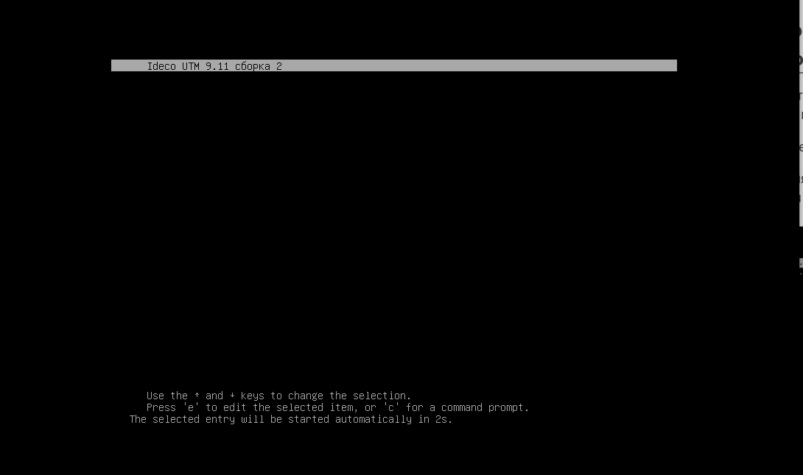
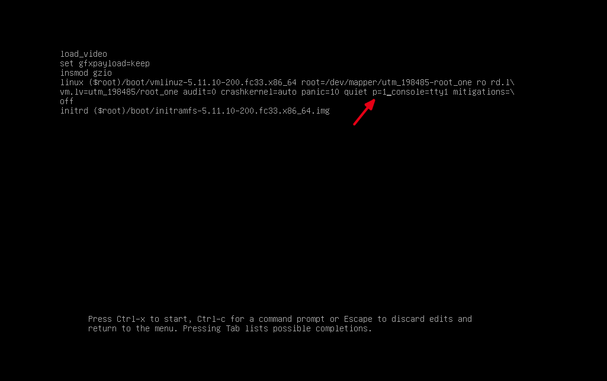
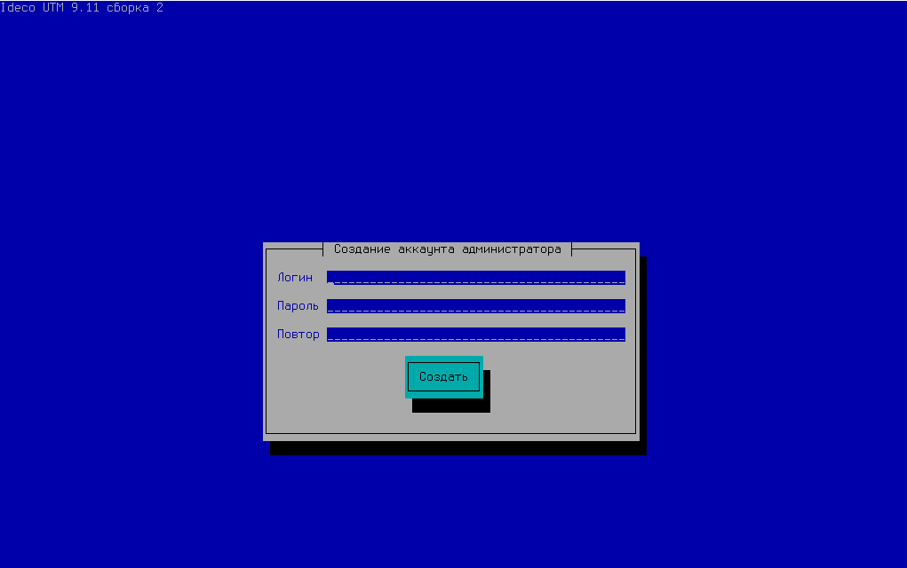
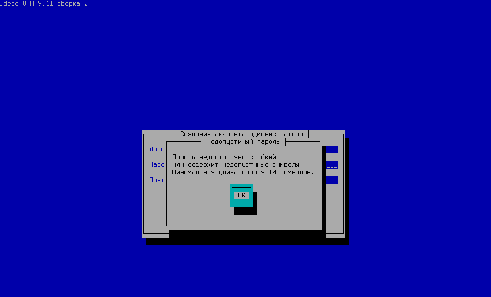
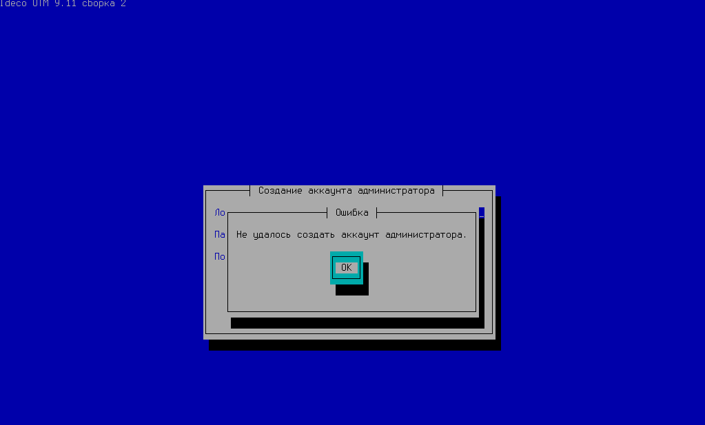

# Как восстановить доступ к Ideco UTM

Для этого нужно выполнить следующие действия:

1. Перезагрузите сервер. При появлении меню загрузчика GRUB с выбором ядра linux для загрузки системы, нажмите англоязычную клавишу **E** на клавиатуре.

1. Откроется окно параметров ядра с возможностью редактирования. Допишите текст `p=1` как на скриншоте ниже:

1. Нажмите комбинацию кнопок `Ctrl - X`.
2. После повторной загрузки системы появится окно создания аккаунта администратора. Задайте новый логин и пароль администратора.

Требования к созданию пароля администратора:

* Минимальная длина пароля - 10 символов;
* Строчные и заглавные латинские символы;
* Цифры;
* Специальные символы \(! \# $ % & ' \* + и т.д.\).

Если пароль не будет соответствовать требованиям политики безопасности, то откроется окно с выводом ошибки. Необходимо нажать «ОК» и ввести новый пароль, учитывая требования к созданию паролей.


Если при создании нового логина администратора он будет совпадать с предыдущим логином, то откроется окно с выводом ошибки. Создайте имя администратора отличное от предыдущего.


