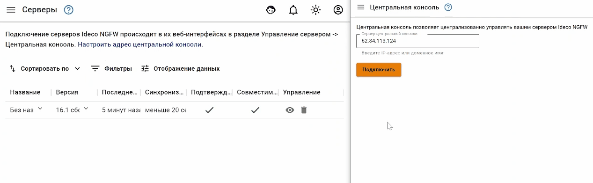

# Перенос данных и настроек на другой сервер


Восстановить бэкап настроек в Ideco UTM 9 из Ideco UTM 7 можно только с версии 7.9.9 Build 176.


Для того чтобы перенести установленный Ideco UTM с одного сервера на другой с сохранением всех настроек выполните следующие действия:

### Этап 1: Копирование резервных копий с сервера

В разделе веб-интерфейса **Управление сервером -> Резервное копирование -> Резервные копии** создайте резервную копию настроек сервера. Загрузите созданную копию на ваш компьютер, нажав на кнопку **Скачать** в столбце **Управление**.

### Этап 2. Установка Ideco UTM на новый сервер

Инструкция по установке: [Процесс установки](../../installation/installation-process.md).

### Этап 3: Перенос резервных копий на новый сервер

В разделе веб-интерфейса **Управление сервером -> Резервное копирование -> Резервные копии** нажмите кнопку добавления резервной копии -> **Загрузить из файла** и выберите выгруженный на первом этапе бэкап.

### Этап 4: Восстановление БД из резервных копий

Нажмите кнопку **Применить** (иконка  в столбце **Управление**). Система будет перезагружена для применения настроек сервера.


При подключении к Ideco Center восстановленного из бекапа клона сервера он не появится в таблице серверов ЦК. Возникает конфликт с донором резервной копии из-за одинакового claster_id. Сервер-клон подменяет собой уже подключенный Ideco UTM:


В случае возникновения такой проблемы обратитесь в [Техническую поддержку](../../general/technical-support.md).

## Перенос данных почтового сервера

Для того чтобы перенести данные с UTM 7.9.9 на UTM 9.x, с переносом почты на отдельный диск, выполните следующие действия:

1. Выкачайте всю почту из папки `/var/mail/` на внешнее хранилище. Это можно сделать с помощью различных программ для копирования файлов между локальным компьютером и удалённым сервером (например: rsync, WinSCP, scp от ssh и др.);
2. Установите с загрузочного образа последнюю версию Ideco UTM на физический диск;
3. Подключите второй физический диск, который будет использоваться для хранения почты;
4. В веб-интерфейсе Ideco UTM перейдите в раздел **Почтовый релей -> Основные настройки**, выберите диск для хранения почты и отформатируйте его;
5. Разрешите доступ по SSH из локальных сетей в разделе **Управление сервером -> Администраторы**;
6. Подключитесь к UTM, например, с помощью программы WinSCP и скопируйте всю почту по пути `/var/mail/`;
7. По окончании копирования файлов почты, выполните команду `chown -R ideco-mail-backend:ideco-mail-backend /var/spool/mail/`. Данная команда меняет владельца и группу для файлов почты, чтобы почтовый демон dovecot мог иметь доступ к этим файлам.
