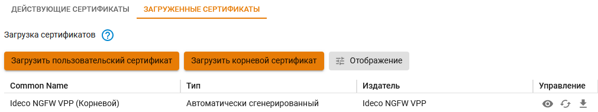

# Автоматическое создание подключение


Перед настройкой VPN-подключения, в дереве пользователей откройте карточку нужного пользователя и установите флаг **Разрешить удаленный доступ через VPN**. Для этого перейдите в раздел **Пользователи -> Учетные записи**:





Не рекомендуем использовать для VPN-подключений кириллические логины.


<details>

<summary>Протокол L2TP/IPSec</summary>

**Важно:** L2TP IPsec клиенты, находящиеся за одним NAT'ом, могут испытывать проблемы подключения если их более одного. Решить проблему может помочь [инструкция](https://docs.microsoft.com/en-us/troubleshoot/windows-server/networking/configure-l2tp-ipsec-server-behind-nat-t-device). Рекомендуем вместо L2TP IPsec использовать IKEv2 IPSec.

Вы можете запустить следующий скрипт PowerShell для автоматического создания подключения на компьютерах пользователей с Windows 8.1 и 10. Для этого скачайте готовые скрипты подключения вашего сервера из раздела **Пользователи -> VPN-подключения -> Основное**.

Подключение будет создано со следующими параметрами:

1. Протокол **L2TP/IPsec** с использованием PSK-ключа.
2.  Параметр **Использовать основной шлюз в удаленной сети** выключен.

    Доступ к локальным сетям того же класса, что были получены для VPN-подключения по умолчанию в Windows 7 и 10 будет осуществляться через VPN-подключение, поэтому дополнительных маршрутов создавать не нужно (если вы не используете разные классы сетей в локальной сети офиса).

Создайте файл с именем **ideco\_utm\_l2tp.ps1** (в Блокноте или редакторе Windows PowerShell ISE) и скопируйте в него следующий текст:

```
### Ideco UTM L2TP/IPsec connection ###
param([switch]$Elevated)
$currentUser = New-Object Security.Principal.WindowsPrincipal $([Security.Principal.WindowsIdentity]::GetCurrent())
if (!$currentUser.IsInRole([Security.Principal.WindowsBuiltinRole]::Administrator))  {
  if (!$elevated) {
    Start-Process `
            powershell.exe `
            -Verb RunAs `
            -ArgumentList ('-noprofile -noexit -file "{0}" -elevated' -f ( $myinvocation.MyCommand.Definition ))
  }
  exit
}
Enable-NetFirewallRule -Group "@FirewallAPI.dll,-28502"
Add-VpnConnection `
    -Force `
    -Name "Ideco UTM L2TP VPN" `
    -TunnelType L2TP `
    -ServerAddress my.domain.com `
    -L2tpPsk "XXXXXXXXXXXXXXXXXXXXXXXXXXXXXXXX" `
    -EncryptionLevel "Required" `
    -AuthenticationMethod MSChapV2 `
    -SplitTunneling $False `
    -DnsSuffix activedirectory.domain `
    -RememberCredential
```

**Поменяйте в нем необходимые параметры на соответствующие вашим настройкам:**

* **Ideco UTM L2TP VPN** - имя подключения в системе (может быть произвольным).
* **my.domain.com** - домен или IP-адрес основного внешнего интерфейса Ideco UTM.
* **XXXXXXXXXXXXXXXXXXXXXXXXXXXXXXXX** - PSK-ключ вашего сервера.
* **activedirectory.domain** - ваш домен Active Directory (если есть, если нет нужно удалить эту строчку из скрипта).

**Запустить скрипт на компьютере пользователя можно из контекстного меню файла «Выполнить с помощью PowerShell». Нажмите «Ок» в диалоге повышения прав (они требуются для разрешения доступа к общим файлам и принтерам).**

После этого подключение в системе будет создано, а также включен общий доступ к файлам и принтерам для всех сетей (иначе доступ к файловым ресурсам в локальной сети может быть невозможен).

Пользователю при первой авторизации необходимо ввести свой логин/пароль.

**Возможные ошибки при выполнении скрипта**

* При появлении ошибки «Выполнение сценариев отключено в этой системе», нужно включить выполнение сценарием, выполнив команду в PowerShell: `Set-ExecutionPolicy Unrestricted`.

</details>

<details>

<summary>Протокол SSTP</summary>

Вы можете запустить следующий скрипт PowerShell для автоматического создания подключения на компьютерах пользователей с Windows 8.1 и 10. Для этого скачайте готовый скрипт из раздела **Пользователи -> VPN-подключения -> Основное**.

**Подключение будет создано со следующими параметрами:**

1. Протокол **SSTP** с использованием PSK-ключа.
2.  Параметр **Использовать основной шлюз в удаленной сети** выключен.

    Доступ к локальным сетям того же класса, что были получены для VPN-подключения по умолчанию в Windows 7 и 10 будет осуществляться через VPN-подключение, поэтому дополнительных маршрутов создавать не нужно (если вы не используете разные классы сетей в локальной сети офиса).

Создайте текстовый файл с именем **ideco\_utm\_sstp.ps1** (в Блокноте или редакторе Windows PowerShell ISE) и скопируйте туда следующий текст:

```
### Ideco UTM SSTP connection ###
param([switch]$Elevated)
$currentUser = New-Object Security.Principal.WindowsPrincipal $([Security.Principal.WindowsIdentity]::GetCurrent())
if (!$currentUser.IsInRole([Security.Principal.WindowsBuiltinRole]::Administrator))  {
  if (!$elevated) {
    Start-Process `
            powershell.exe `
            -Verb RunAs `
            -ArgumentList ('-noprofile -noexit -file "{0}" -elevated' -f ( $myinvocation.MyCommand.Definition ))
  }
  exit
}
Enable-NetFirewallRule -Group "@FirewallAPI.dll,-28502"
Add-VpnConnection `
    -Force `
    -Name "Ideco UTM SSTP VPN" `
    -TunnelType SSTP `
    -ServerAddress my.domain.com:4443 `
    -EncryptionLevel "Required" `
    -AuthenticationMethod MSChapV2 `
    -SplitTunneling $False `
    -DnsSuffix activedirectory.domain `
    -RememberCredential
```

**Поменяйте в нем необходимые параметры на соответствующие вашим настройкам:**

1. **Ideco UTM SSTP VPN** - имя подключения в системе (может быть произвольным).
2. **my.domain. com:4443** - домен внешнего интерфейса Ideco UTM и порт, на котором вы включили SSTP.
3. **activedirectory.domain** - ваш домен Active Directory (если домена нет, нужно удалить эту строчку из скрипта).

**Запустить скрипт на компьютере пользователя можно из контекстного меню файла «Выполнить с помощью PowerShell». Нажмите «Ок» в диалоге повышения прав (они требуются для разрешения доступа к общим файлам и принтерам).**

После этого подключение в системе будет создано, а также включен общий доступ к файлам и принтерам для всех сетей (иначе доступ к файловым ресурсам в локальной сети может быть невозможен).

Пользователю при первой авторизации необходимо ввести свой логин/пароль.

**Возможные ошибки при выполнении скрипта**

При ошибке «Выполнение сценариев отключено в этой системе», нужно включить выполнение сценарием, выполнив команду в PowerShell: `Set-ExecutionPolicy Unrestricted`.

</details>

<details>

<summary>Протокол IPSec IKEv2</summary>

Запустить скрипт PowerShell для автоматического создания подключения на компьютерах пользователей с Windows 8.1 и 10, скачав готовый скрипт из раздела **Пользователи -> VPN-подключение -> Основное**.

Перед настройкой подключения по протоколу IKEv2 установите корневой сертификат UTM на устройство пользователя. Скачать сертификат можно одним из способов:

*   В личном кабинете, введя логин/пароль пользователя:

    
*   В разделе **Сервисы -> Сертификаты**:

    

Корневой сертификат потребуется для настройки подключения рабочей станции пользователя, если не был получен корневой сертификат через Let\`s Encrypt. \
Если для VPN-подключения используется сертификат выданный Let\`s Encrypt, то установка корневого сертификата на устройство не требуется.

**Подключение с помощью скрипта будет создано со следующими параметрами:**

1. Протокол IKEv2.
2. Параметр **Использовать основной шлюз в удаленной сети** выключен. Доступ к локальным сетям того же класса, что были получены для VPN-подключения по умолчанию в Windows 7 и 10, будет осуществляться через VPN-подключение, поэтому дополнительных маршрутов создавать не нужно (если вы не используете разные классы сетей в локальной сети офиса).

Создайте текстовый файл с именем **ideco\_utm\_ikev2.ps1** (в Блокноте или редакторе Windows PowerShell ISE) и скопируйте туда следующий текст:

```
### Ideco UTM IKEv2 connection ###
param([switch]$Elevated)
$currentUser = New-Object Security.Principal.WindowsPrincipal $([Security.Principal.WindowsIdentity]::GetCurrent())
if (!$currentUser.IsInRole([Security.Principal.WindowsBuiltinRole]::Administrator))  {
  if (!$elevated) {
    Start-Process \`
            powershell.exe `
            -Verb RunAs `
            -ArgumentList ('-noprofile -noexit -file "{0}" -elevated' -f ( $myinvocation.MyCommand.Definition ))
  }
  exit
}
Enable-NetFirewallRule -Group "@FirewallAPI.dll,-28502"
Add-VpnConnection `
    -Force `
    -Name "Ideco UTM IKEv2 VPN" `
    -TunnelType IKEv2 `
    -ServerAddress my.domain.com `
    -EncryptionLevel "Required" `
    -AuthenticationMethod EAP `
    -SplitTunneling $False `
    -DnsSuffix activedirectory.domain `
    -RememberCredential
```

**Поменяйте в нем необходимые параметры на соответствующие вашим настройкам:**

1. `Ideco UTM IKEv2 VPN` - название подключения в системе (может быть произвольным).
2. `my.domain.com` - домен внешнего интерфейса Ideco UTM (А-запись для домена должна ссылаться на IP-адрес внешнего интерфейса Ideco UTM).
3. `activedirectory.domain` - ваш домен Active Directory (если его, то нужно удалить эту строчку из скрипта).

Запустить скрипт на компьютере пользователя можно из контекстного меню файла «Выполнить с помощью PowerShell». Нажмите «Ок» в диалоге повышения прав (они требуются для разрешения доступа к общим файлам и принтерам).

После этого подключение в системе будет создано, а также включен общий доступ к файлам и принтерам для всех сетей (иначе доступ к общим папкам в локальной сети будет невозможен).

При первой авторизации необходимо ввести логин/пароль пользователя.

**Возможные ошибки при выполнении скрипта**

При появлении ошибки «Выполнение сценариев отключено в этой системе», нужно включить выполнение сценариев, выполнив команду в PowerShell: `Set-ExecutionPolicy Unrestricted`

</details>

## Ошибки работы VPN-подключений

<details>

<summary>Если VPN-подключение по протоколам IPSeс в Windows автоматически разрывается через 7 часов 45 минут и при подключении по IKEv2 возникает ошибка "Ошибка сопоставления групповой политики" или ошибка с кодом "13868"</summary>

Для восстановления связи подойдут следующие действия:

1\. Переподключите соединение. В данном случае соединение восстановится, но через 7 часов 45 минут вновь будет автоматически разорвано. Если вы хотите, чтобы подключение не разрывалось автоматически, то выполните действия из следующего пункта.

2\. Внесите изменения в реестр:

* Откройте **Редактор реестра**.
* Перейдите по пути `HKEY_LOCAL_MACHINE\SYSTEM\CurrentControlSet\Services\RasMan\Parameters`.
* Нажмите правой кнопкой мыши по параметру именем **NegotiateDH2048\_AES256** и нажмите **Изменить**.
* В строке **Значение** укажите значение `1`:


* Нажмите **OK**.
*   Перезагрузите Windows.

    Если параметра именем **NegotiateDH2048\_AES256** нет, то создайте его. Для этого:
* Нажмите правой кнопкой мыши по свободному месту реестра в **Parameters** и выберите **Создать -> DWORD**:


* Задайте имя **NegotiateDH2048\_AES256**.
* Нажмите правой кнопкой мыши по созданному файлу и выберите **Изменить**:


* В строке **Значение** укажите значение `1`:


* Нажмите **OK**.

3\. Перезагрузите Windows.

</details>
