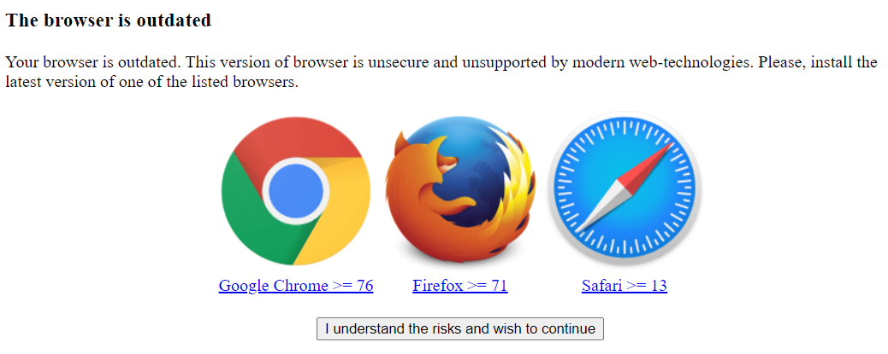

# Ошибка при авторизации "The browser is outdated"

Если вы используете браузер, который не поддерживает UTM, то при авторизации появится ошибка **Your browser is outdated. This version of browser is unsecure and unsupported by modern web-technologies. Please, install the latest version of one of the listed browsers**.

Поддерживаемые браузеры:
* Google Chrome версия >= 76;
* Firefox версия >= 71;
* Safari версия >= 13.

Рекомендуем обновить браузер до минимально поддерживаемой версии.

Для продолжения авторизации не смотря на риски, потребуется нажать **I understand the risks and wish to continue**.

