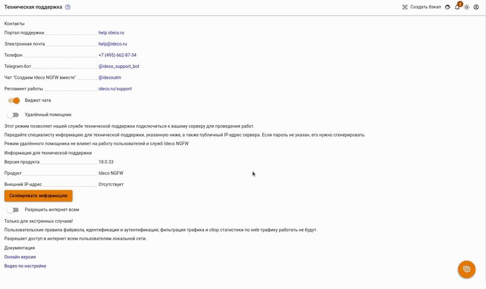
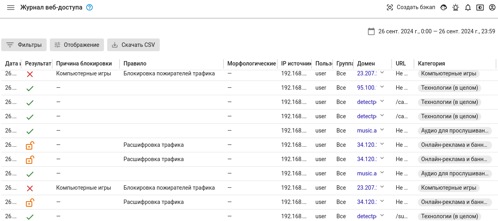
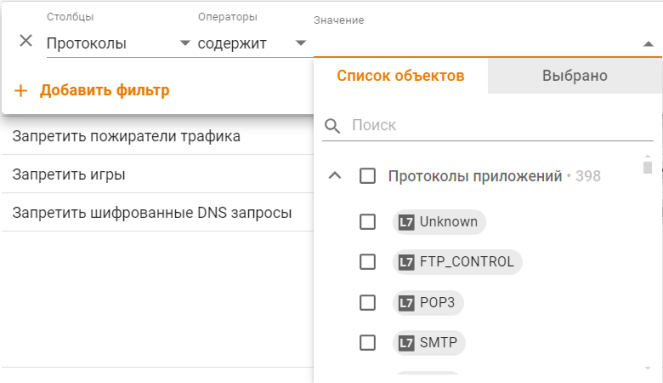
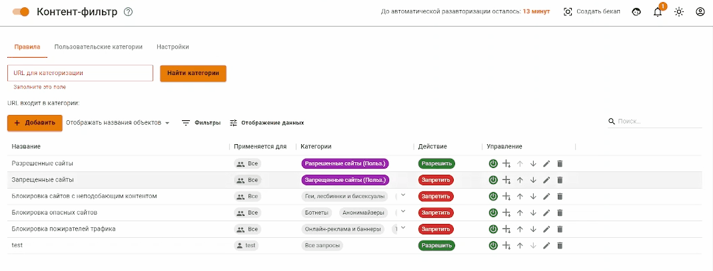

# Ошибка при открытии сайта ERR\_CONNECTION\_TIMED\_OUT или Не открывается сайт

### Шаг 1. Проверьте, открывается ли сайт в режиме **Разрешить Интернет всем**:

* Нажмите на иконку технической поддержки в верхней правой части окна ;
*   Переведите **Разрешить Интернет всем** в положение включен:

    
* Откройте сайт.

Если сайт не открывается, то проверьте, откроется ли сайт на другом устройстве с того же IP-адреса:

1.1. Если не открывается, то рекомендуем обратиться к провайдеру. Скорее всего провайдер блокирует IP-адрес или адрес сайта. 

1.2. Если сайт открывается, то обратитесь в техническую поддержку.

### Шаг 2. Проверьте, не блокирует ли сайт система [**Предотвращения вторжений**](../../settings/access-rules/ips.md).

* Перейдите в раздел **Правила трафика -> Предотвращение вторжений**;
*   Переведите раздел **Предотвращение вторжений** в положение _выключен_ на несколько минут:

    
* Повторите попытку входа на сайт.

Если сайт открылся, найдите в логах номер блокирующего правила и добавьте номер правила в **Предотвращение вторжений -> Исключения**.

Либо добавьте в исключение IP-адрес сайта по [инструкции](../../settings/access-rules/ips.md#kak-isklyuchit-uzel-iz-obrabotki-sistemoi-ids-ips).

### Шаг 3. Если предыдущий пункт не помог, то проверьте, не блокируется ли сайт правилом [Контент-фильтра](../../settings/access-rules/content-filter/). Для этого:

* Создайте тестовое правило для тестируемого пользователя в разделе **Правила трафика -> Контент-фильтр**:
  * **Название** - произвольное название
  * **Применяется для** - выберите тестового пользователя
  * **Категория сайтов** - Все запросы
  * **Действие** – Разрешить 
    
    

* Нажмите _Сохранить_;
* Поместите созданное правило вверх списка, нажав на кнопку ;
* Откройте сайт.

Если сайт откроется, то найти блокирующее правило можно опуская тестовое правило вниз по списку.

Если блокирующее правило не найдено, переходите к следующему пункту.

### Шаг 4. Определите блокируемый домен или IP-адрес (рассмотрим на примере FireFox):

* Откройте в браузере нужный сайт;
* Нажмите F12;
* Выберите вкладку «Сеть»;
* Обновите страницу;
* Столбец _Статус_ отсортируйте левой кнопкой мышки.

Обратите внимание на коды состояния 4xx и 5хх, именно эти запросы блокируются либо УТМ, либо вышестоящими сервисами.

Определите к какой категории контент-фильтра относится то или иное имя. Для этого перейдите в разделе **Правила трафика -> Контент-фильтр -> URL для категоризации**:

**Если вам не удалось решить проблему, пришлите, пожалуйста, в техподдержку:**

1\. Скриншот ошибки в браузере;

2\. Скриншот отсортированных ошибок из FireFox, чтобы было видно проблемные домены или ip-адреса (изменено).


Заведомо надежные сервисы можно добавлять в раздел **Сервисы -> Прокси -> Исключения** во вкладке **Сети назначения**.

Добавлять в исключения адреса клиентов вашей сети не рекомендуется, так как в этом случае их веб-трафик не будет фильтроваться правилами контент-фильтра и не будет попадать в отчеты.

