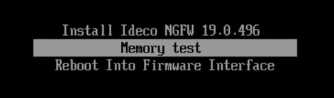

# Тестирование оперативной памяти сервера

При загрузке GRUB для тестирования оперативной памяти используйте Memtest86+.
Для запуска тестирования памяти выполните действия:

1. При загрузке сервера выберите **Memory test**:
   

2. Для начала тестов нажмите **Enter** или подождите 5 секунд до автоматического запуска тестирования:


Для выбора режима диагностики **Fail-Safe Mode** - нажмите **F1**.\
Для выбора режима диагностики **Multi-Threading(SMP)** - нажмите **F2**.


* Если появится запись **PASS**, тесты памяти пройдены успешно:

    

* При ошибке памяти появится запись вида:
    
    
