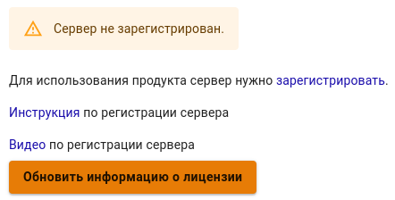
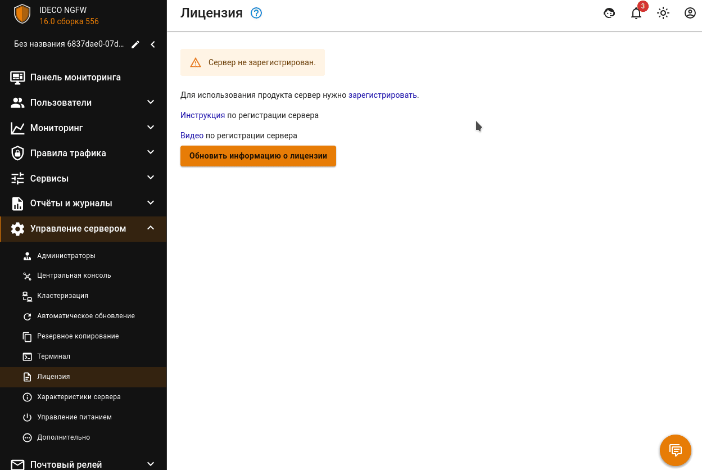

## Регистрация сервера 


Для активации лицензии необходима обязательная регистрация сервера в [личном кабинете](https://my.ideco.ru/#/login/?next=/utm/license/).

Для привязки лицензии к Ideco UTM версии 7.9.3, обратитесь в [техническую поддержку](../../general/technical-support.md).



Для привязки лицензии сервер должен иметь выход в интернет.


Для полноценной работы Ideco UTM зарегистрируйте сервер и получите лицензию, выполнив действия:

1. Перейдите в веб-интерфейс Ideco UTM в раздел **Управление сервером -> Лицензия** и нажмите **Зарегистрировать**:

2. В открывшемся окне перейдите по ссылке **Зарегистрировать новый сервер**, выберите компанию и нажмите **Добавить**. После добавления нажмите **Обновить информацию о лицензии** для проверки состояния лицензии:

