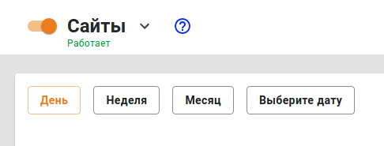

# Сайты

## Настройка

Для доступа к отчётам необходимо зайти в веб-интерфейс Ideco UTM в раздел **Отчеты**.

Отчетность доступна при следующих условиях:

* На странице **Отчеты -&gt; Сайты** ползунок включения модуля должен находиться в положении **Включен**:

  

* Должен быть включен [Контент-фильтр](../access-rules/content-filter/) \(даже если вы не собираетесь ограничивать доступ пользователям к сайтам, он нужен для категоризации сайтов в отчетах\).

## Исключение пользователей из отчетности

Исключить пользователя из отчетов по веб-активности можно, если [исключить его IP-адрес из обработки прокси-сервером](../service/proxy/exclusions.md).


При этом на пользователя не будут распространяться запрещающие правила контент-фильтра, и его трафик не будет проверяться антивирусами для веб-трафика. 


## Особенности работы

* При переводе системного времени на UTM назад или вперёд, а затем обратно, веб-статистика за конкретный период времени \(который включает переводы времени\), в случае наличия трафика за этот период, будет посчитана некорректно. Это происходит из-за дублирования статистики за один и тот же промежуток времени.
* Начиная с версии Ideco UTM 7.2 работа веб-отчетности возможна только на процессорах с поддержкой инструкций [SSE 4.2](https://ru.wikipedia.org/wiki/SSE4).
* Имена удаленных из Ideco UTM пользователей в статистике не отображаются \(статистика таких пользователей будет агрегирована в пользователе **Удаленный пользователь**\).

