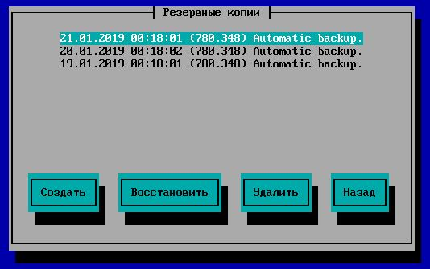

# Резервное копирование и восстановление данных


Начиная с версии 7.8.0 используется новый формат бэкапов, не совместимый со старыми версиями. Восстановить бэкап настроек можно только на той же мажорной версии Ideco UTM для которой он создан или следующей версии. Например, бэкап созданный в версии 7.8.2 можно восстановить только в установленной версии 7.8.х или 7.9.0. Восстановить его в версии 7.7 или 7.10 нельзя.


## Резервное копирование

Предоставление пользователям стабильного доступа в сеть Интернет является основной задачей, решаемой интернет-шлюзом. Но иногда случаются ситуации, которые приводят к сбоям в работе системы и последующему нарушению доступа в интернет. В зависимости от сложности сбоя может потребоваться полная переустановка интернет-шлюза и восстановление данных из резервных копий. В этом разделе вы найдете описание процесса создания резервных копий интернет-шлюза Ideco UTM.

В зависимости от того, где вы собираетесь хранить резервные копии, интернет-шлюз поддерживает следующие типы автоматического резервного копирования:

* на сетевое файловое хранилище по протоколу FTP;
* на сетевое файловое хранилище по протоколу NetBIOS;&#x20;
* на локальный жесткий диск.

Для настройки автоматического резервного копирования перейдите в следующий раздел административного web-интерфейса **Сервисы -> Резервное копирование**. В этом разделе вы сможете настроить каждый из типов резервирования данных. Резервная копия создается каждый день в указанный в настройках час (рекомендуется выбирать ночное время для создания резервной копии).

&#x20;Хранить резервные копии можно в течение недели или месяца.

## Резервное копирование на удаленное файловое хранилище по протоколу FTP

Данный тип предусматривает запись резервных копий на FTP-сервер. Ключевые параметры, необходимые для настройки резервного копирования на FTP-сервер, описаны в таблице.

| Параметр        | Описание                                                                |
| --------------- | ----------------------------------------------------------------------- |
| Адрес сервера   |  IP-адрес удаленного FTP-сервера, на котором будут размещаться копии БД |
| Логин           | Имя пользователя для авторизации на FTP-сервере                         |
| Пароль          | Пароль для авторизации на FTP-сервере                                   |
| Путь к каталогу | Каталог, в который будут записываться копии БД                          |

## Резервное копирование на сетевое файловое хранилище по протоколу NetBIOS

Данный тип резервного копирования предусматривает запись копии на сервер по протоколу NetBIOS (CIFS). Ключевые параметры, необходимые для настройки резервного копирования на NetBIOS-сервер, описаны в таблице.

| Параметр        | Описание                                                                   |
| --------------- | -------------------------------------------------------------------------- |
| Адрес сервера   | IP-адрес удаленного NetBIOS-сервера, на котором будут размещаться копии БД |
| Логин           | Имя пользователя для авторизации на сетевом ресурсе Windows                |
| Пароль          | Пароль для авторизации на сетевом ресурсе Windows                          |
| Путь к каталогу | Каталог, в который будут записываться копии БД                             |


Для доменной учётной записи формат поля **Имя пользователя** должен иметь вид: _Имя\_домена/Имя\_пользователя_\
Путь к каталогу нужно указывать в UNIX-формате. К примеру, в ОС Windows каталог открывается по следующему пути _\\\\\\\192.168.1.1\\\dir\\\_1\\\dir\\\_2\\\backup_ , значит в поле **Путь к каталогу** нужно прописать _dir\\\_1/dir\\\_2/backup_


## Резервное копирование на локальный жесткий диск

Возможно загрузить резервную копию с сервера или с компьютера на сервер с помощью веб-интерфейса либо локального меню.

* Кнопка **Загрузить из файла** позволяет загрузить выбранную резервную копию на сервер для последующего восстановления.&#x20;
* Кнопка **Создать** позволяет создать резервную копию настроек сервера. Копии настроек создаются автоматически ежедневно.&#x20;
* Кнопка **Применить резервную копию** позволяет восстановить резервную копию настроек. Возможно восстановление настроек только для бэкапа версии одинаковой с установленной на сервере.&#x20;
* Кнопка **Загрузить резервную копию** позволяет скачать резервную копию с сервера на ваш компьютер.&#x20;
* Кнопка **Удалить** удаляет резервную копию с сервера.

## Резервное копирование и восстановление почтовых ящиков пользователей.&#x20;

Если на UTM был настроен почтовый сервер и требуется полностью восстановить конфигурацию на новом сервере, то, помимо восстановления базы данных с настройками UTM, нужно так же переписать все почтовые ящики пользователей, хранящиеся на сервере в каталоге `/var/mail/` (является символической ссылкой на каталог `/var/spool/mail/`).

Копирование содержимого этого каталога можно осуществить с помощью WinSCP или любым другим scp-клинетом. Также возможно перемещение содержимого каталога с диска старого сервера на диск нового сервера в каталог `/var/mail/`, подключив оба диска к серверу и загрузившись из-под любого live-cd дистрибутива linux. Будьте готовы к копированию/сохранению больших объемов данных.&#x20;

После перемещения содержимого каталога `/var/mail/` на новую инсталляцию сервера важно расставить верные права (`nobody:imap`) на содержимое каталога рекурсивно. Лучше всего это делать на новой инсталляции, [загрузив сервер в режиме удаленного помощника](remote-assistant.md), [подключившись к консоли сервера от root](remote-access-for-server-management.md) и выполнив команду: `chown imap:mail /var/mail/ -R`&#x20;

После этого вся почтовая корреспонденция станет доступна клиентам UTM на новой установке под их прежними учетными записями на ПК из-под почтовых клиентов как прежде.&#x20;

При возникновении проблем в ходе выполнения этой процедуры - обратитесь в [техническую поддержку](../technical-support.md) нашей компании, заранее подготовив [доступ по ssh](remote-assistant.md) к новому серверу и корреспонденции со старого сервера (к бэкапу или диску старого сервера).
