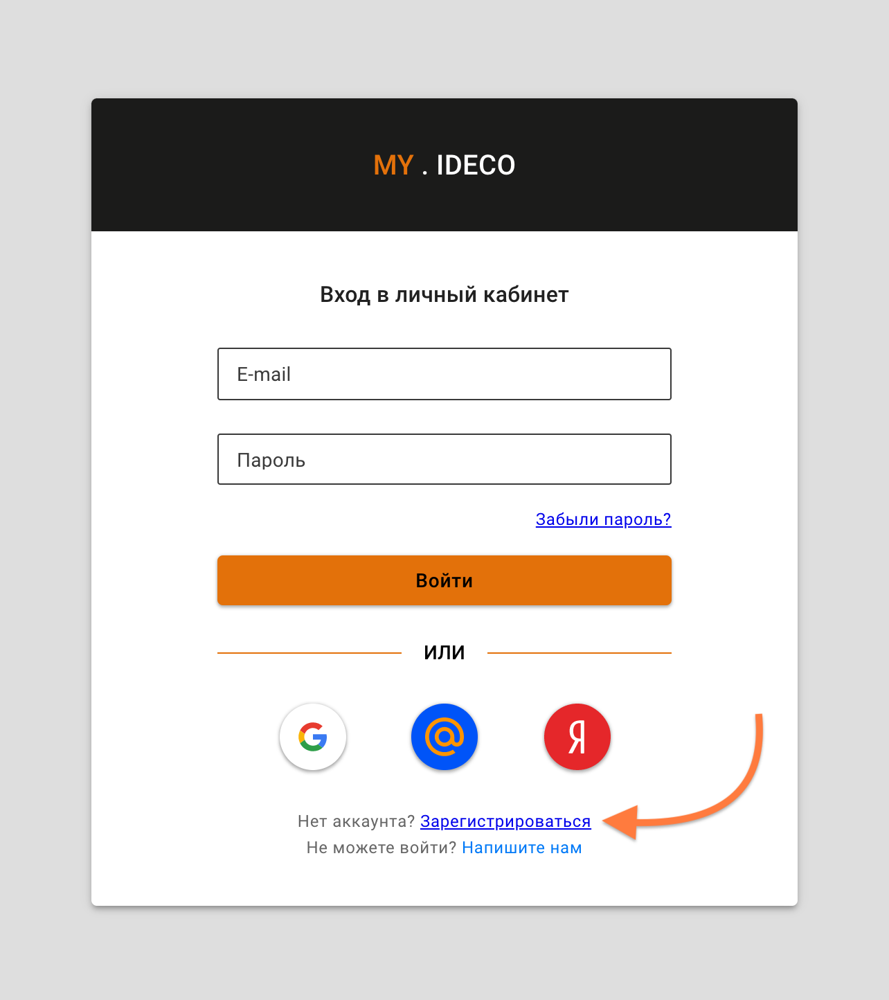
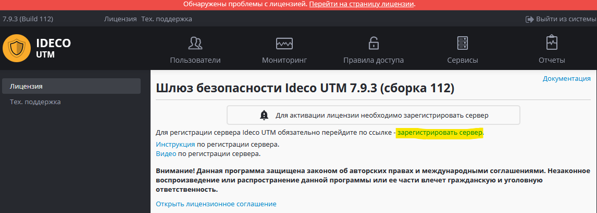
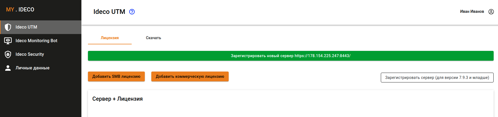
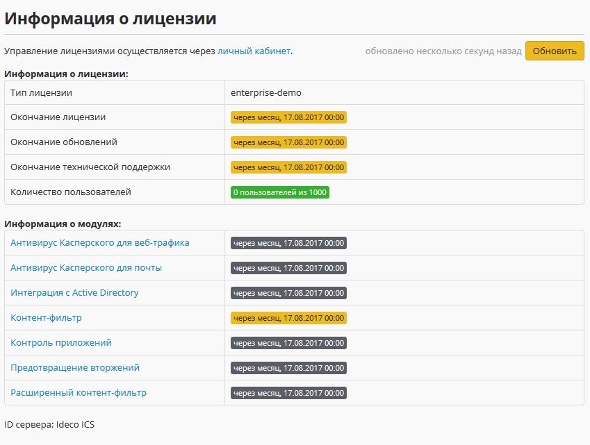
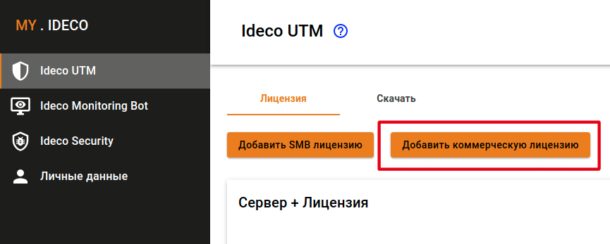
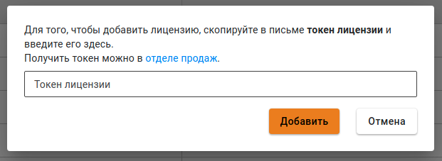
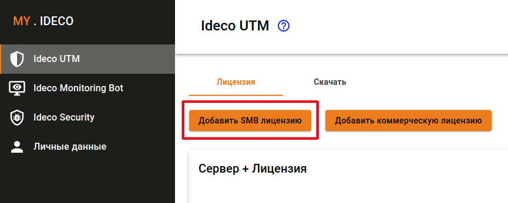
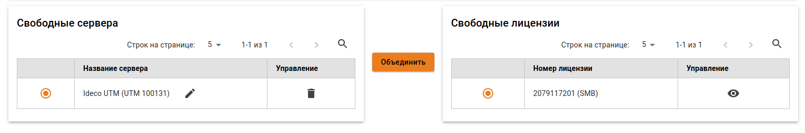
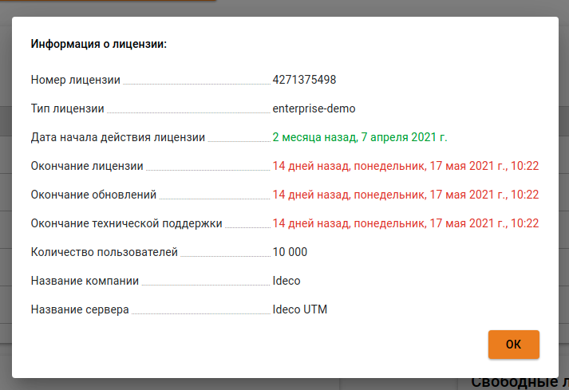

# Регистрация сервера

## Личный кабинет

Личный кабинет [my.ideco.ru](http://my.ideco.ru/) позволяет пользователю получить информацию:

* об имеющихся лицензиях;
* о [сроке окончания подписки](https://2020.ideco.ru/development) на обновления модулей и технической поддержки.

Для получения 40-дневной пробной лицензии на Ideco UTM, а также для привязки [коммерческих](https://2020.ideco.ru/buy) и [бесплатных](https://ideco.ru/products/ics/free-edition) лицензий к серверу требуется обязательная регистрация сервера в личном кабинете.

### Регистрация в  личном кабинете

Зайдите на [сайт](https://my.ideco.ru/#/login/?next=/utm/license/) личного кабинета и перейдите по ссылке **Зарегистрироваться**.

Укажите свои личные данные и данные о компании.

**На указанную электронную почту придет активационное письмо.**

Адрес электронной почты будет использоваться в качестве логина в личный кабинет и для восстановления пароля.


Также для регистрации и авторизации вы можете использовать учетные записи `Google`, `Mail.ru` или `Яндекс`. В этом случае активационного письма не будет.


### Регистрация сервера

После установки Ideco UTM для полноценной работы сервера необходима его регистрация.

**Для регистрации сервера на нем должен быть доступен интернет \(обязательно настройте внешний интерфейс и** [**подключение к провайдеру**](../connection-to-provider/) **перед регистрацией\).**

Выполните для этого следующие действия:

1. [**Зарегистрируйтесь**](https://my.ideco.ru/register/) в личном кабинете пользователя, если вы не делали этого ранее.

2. В веб-интерфейсе Ideco UTM перейдите на вкладку "Лицензия" и нажмите на ссылку "Зарегистрировать сервер".

3. В открывшемся окне личного кабинета перейдите по ссылке "Зарегистрировать новый сервер [https://x.x.x.x/](https://x.x.x.x/)" \(зайдите в личный кабинет под своей учетной записью, если это не произошло автоматически\).

После регистрации сервер автоматически получит лицензию \(если он имеет доступ к интернету\) и в веб-интерфейсе можно будет увидеть ее состояние:

Привязать к серверу коммерческую лицензию вы можете по инструкции, расположенной ниже в разделе "управление лицензиями".

### Просмотр информации о лицензиях

В разделе **Ideco UTM** находится информация о зарегистрированных вами серверах и имеющихся лицензиях. Тестовую 30-ти дневную лицензию на сервер можно получить автоматически при его регистрации.

Доступны следующие типы лицензий, соответствующие одноименным редакциям \(подробнее о [редакциях Ideco UTM](https://ideco.ru/products/ics/editions)\):

| Название лицензии | Редакция | Подключенные модули, ограничения |
| :--- | :--- | :--- |
| enterprise-demo | 40-ти дневная пробная версия | Авторизация до 10 000 пользователей. Включены все модули и техническая поддержка на 40 дней. Данную лицензию нельзя переназначить на другой сервер или переместить в свободные. Выдается один раз при регистрации сервера. **Тестовую 40-дневную лицензию вы получаете автоматически при регистрации сервера** |
| SMB | SMB \([бесплатная редакция](https://ideco.ru/products/ics/free-edition)\) | Авторизация до 20 пользователей. По умолчанию действует 5 лет. Основные модули фильтрации недоступны \(интеграция с Active Directory, антивирусы Kaspersky/ClamAV, Контроль приложений, Предотвращение вторжений, Расширенный контент фильтр\) |
| enterprise | Enterprise | Количество авторизованных пользователей ограничено лицензией. Включены модули интеграции с Active Directory, контроль приложений, предотвращение вторжений, расширенный контент-фильтр, доступ к технической поддержке на период активности подписки на редакцию \(кроме модуля интеграции с Active Directory, который доступен всегда во время действия лицензии на Ideco UTM\). Модули антивируса Касперского приобретаются отдельно \(для покупки вы можете обратиться в [отдел продаж](https://2020.ideco.ru/contacts)\). |


При отсутствии лицензии для сервера Ideco UTM или при окончании срока действия лицензии отключена авторизация пользователей и фильтрация трафика.


Выполнить регистрацию сервера, просмотреть информацию об имеющихся лицензиях и добавить коммерческую лицензию \(если она куплена\) или лицензию SMB можно в разделе "Ideco UTM" личного кабинета.

## Управление лицензиями

Управление лицензиями происходит в разделе **Ideco UTM** личного кабинета. Доступные действия:

* выполнить регистрацию сервера, 
* добавить коммерческую или бесплатную лицензию,
* просмотреть информацию об имеющихся лицензиях.

### Добавление коммерческой лицензии

После покупки лицензии вы получите токен вида: `owhYLGvT6Xmt819JyinSxREkJfvjVO63`.

Чтобы добавить лицензию в личный кабинет, нажмите на кнопку **Добавить коммерческую лицензию** в разделе **Ideco UTM**.

Далее скопируйте в поле **Токен лицензии** имеющийся токен.

После этого токен будет недействителен, а в таблице **Свободные лицензии** отобразится купленная вами лицензия.

### Добавление SMB лицензии

Чтобы добавить лицензию SMB в личный кабинет, нажмите кнопку **Добавить SMB лицензию** в разделе **Ideco UTM**.

### Привязка лицензии к серверу

Для того чтобы привязать лицензию к серверу выполните следующие действия: 

1. В разделе **Ideco UTM** личного кабинета выберите один свободный сервер и одну свободную лицензию.  

2. Нажмите кнопку **Объединить**. Сервер с привязанной лицензией отобразится в таблице **Сервер + Лицензия**.

Вы можете назначить имеющиеся коммерческие лицензии на любой зарегистрированный вами сервер Ideco UTM с учетом следующих ограничений:

* Одна лицензия может быть привязана только к одному серверу.
* Демо-лицензию нельзя привязать к другому серверу. Можно только удалить ее, нажав на иконку  в колонке **Управление**. После этого сервер без лицензии отобразится в таблице **Свободные сервера**.
* Демо-лицензию нельзя повторно получить на одну и ту же инсталляцию сервера.

### Просмотр информации о лицензиях

Подробный просмотр информации о сервере и лицензии доступен при нажатии на иконку  в колонке **Управление** таблицы **Сервер + Лицензия**.

Подробная информация о лицензии содержит сведения о сроке действия лицензии, количестве пользователей, сроке окончания обновлений и технической поддержки продукта.


В будущем в личном кабинете появится возможность покупки модулей, выставления счетов на продление и покупку лицензий. В настоящее время для осуществления этих операций вы можете обратиться в отдел продаж.


