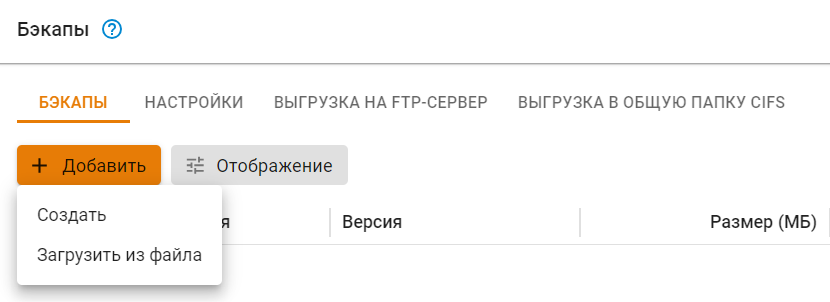
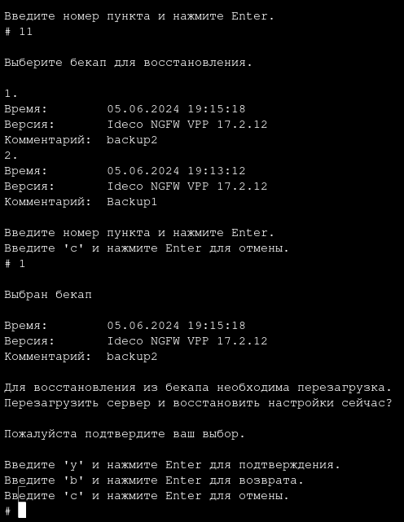

# Резервное копирование и восстановление данных


Восстановить бэкап настроек в Ideco UTM 9 из Ideco UTM 7 можно только с версии 7.9.9 Build 176.


## Резервное копирование

Предоставление пользователям стабильного доступа в сеть Интернет является основной задачей, решаемой интернет-шлюзом. Но иногда случаются ситуации, которые приводят к сбоям в работе системы и последующему нарушению доступа в Интернет. В зависимости от сложности сбоя может потребоваться полная переустановка интернет-шлюза и восстановление данных из резервных копий. 

Интернет-шлюз поддерживает следующие типы автоматического резервного копирования:

* на сетевое файловое хранилище по протоколу FTP;
* на сетевое файловое хранилище по протоколу NetBIOS;
* на локальный жесткий диск.

Для настройки автоматического резервного копирования перейдите в раздел **Управление сервером -> Резервное копирование -> Настройки**. Резервная копия создается каждый день в указанный в настройках час (рекомендуется выбирать ночное время для создания резервной копии).

Хранить резервные копии можно в течение недели или месяца.

## Резервное копирование на удаленное файловое хранилище по протоколу FTP или на сетевое файловое хранилище по протоколу NetBIOS(CIFS)

Для создания настройки перейдите в раздел **Управление сервером -> Резервное копирование -> Выгрузка на FTP-сервер/Выгрузка в общую папку CIFS**, установите флаг в пункте **Включить выгрузку на FTP-сервер/в общую папку CIFS** и заполните соответствущие поля.


В строке **Адрес сервера** указывается IP-адрес или домен удаленного FTP-сервера/NetBIOS-сервера, на котором будут размещаться копии базы данных.

Путь к каталогу нужно указывать в UNIX-формате. \
К примеру, в ОС Windows каталог открывается по следующему пути `\\192.168.1.1\dir_1\dir_2\backup`, значит в поле **Путь к каталогу** нужно прописать `dir_1/dir_2/backup`.



По протоколу FTP и NetBIOS(CIFS) выгружаются только автоматически созданные резервные копии с периодичностью, указанной во вкладке **Настройки**. 


## Резервное копирование на локальный жесткий диск

Возможно загрузить резервную копию с сервера или с компьютера на сервер с помощью веб-интерфейса либо локального меню.

* Кнопка **Добавить** позволяет создать резервную копию настроек сервера. Копии настроек создаются автоматически ежедневно;
* Кнопка **Применить** позволяет восстановить резервную копию настроек. Возможно восстановление настроек только для бэкапа версии одинаковой с установленной на сервере;
* Кнопка **Скачать** позволяет скачать резервную копию с сервера на компьютер;
* Кнопка **Удалить** удаляет резервную копию с сервера.

Интерфейс управления резервными копиями в веб-интерфейсе представлен на скриншоте ниже.

### Управление резервными копиями через локальное меню

* Для того чтобы создать новую резервную копию через локальное меню Ideco NGFW, выберите пункт **9** и нажмите **Enter**. Далее введите комментарий для резервной копии и нажмите **Enter**.

Пример создания резервной копии через локальное меню приведен на скриншоте ниже:

* Для того чтобы восстановить конфигурацию из резервной копии, выберите пункт **10** и нажмите **Enter**. Выберите из списка резервную копию (если копий несколько), введя пункт нужной копии, и нажмите **Enter**. Для восстановления из резервной копии необходимо перезагрузить сервер. Введите **y**, а затем **Enter** для перезагрузки.

Пример восстановления из резервной копии через локальное меню приведен на скриншоте ниже:


При миграции NGFW с одной физической машины на другую (перенос диска или восстановление резервной копии на новом оборудовании), будут восстановлены настройки всех сетевых интерфейсов, указанные до миграции. Для удаления ненужных интерфейсов воспользуйтесь кнопкой .

**Например:** исходная версия NGFW 16.0 -> произвели миграцию NGFW на новое оборудование -> настроили новое оборудование -> провели обновление на NGFW 16.1-> в разделе **Сетевые интерфейсы** будут отображаться старые (до миграции) и новые (после миграции и настройки) сетевые интерфейсы.

