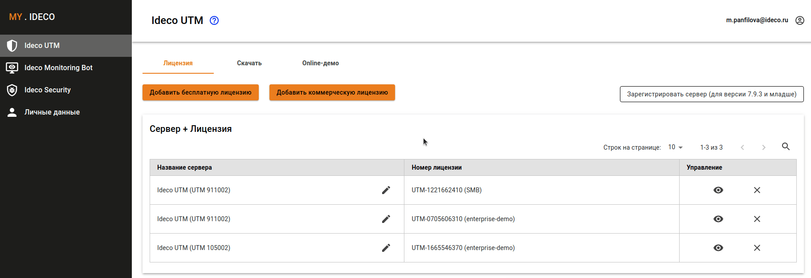
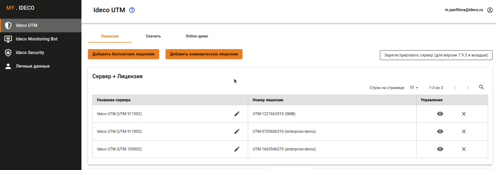
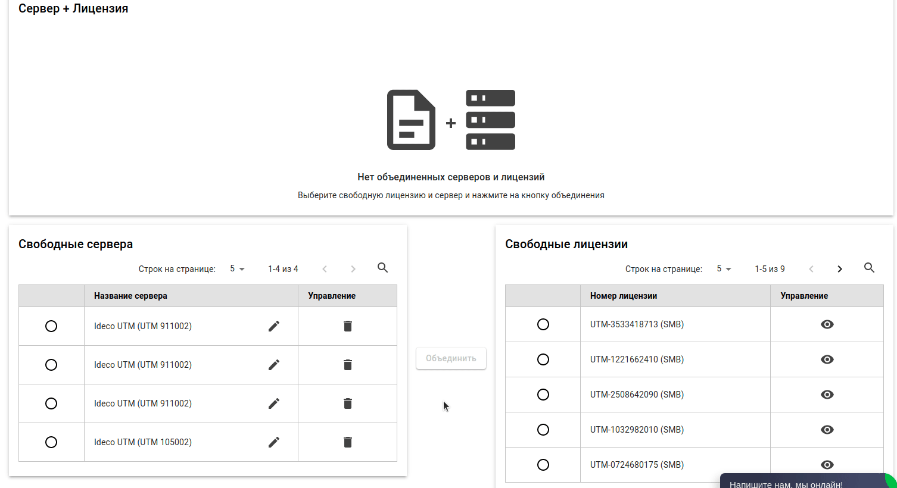
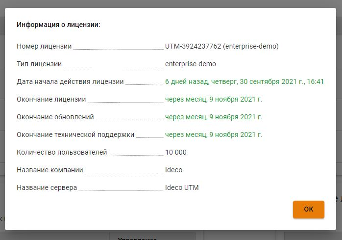

# Управление лицензиями

В разделе **Ideco UTM** личного кабинета находится информация о зарегистрированных вами серверах и имеющихся лицензиях.

## Виды лицензий

Доступны следующие типы лицензий:

### Enterprise-demo - 40-дневная пробная версия
* [x] Авторизация до 10 000 пользователей
* [x] Включены все модули на 40 дней
* [x] Техническая поддержка на 40 дней

Включены все модули и техническая поддержка на 40 дней. Данную лицензию нельзя переназначить на другой сервер или переместить в свободные. **Выдается автоматически один раз при регистрации сервера.** 

После окончания действия лицензии:
* 

### SMB - бесплатная лицензия, действует 5 лет

* [x] Авторизация до 20 пользователей
* [X] Интеграция с **Active Directory** на 1 год
* [x] **IPS**, **Контроль приложений** и расширенный **Контент-фильтр** доступны 90 дней с даты создания лицензии
* [x] Антивирус ClamAV
* [x] Авторизация через программу-агент
  
Техническая поддержка не оказывается. Модули фильтрации недоступны: антивирусы *Kaspersky* и *Предотвращение вторжений*.

После окончания действия лицензии:
* **Active Directory** - UTM не синхронизирует пользователей с AD. Ранее добавленные пользователи доступны в [дереве пользователей](../users/user-tree.md). Отключается авторизация пользователей AD по логам.
* **Контроль приложений** и **Монитор трафика** - Отключается работа модулей.
* **Предотвращение вторжений**- Остается доступ к старой отчетности, но защита периметра отключается.
* **Расширенный Контент-фильтр** - Остаются доступны только пользовательские категории.

### Enterprise - коммерческая

* [x] Количество авторизованных пользователей ограничено лицензией
* [x] Включены модули интеграции с **Active Directory**, **Контроль приложений**, **Предотвращение вторжений**, расширенный **Контент-фильтр**
* [x] Доступ к технической поддержке на период активности подписки
* [x] Антивирус ClamAV
* [x] Авторизация через программу-агент

Модули *Антивируса Касперского* приобретаются отдельно (для покупки вы можете обратиться в [отдел продаж](https://2020.ideco.ru/contacts)). 

После окончания действия лицензии:
* **Active Directory** - UTM не синхронизирует пользователей с AD. Ранее добавленные пользователи доступны в [дереве пользователей](../settings/users/user-tree.md). Отключается авторизация пользователей AD по логам.
* **Контроль приложений** и **Монитор трафика** - Отключается работа модулей.
* **Предотвращение вторжений** - Остается доступ к старой отчетности, но защита периметра отключается.
* **Расширенный Контент-фильтр** - Остаются доступны только пользовательские категории.


Более подробная таблица сравнения видов лицензий доступна на сайте [https://ideco.ru/sravnenie-versiy](https://ideco.ru/sravnenie-versiy).



При отсутствии лицензии для сервера Ideco UTM или при окончании срока действия лицензии отключена авторизация пользователей и фильтрация трафика.


## Управление лицензиями

Управление лицензиями происходит в разделе **Ideco UTM** [личного кабинета](https://my.ideco.ru/). Доступные действия:

* выполнить [регистрацию сервера](server-registration.md),
* добавить коммерческую или бесплатную лицензию,
* просмотреть информацию об имеющихся лицензиях.

### Добавление коммерческой лицензии

После покупки лицензии вы получите токен вида: `owhYLGvT6Xmt819JyinSxREkJfvjVO63`.

Чтобы добавить лицензию в личный кабинет, нажмите на кнопку **Добавить коммерческую лицензию** в разделе **Ideco UTM**. Затем скопируйте в поле **Токен лицензии** имеющийся токен.

После этого токен будет недействителен, а в таблице **Свободные лицензии** отобразится купленная вами лицензия.

**Видеоинструкция по регистрация сервера Ideco UTM**:

 

### Добавление SMB лицензии

Чтобы добавить лицензию SMB в личный кабинет, нажмите кнопку **Добавить SMB лицензию** в разделе **Ideco UTM**. Добавленная лицензия отобразится в таблице **Свободные лицензии**.

### Привязка лицензии к серверу

Для того чтобы привязать лицензию к серверу выполните следующие действия:

1. В разделе **Ideco UTM** личного кабинета выберите один свободный сервер и одну свободную лицензию.
2. Нажмите кнопку **Объединить**. Сервер с привязанной лицензией отобразится в таблице **Сервер + Лицензия**.


Вы можете назначить имеющиеся коммерческие лицензии на любой зарегистрированный вами сервер Ideco UTM с учетом следующих ограничений:

* Одна лицензия может быть привязана только к одному серверу.
* Демо-лицензию нельзя привязать к другому серверу. Можно только удалить ее, нажав на иконку  в колонке **Управление**. После этого сервер без лицензии отобразится в таблице **Свободные сервера**.
* Демо-лицензию нельзя повторно получить на одну и ту же инсталляцию сервера.


### Просмотр информации о лицензиях

Подробный просмотр информации о сервере и лицензии доступен при нажатии на иконку .png>) в колонке **Управление** таблицы **Сервер + Лицензия**.

Подробная информация о лицензии содержит сведения о сроке действия лицензии, количестве пользователей, сроке окончания обновлений и технической поддержки продукта.

