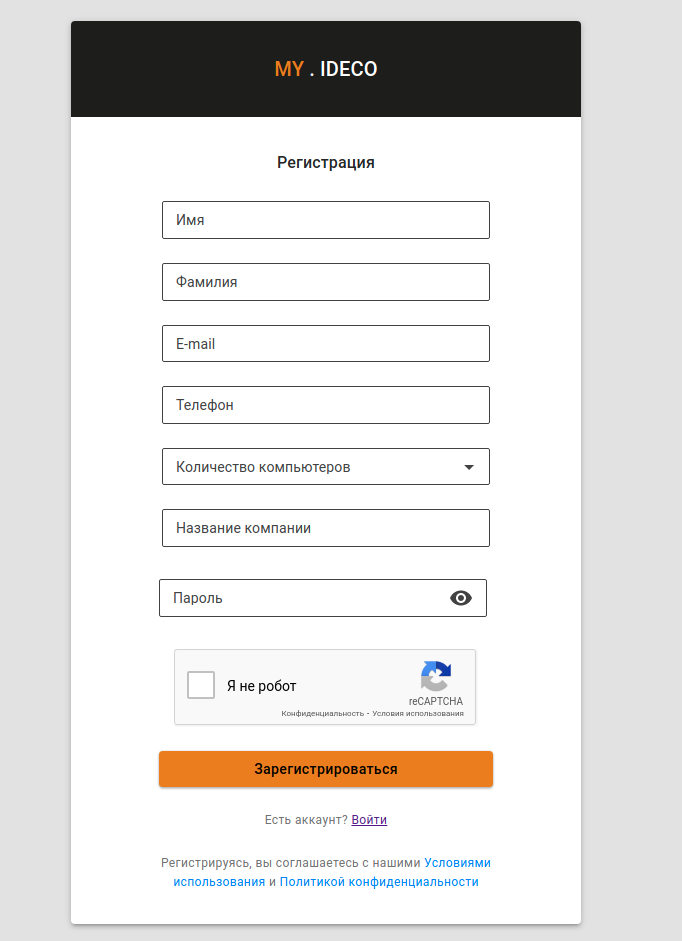

# Личный кабинет

Личный кабинет my.ideco.ru позволяет пользователю получить информацию:

* об имеющихся лицензиях;
* о [сроке окончания подписки](https://2020.ideco.ru/development) на обновления модулей и технической поддержки.

Для получения 40-дневной пробной лицензии на Ideco UTM, а также для привязки [коммерческих](https://2020.ideco.ru/buy) и [бесплатных](https://ideco.ru/kontakty) лицензий к серверу требуется обязательная регистрация сервера в личном кабинете.

## Регистрация

Зайдите на [сайт](https://my.ideco.ru/#/login/?next=/utm/license/) личного кабинета и перейдите по ссылке **Зарегистрироваться**.

Укажите свои личные данные и данные о компании.

**На указанную электронную почту придет активационное письмо.**

Адрес электронной почты будет использоваться в качестве логина в личный кабинет и для восстановления пароля.


Также для регистрации и авторизации можно использовать учетные записи `Google`, `Mail.ru` или `Яндекс`. В этом случае активационного письма не будет.

