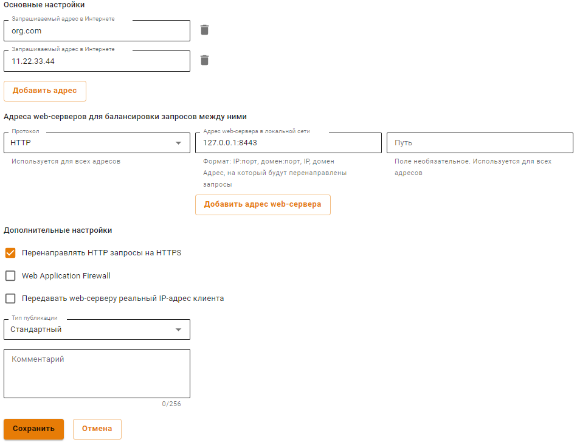

# Удаленный доступ для управления сервером

## Подключение по SSH из локальной сети

Для подключения к локальному меню сервера из локальной сети по SSH необходимо:

1. Разрешить подключение по SSH. Для этого перейдите в меню **Управление сервером -> Администраторы** и активируйте пункт **Доступ по SSH из локальных сетей**.
2. Подключиться к серверу с помощью любого SSH-клиента (например, PuTTY), используя 22 порт. Скачать SSH-клиент PuTTY вы можете на сайте [https://www.putty.org/](https://www.putty.org/). Необходимо указать логин **от Адмнистратора** и его пароль.

Используйте команду **`ideco-local-menu`** для запуска меню или команду **mc** – для запуска файлового менеджера.

## Подключение по SSH из сети Интернет

Для подключения по SSH из сети Интернет к локальному меню сервера необходимо:

1. Разрешить подключение по SSH из Интернета. Для этого перейдите в меню **Управление сервером -> Администраторы** и активируйте пункт **Доступ по SSH из внешних сетей**.
2. Подключиться к серверу с помощью любого SSH-клиента (например, PuTTY), используя 22 порт. Необходимо указать логин **от Адмнистратора** и его пароль.

Используйте команду **`ideco-local-menu`** для запуска меню или команду **mc** – для запуска файлового менеджера.

## Доступ к веб-интерфейсу управления сервером из сети Интернет

Прямой доступ к веб-интерфейсу Ideco UTM из сети Интернет запрещен по умолчанию. Вы можете использовать один из способов, указанных ниже:

1. Включить функцию **Доступ к веб-интерфейсу из внешней сети** в разделе **Управление сервером -> Администраторы** (Это разрешит доступ только по IP-адресу с портом 8443).
2. Создать VPN-подключение к серверу, например, по IPSec, IKEv2 или SSTP. После подключения можно перейти в веб-интерфейс по IP-адресу любого локального интерфейса (в том числе IP-адрес из диапазона для VPN-подключений. Адрес по умолчанию - 10.128.0.1).
3. Создать правило в обратном прокси для публикации веб-интерфейса:

   3.1. Перейдите в раздел **Сервисы -> Обратный прокси**.

   3.2. Добавьте новое правило заполнив поля следующим образом:

   

   В качестве запрашиваемого адреса укажите IP-адрес или доменное имя, присвоенное внешнему интерфейсу Ideco UTM.

   3.3. Нажмите на кнопку "Сохранить".

   3.4. Зайдите по одному из адресов, которые Вы указали в **запрашиваемых адресах**
